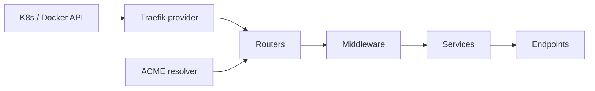

import { ConceptTemplate } from '@/features/kb/components/templates/ConceptTemplate'
import { Callout } from '@/features/kb/components/mdx/Callout'
import { ComparisonTable } from '@/features/kb/components/mdx/ComparisonTable'

export default function Layout({ children }) {
  return (
    <ConceptTemplate title="Traefik">
      {children}
    </ConceptTemplate>
  )
}

**Traefik** is a reverse proxy that **discovers** backends instead of waiting for you to edit a file. It watches Docker, Kubernetes, Consul, and others, then builds routers, services, and middleware from labels or CRDs. Automatic HTTPS is a first-class resolver, not a sidecar cron.

## 1. Deep Dive and Mechanics

**Entry points, routers, services, middleware.** An **entry point** is a listen port (80, 443). A **router** matches Host, PathPrefix, headers. A **service** is the upstream (and load-balancing). **Middleware** chains sit in between: strip prefix, rate limit, basic auth, headers, retries.

**Providers.** The Kubernetes provider reads Ingress, IngressRoute, and EndpointSlices. The Docker provider reads container labels. When a pod appears with the right labels, the routing table updates in memory — no worker reload dance.

**ACME.** A certificate resolver (Let's Encrypt or another CA) attaches to an entry point. HTTP-01, TLS-ALPN-01, or DNS-01 challenges run as routes appear. Store the ACME account and certs on a shared volume or KV if you run more than one Traefik replica.

**TCP and UDP.** Traefik is not only HTTP. SNI-based TCP routers cover databases and gRPC-without-HTTP-routing. UDP is the thin sibling.

<Callout icon="warning" title="Labels are a security boundary">
Anyone who can set a Docker label or an IngressRoute in a namespace can steal a Host rule if Traefik is cluster-wide. Restrict who can create those objects, or run a Traefik per team with a hostname allow-list.
</Callout>

## 2. Mathematical / Theoretical Foundation

Discovery is an **eventual-consistency** control loop: API event → in-memory snapshot → datapath. The lag is usually milliseconds to a few seconds. During that window, traffic can hit a terminating pod (need readiness + `terminating` endpoints) or miss a new one.

ACME rate limits are a **quota**. Many replicas racing HTTP-01 for the same name will trip Let’s Encrypt. Elect one writer or share the certificate store.

<ComparisonTable
  headers={['Edge', 'Discovery', 'TLS', 'Best fit']}
  rows={[
    ['Traefik', 'Orchestrator watch', 'Built-in ACME', 'K8s / Docker teams'],
    ['Nginx Ingress', 'Ingress + annotations', 'cert-manager usually', 'Annotation muscle memory'],
    ['Envoy / Gateway API', 'xDS or Gateway', 'SDS / cert-manager', 'Mesh-aligned edges'],
    ['HAProxy Ingress', 'Ingress', 'External', 'L4-heavy shops'],
  ]}
/>

## 3. Real-World Implementation

```yaml
apiVersion: traefik.io/v1alpha1
kind: IngressRoute
metadata:
  name: shop
  namespace: shop
spec:
  entryPoints:
    - websecure
  routes:
    - match: Host(`shop.example.com`) && PathPrefix(`/`)
      kind: Rule
      services:
        - name: shop
          port: 80
      middlewares:
        - name: compress
  tls:
    certResolver: le
```

Docker equivalent is a container label that sets `Host` and the internal port. Same router/service model, different provider.

## 4. Visualizations



## 5. Interview Prep

**Q: Traefik versus ingress-nginx?**
**A:** Traefik leans on CRDs and ACME in-process. ingress-nginx leans on annotations and a battle-tested Nginx datapath. Pick the ops model your team already debugs at 3 a.m.

**Q: Why do certificates flap with two Traefik pods?**
**A:** Each replica may try to issue. Share `acme.json` (or a KV store) and a leader, or terminate TLS in front of Traefik.

**Q: How do canaries work?**
**A:** Weighted services: two backends on one router with percent weights, or a dedicated middleware. Still need metrics to decide the weight, same as any canary.

## 6. Production Use Cases

- **Default Kubernetes ingress** for clusters that want ACME without cert-manager.
- **Docker Compose** demos and small PaaS boxes with label-driven routing.
- **TCP entry** for exposing a database SNI on a shared IP.

<Callout icon="tip" title="Pin Traefik and CRD versions together">
IngressRoute API groups have moved (`traefik.containo.us` to `traefik.io`). Upgrade CRDs and the controller in one change window or routers silently vanish.
</Callout>
