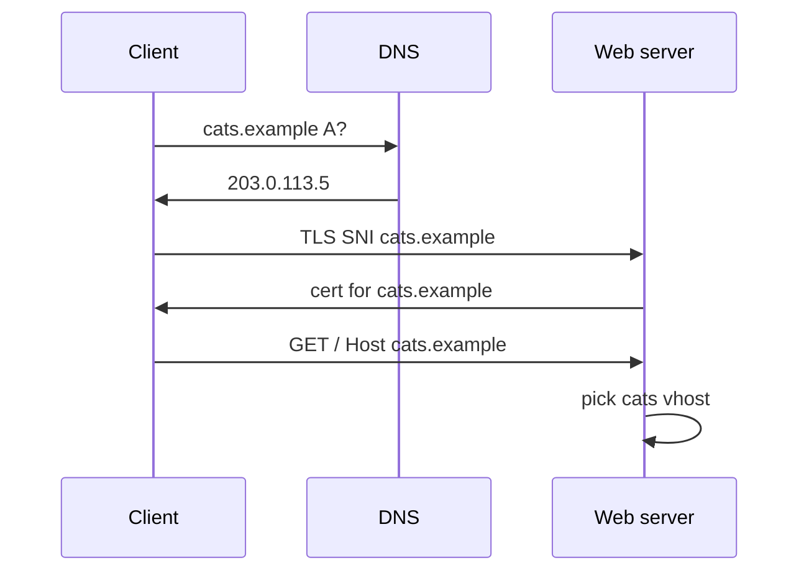

import { ConceptTemplate } from '@/features/kb/components/templates/ConceptTemplate'
import { Callout } from '@/features/kb/components/mdx/Callout'
import { ComparisonTable } from '@/features/kb/components/mdx/ComparisonTable'

export default function Layout({ children }) {
  return (
    <ConceptTemplate title="Virtual Hosts">
      {children}
    </ConceptTemplate>
  )
}

**Virtual hosts** let one process and one public IP serve `cats.example` and `dogs.example`. DNS A/AAAA records collide on purpose. The server reads the **Host** header (HTTP) or **SNI** (TLS) and picks a vhost: document root, proxy upstream, cert, and logs.

## 1. Deep Dive and Mechanics

**Name-based vhosts.** HTTP/1.1 made Host mandatory. The browser sends `Host: cats.example`. Nginx `server_name`, Apache `ServerName` / `ServerAlias`, IIS host-header bindings all match that string. First or default vhost wins if nothing matches — that default is how you leak the wrong site.

**IP-based vhosts.** Old model: one dedicated address per site. Still used when a client cannot send Host (broken HTTP/1.0) or when a compliance rule wants a unique IP.

**TLS and SNI.** HTTPS encrypts the HTTP Host header. The client puts the hostname in **Server Name Indication** during the handshake so the edge can select a certificate **before** HTTP exists. Without SNI, one IP could only hold one cert (or a giant SAN/wildcard).

**HTTP/2 and HTTP/3.** Connection coalescing may reuse a TLS session across hostnames that share a cert and IP. Misaligned vhost and cert SAN lists cause surprising cross-site routing bugs.

<Callout icon="warning" title="Always define an explicit default">
The first `listen` / `VirtualHost` is the dumpster for unknown Host values and empty headers. Point it at a 444 or a static “no site” page, not at production.
</Callout>

## 2. Mathematical / Theoretical Foundation

Selection is a **map** from hostname to config, plus a default. Match cost is a few string compares or a hash lookup — not your bottleneck. The interesting math is **certificate coverage**: a wildcard `*.example.com` covers one label, not `a.b.example.com`. A SAN list is a finite set; every vhost name must sit in that set or have its own cert (SNI).

Coalescing: if two names share IP and cert, HTTP/2 may send both on one connection. The server must still honor per-request Host, not “whatever SNI was.”

<ComparisonTable
  headers={['Style', 'Discriminator', 'Cert selection', 'Use today']}
  rows={[
    ['Name-based', 'Host header', 'SNI then Host', 'Default'],
    ['IP-based', 'Destination IP', 'Per-IP cert', 'Rare, compliance'],
    ['Port-based', 'TCP port', 'Per-port cert', 'Dev and admin UIs'],
    ['Wildcard / SAN', 'One cert, many names', 'One handshake', 'Shared hosting, SaaS'],
  ]}
/>

## 3. Real-World Implementation

```nginx
server {
    listen 80 default_server;
    server_name _;
    return 444;
}

server {
    listen 80;
    server_name cats.example;
    root /var/www/cats;
}

server {
    listen 80;
    server_name dogs.example;
    root /var/www/dogs;
}
```

Add `listen 443 ssl` plus `ssl_certificate` per name, or one wildcard cert on both server blocks.

## 4. Visualizations



## 5. Interview Prep

**Q: How can two domains share one IP?**
**A:** DNS points both at the IP. HTTP Host or TLS SNI names the site. The server’s vhost table maps that name to files or an upstream.

**Q: What breaks if SNI is missing?**
**A:** The server presents the default certificate. Browsers show a name mismatch. Old enterprise middleboxes and some Java 6-era clients did this; they are why IP-per-tenant still exists in pockets.

**Q: Host header versus SNI mismatch?**
**A:** A client can SNI to A and send Host B (or an IP). Treat that as hostile: reject, or require them to match. Host header attacks depend on your default vhost being sloppy.

## 6. Production Use Cases

- **Shared hosting** with thousands of customer names on one fleet.
- **SaaS vanity domains** that all terminate on one ingress with SNI.
- **Staging plus prod** on one box, split only by `server_name`.

<Callout icon="tip" title="Log the Host and the SNI">
When users report “the wrong site,” compare SNI, Host, and the vhost that actually ran. Those three strings diagnose 90 percent of virtual-host incidents.
</Callout>
