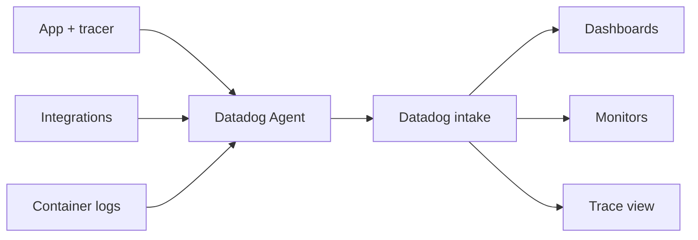

import { ConceptTemplate } from '@/features/kb/components/templates/ConceptTemplate'
import { Callout } from '@/features/kb/components/mdx/Callout'
import { ComparisonTable } from '@/features/kb/components/mdx/ComparisonTable'

export default function Layout({ children }) {
  return (
    <ConceptTemplate title="Datadog">
      {children}
    </ConceptTemplate>
  )
}

**Datadog** is a hosted observability platform. One **Agent** (or OpenTelemetry export) ships host metrics, APM spans, and logs under a shared tag set (`service`, `env`, `version`). The product bet is **correlation**: a CPU graph, a trace, and a log line share keys so an on-call can jump without rewriting queries in three tools.

## 1. Deep Dive and Mechanics

**Agent.** A Go process on each host or a DaemonSet. It scrapes dogstatsd, tails logs, and receives traces from language tracers. Integrations cover nginx, postgres, kube-state-metrics, and hundreds more. Kubernetes autodiscovery binds integrations to pod annotations.

**APM.** Language libraries wrap incoming requests and outbound HTTP/SQL. Spans go to the Agent, then to Datadog intake. Trace search is indexed on a sample; the rest is retained cheaper or dropped. Ingestion controls and retention filters are how you avoid a second AWS bill.

**Watchdog and monitors.** Static thresholds (`error rate greater than 1 percent`) sit beside anomaly detectors that learn weekly seasonality. Monitors page Slack or PagerDuty. Composite monitors AND together signals so a deploy and an error spike fire as one incident.

**Security and RUM.** The same vendor now sells CSPM, workload security, and browser RUM. Convenient; also a concentration-of-risk and a contract that is hard to unwind.

<Callout icon="warning" title="Custom metrics are the silent invoice">
Unbound tags (user id, request id, raw URL) explode cardinality. Datadog charges for custom metric series. Standardize a tag allow-list before the first `increment` call.
</Callout>

## 2. Mathematical / Theoretical Foundation

Anomaly detection here is **time-series residual** modeling: forecast a seasonal baseline, alert when the residual exceeds a band. False positives track how well the seasonality matches reality (launches, holidays, DST). You still need a hard SLO monitor; ML will not replace an error-budget burn alert.

Cardinality of a metric is the product of tag value counts. A counter with 4 tags at 10, 20, 50, and 1000 values is 4×10^6 series. That is both a query-latency and a billing event.

<ComparisonTable
  headers={['Layer', 'Datadog piece', 'Open-source stand-in']}
  rows={[
    ['Metrics', 'DogStatsD + query', 'Prometheus + PromQL'],
    ['Traces', 'APM + Trace Search', 'OTel + Jaeger / Tempo'],
    ['Logs', 'Log pipelines + indexes', 'Loki or ELK'],
    ['UX', 'RUM', 'Open-source RUM is thinner'],
  ]}
/>

## 3. Real-World Implementation

```python
from datadog import initialize, statsd

initialize(statsd_host="127.0.0.1", statsd_port=8125)

def checkout(order_id: str) -> None:
    statsd.increment("checkout.attempts", tags=["service:payments", "env:prod"])
    try:
        charge(order_id)
        statsd.increment("checkout.success", tags=["service:payments", "env:prod"])
    except Exception:
        statsd.increment("checkout.errors", tags=["service:payments", "env:prod"])
        raise
```

Prefer unified service tags over ad-hoc strings so APM and metrics join. Do not put `order_id` on the metric.

## 4. Visualizations



## 5. Interview Prep

**Q: Why buy Datadog instead of Prometheus plus Grafana?**
**A:** Time-to-dashboard, out-of-box integrations, and click-from-metric-to-trace-to-log. You pay margin and lock-in. Many teams keep Prometheus for cluster internals and Datadog for product APM.

**Q: What is a custom metric?**
**A:** A series you emit (StatsD, API) that is not a bundled integration metric. High-cardinality tags multiply the series count and the bill.

**Q: How do you keep trace cost sane?**
**A:** Head sampling at the library, tail sampling / retention filters at intake, and drop health-check routes. Index only the traces you search.

## 6. Production Use Cases

- **Multi-cloud product companies** that want one vendor UI for app and infra.
- **Enterprise APM** replacements for New Relic or AppDynamics with stronger k8s support.
- **Security-adjacent** shops that already standardized on Datadog monitors.

<Callout icon="tip" title="Treat env and version as mandatory tags">
Canary analysis is “this version versus the last on the same env.” If those tags are missing, Watchdog cannot save you from comparing apples to last Black Friday.
</Callout>
