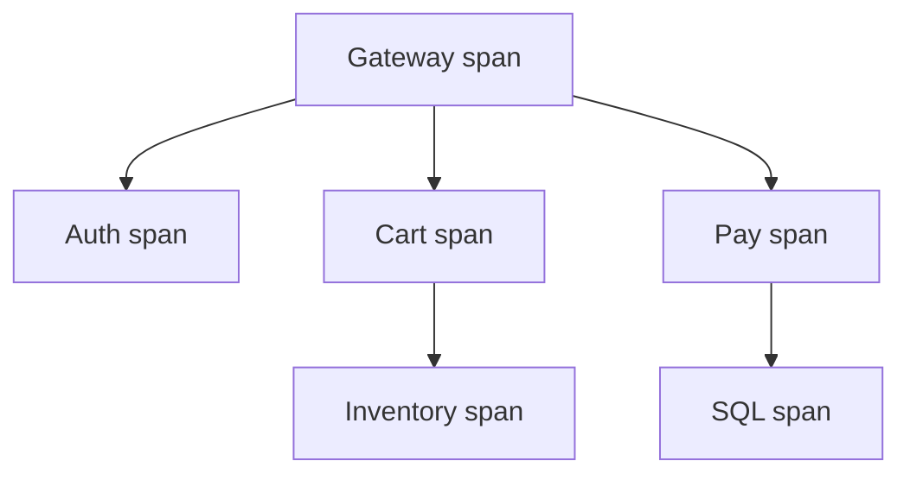

import { ConceptTemplate } from '@/features/kb/components/templates/ConceptTemplate'
import { Callout } from '@/features/kb/components/mdx/Callout'
import { ComparisonTable } from '@/features/kb/components/mdx/ComparisonTable'

export default function Layout({ children }) {
  return (
    <ConceptTemplate title="Distributed Tracing">
      {children}
    </ConceptTemplate>
  )
}

**Distributed tracing** reconstructs a request as a **trace**: a tree of **spans**. Each span is a timed operation (HTTP handler, SQL, enqueue). Context — trace id, parent span id, flags — rides on headers so the next service continues the same tree. Logs tell you a line existed; a trace tells you **where time went**.

## 1. Deep Dive and Mechanics

**IDs.** A **trace id** is unique per request (128-bit in W3C). A **span id** names this operation. The child stores the parent span id. Collectors group by trace id and build a Gantt chart.

**Propagation.** W3C `traceparent` is the modern header. Zipkin B3 (`X-B3-TraceId`) is still everywhere. A gateway or mesh injects if the app does not. Miss one hop and the tree **breaks** — you see two traces instead of one.

**Sampling.** Full-fidelity on every request at mesh scale is unaffordable. **Head sampling** decides at the first span. **Tail sampling** keeps the trace if any span was slow or errored. Head is cheap and biased toward normal traffic; tail needs a buffer of complete traces.

**Backends.** Jaeger, Tempo, Zipkin, Datadog, Honeycomb. The API you should emit is **OpenTelemetry**, not a vendor SDK, so the backend is swappable.

<Callout icon="warning" title="A missing propagator is a silent partition">
If service B does not forward `traceparent` to C, you will debug B’s 10 ms span and never see C’s 4 second SQL. Add context propagation tests to CI, not to the incident review.
</Callout>

## 2. Mathematical / Theoretical Foundation

A trace is a **rooted tree** (or DAG if you have async fan-out with multiple parents — most UIs still flatten). Span duration D includes children unless you look at **self time** D minus sum of child overlaps. Critical-path analysis walks the longest root-to-leaf path; that path is the lower bound on user latency.

Sampling is **biased estimation**. If you keep 1 percent at random, rare 500s vanish. Error-aware tail sampling estimates the tail of the latency distribution better than uniform head sampling at the same budget.

<ComparisonTable
  headers={['Signal', 'Question it answers', 'Weakness']}
  rows={[
    ['Metrics', 'Is the SLO burning?', 'No per-request story'],
    ['Logs', 'What did this process say?', 'Join keys are optional'],
    ['Traces', 'Where did this request spend time?', 'Cost and broken links'],
    ['Profiles', 'Which function is hot?', 'Not request-scoped unless linked'],
  ]}
/>

## 3. Real-World Implementation

```python
from opentelemetry import trace
from opentelemetry.propagate import inject
import httpx

tracer = trace.get_tracer("checkout")

def call_payments(order_id: str) -> None:
    with tracer.start_as_current_span("payments.charge") as span:
        span.set_attribute("order.id", order_id)
        headers = {}
        inject(headers)
        httpx.post("http://payments/charge", headers=headers, json={"id": order_id})
```

The `inject` call writes `traceparent` into outbound headers. Incoming middleware should `extract` before your handler runs.

## 4. Visualizations



## 5. Interview Prep

**Q: Trace versus log correlation?**
**A:** Put the trace id on every log line. Then a trace view and a log query meet. Logs without the id are a separate universe.

**Q: Why is my service always 0 ms in Jaeger?**
**A:** You created a span but the exporter is wrong, the sampler dropped it, or clocks are so skewed the UI clips it. Check Agent connectivity and `always_on` in staging.

**Q: Head or tail sampling in production?**
**A:** Head for cheap baselines. Tail (or a hybrid) when you must keep the 0.1 percent disasters. Pure head sampling is how teams “have tracing” and still cannot find the incident.

## 6. Production Use Cases

- **Checkout or book-ride** flows that cross 10-plus services.
- **Mesh** default tracing from Envoy with app spans stitched in.
- **Vendor debugging** — attach a trace id to a support ticket.

<Callout icon="tip" title="Name spans like operations, not classes">
`GET /cart` and `sql checkout.orders` search well. `Controller.Handle` does not. Attributes belong on the span, not stuffed into the name.
</Callout>
