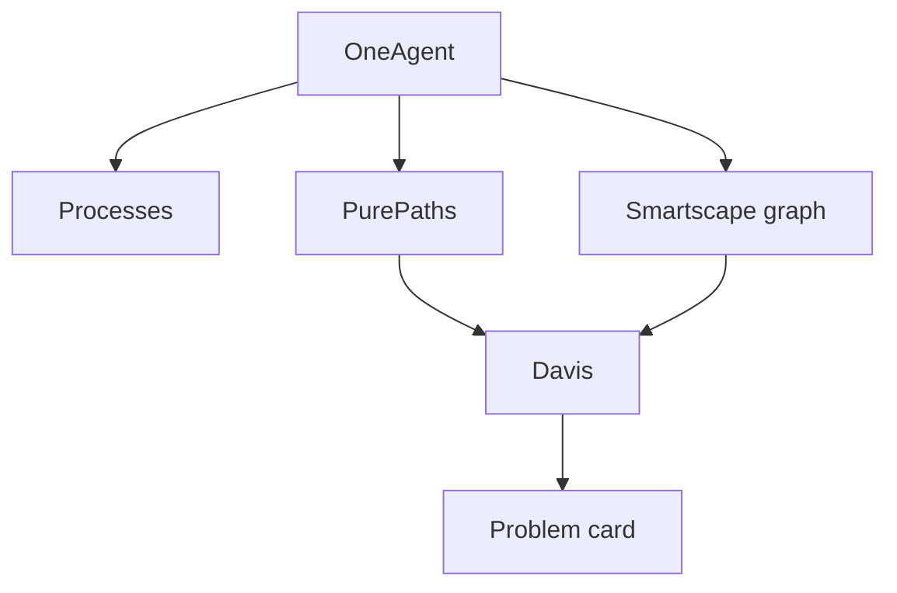

import { ConceptTemplate } from '@/features/kb/components/templates/ConceptTemplate'
import { Callout } from '@/features/kb/components/mdx/Callout'
import { ComparisonTable } from '@/features/kb/components/mdx/ComparisonTable'

export default function Layout({ children }) {
  return (
    <ConceptTemplate title="Dynatrace">
      {children}
    </ConceptTemplate>
  )
}

**Dynatrace** sells **automatic** full-stack observability. You install **OneAgent** on a host (or use Operator + code modules). It injects into Java, .NET, Node, and others, records **PurePath** traces, and draws a dependency graph. **Davis** walks that graph when something breaks and names a root cause instead of firing 40 red monitors.

## 1. Deep Dive and Mechanics

**OneAgent.** A privileged installer drops a system module and language modules. At process start, the module wraps sockets, HTTP clients, and SQL drivers. No code change is the pitch; the cost is a vendor in your process and a compatibility matrix (libc, musl, distroless, newer JDKs).

**Smartscape.** Continuous topology: hosts, processes, services, and third-party APIs as a live graph. Edges come from observed calls, not a CMDB someone forgot to update.

**PurePath.** Dynatrace’s end-to-end trace, including code-level method hotspots on supported runtimes. It is richer than a typical OpenTelemetry HTTP-only trace and more proprietary.

**Davis.** Not “CPU correlated with errors.” Davis uses the graph: if checkout fails and the only new edge change is a bad deploy on orders-db, the problem card says that. You still verify; you do not start from a blank Grafana.

**OpenTelemetry.** Dynatrace can ingest OTLP. New services sometimes skip OneAgent inject and export OTLP, at the cost of some automatic code-level magic.

<Callout icon="warning" title="Auto-inject is a change-control event">
A OneAgent upgrade is a production deploy into every process. Pin versions, soak in one cluster, and have a kill switch (disable injection) before a Friday JVM crash.
</Callout>

## 2. Mathematical / Theoretical Foundation

Davis is **graph causality**, not Pearson correlation. Given nodes V and observed fault F on a subset, it searches ancestors for change events (deploy, config, resource saturation) that explain F. Deterministic here means “follows the dependency edges,” not “mathematically proven in all topologies.” Hidden edges (async via a queue you did not instrument) produce wrong ancestors.

Trace volume is still a **sample**. Even OneAgent cannot keep every method on every request at mesh scale; it budgets CPU and adaptive capture.

<ComparisonTable
  headers={['Approach', 'How you instrument', 'Root cause style']}
  rows={[
    ['Dynatrace OneAgent', 'Auto-inject', 'Graph + problem cards'],
    ['Datadog APM', 'Library + Agent', 'Unified tags, Watchdog'],
    ['OTel + Grafana', 'SDK / auto-instr', 'You write the joins'],
    ['New Relic', 'Agent', 'APM-first, now broader'],
  ]}
/>

## 3. Real-World Implementation

```yaml
apiVersion: dynatrace.com/v1beta1
kind: DynaKube
metadata:
  name: dynakube
  namespace: dynatrace
spec:
  apiUrl: https://abc12345.live.dynatrace.com/api
  oneAgent:
    cloudNativeFullStack: {}
  activeGate:
    capabilities:
      - routing
      - kubernetes-monitoring
```

The Operator injects OneAgent into node and workload paths. Tokens live in a Secret, not in the YAML you commit.

## 4. Visualizations



## 5. Interview Prep

**Q: How is Davis different from static alerts?**
**A:** Alerts fire per signal. Davis groups signals that share a causal path on the topology and proposes one problem. You still need SLOs; Davis is a triage accelerator.

**Q: Why do some containers show no deep monitoring?**
**A:** Unsupported runtime, missing capabilities, musl, or injection blocked by a restricted PodSecurity policy. Check the OneAgent compatibility list before promising “zero code.”

**Q: Can you avoid OneAgent entirely?**
**A:** Export OTLP and host metrics. You lose some automatic topology richness. Many hybrid estates do exactly that for new Go services.

## 6. Production Use Cases

- **Large enterprises** with mixed JVM, .NET, and k8s that want a single vendor RCA story.
- **Mainframe-adjacent** and classic Windows estates where OneAgent coverage is a selling point.
- **Managed service** contracts that include Dynatrace as the observability clause.

<Callout icon="tip" title="Map problem cards to your CMDB owners">
A perfect root-cause sentence still pages the wrong team if service names do not match ownership. Align naming before you tune Davis.
</Callout>
