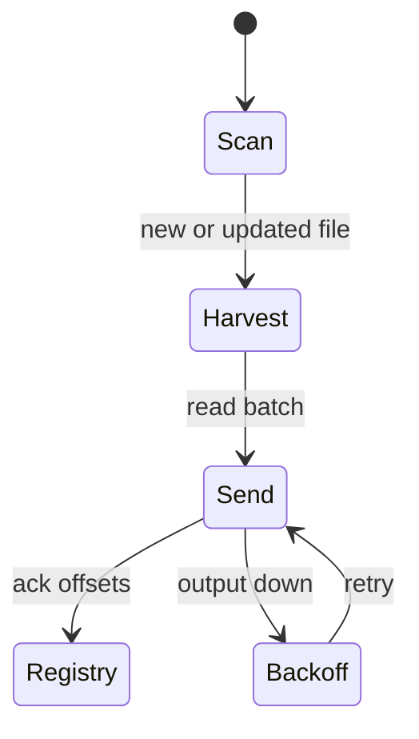

import { ConceptTemplate } from '@/features/kb/components/templates/ConceptTemplate'
import { Callout } from '@/features/kb/components/mdx/Callout'
import { ComparisonTable } from '@/features/kb/components/mdx/ComparisonTable'

export default function Layout({ children }) {
  return (
    <ConceptTemplate title="Filebeat">
      {children}
    </ConceptTemplate>
  )
}

**Filebeat** is the Beats-family **file tailer**. You point it at glob paths; it follows rotators, records an offset **registry**, and ships events. It exists because putting Logstash (JVM) on every node is a memory tax, and because `tail -F | nc` has no backpressure story.

## 1. Deep Dive and Mechanics

**Harvesters.** One harvester per file. It reads, then waits. On rotate (rename + new inode), Filebeat finishes the old inode and starts the new one — if `close_renamed` / `close_inactive` are sane. The **registry** file stores inode, offset, and fingerprint so a restart does not replay the world or skip a gap.

**Outputs.** Elasticsearch, Logstash, Kafka, Redis, or console. At the edge, Kafka is the usual shock absorber: Filebeat never blocks the app; it only blocks its own read if the output is down and the spool fills.

**Modules.** Prebuilt prospectors and ingest pipelines for Nginx, system auth, AWS, etc. They are opinionated grok. App logs should be JSON; modules are for software you do not control.

**Autodiscover.** On Kubernetes, Filebeat can watch the API and tail container logs with pod labels attached as fields. DaemonSet plus a hint annotation is the common pattern; Elastic Agent is the newer “one agent” replacement.

<Callout icon="error" title="Delete a log before the offset advances and you lose data">
If an app truncates or unlinks a file while Filebeat is down, the registry cannot invent those bytes. Coordinate rotation (copytruncate is hostile) and size Filebeat’s scan so it keeps up.
</Callout>

## 2. Mathematical / Theoretical Foundation

Delivery is **at-least-once** in the usual setup. Crash after send, before registry fsync, and you **duplicate**. Downstream must be idempotent or tolerate dupes (most log stores do).

Lag: if ingest rate λ exceeds output rate μ, the file grows and Filebeat’s offset trails `end`. Disk is the buffer. When disk hits quota, the **app** fails — so treat shipper lag as a first-class SLO.

<ComparisonTable
  headers={['Shipper', 'Language', 'Edge cost', 'Typical sink']}
  rows={[
    ['Filebeat', 'Go', 'Low', 'ES / Logstash / Kafka'],
    ['Fluent Bit', 'C', 'Very low', 'Forward, ES, S3, Loki'],
    ['Fluentd', 'Ruby + C', 'Medium', 'Plugin zoo'],
    ['Logstash', 'Java', 'High', 'Heavy parse hub'],
  ]}
/>

## 3. Real-World Implementation

```yaml
filebeat.inputs:
  - type: filestream
    id: nginx-access
    paths:
      - /var/log/nginx/access.log
    prospector.scanner.fingerprint.enabled: true

filebeat.registry.path: /var/lib/filebeat/registry

queue.mem:
  events: 4096
  flush.min_events: 256
  flush.timeout: 5s

output.kafka:
  hosts: ["kafka-1:9092", "kafka-2:9092"]
  topic: logs-raw
```

`filestream` plus fingerprinting survives inode reuse after rotate better than the old `log` input.

## 4. Visualizations



## 5. Interview Prep

**Q: Filebeat versus Fluent Bit on Kubernetes?**
**A:** Both DaemonSet well. Filebeat fits Elastic-centric stacks and modules. Fluent Bit is lighter, has a stronger filter/route story, and is the default in many EKS/GKE add-ons. Do not run both on the same node “just in case.”

**Q: What does the registry prevent?**
**A:** Re-ingesting a whole file after restart, and losing the place after a clean rotate. It does not protect you from truncate or from a wiped volume.

**Q: Why Kafka between Filebeat and Elasticsearch?**
**A:** Decouple bursty apps from cluster maintenance. You can replay a topic after a bad ingest pipeline; you cannot replay a deleted file.

## 6. Production Use Cases

- **VM fleets** shipping `/var/log` into Elastic Cloud or self-hosted ES.
- **Windows** event-adjacent setups using Winlogbeat alongside Filebeat for files.
- **Kafka-first** logging where Filebeat is only the tailer.

<Callout icon="tip" title="Monitor registry write failures">
A full or read-only `/var/lib/filebeat` looks like “Filebeat is running” while every restart duplicates or stalls. Alert on registry I/O errors, not only on process up.
</Callout>
