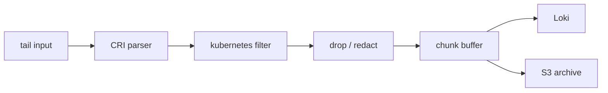

import { ConceptTemplate } from '@/features/kb/components/templates/ConceptTemplate'
import { Callout } from '@/features/kb/components/mdx/Callout'
import { ComparisonTable } from '@/features/kb/components/mdx/ComparisonTable'

export default function Layout({ children }) {
  return (
    <ConceptTemplate title="Fluent Bit">
      {children}
    </ConceptTemplate>
  )
}

**Fluent Bit** is the lightweight sibling of Fluentd. Written in C, it is the **DaemonSet** you can afford on a 5,000-node cluster. It tails container logs, attaches Kubernetes metadata, drops secrets, and forwards. Fluentd still wins as a fat aggregator with every plugin; Fluent Bit wins on the node.

## 1. Deep Dive and Mechanics

**Pipeline.** INPUT → optional PARSER → FILTER → BUFFER → OUTPUT. Inputs: tail, systemd, TCP, forward, Kubernetes events. Outputs: Elasticsearch, Loki, S3, Kafka, Splunk, forward to Fluentd, HTTP.

**Filters.** Modify records in flight: `kubernetes` metadata, `modify`/`nest`, `lua`, `grep`, `throttle`. This is where you strip `Authorization` headers and drop kube-probe noise.

**Buffering.** Filesystem or memory chunks. On backpressure, Fluent Bit stops reading or spills to disk. Size the disk volume or you will either OOM or stall container log rotation.

**CRI.** Container runtimes write JSON or CRI log lines under `/var/log/containers`. The tail input plus a CRI parser splits the stream; multiline parsers reassemble Java stack traces that crossed lines.

<Callout icon="warning" title="Metadata calls can outrun the API server">
The kubernetes filter talks to the API (or uses a cache). A misconfigured filter at cluster scale is a self-inflicted API flood. Use the kubelet local endpoint or a short TTL cache, and never sync-query per line.
</Callout>

## 2. Mathematical / Theoretical Foundation

RSS is typically a few MB plus buffer chunks. Throughput is **lines per second** limited by parse cost (regex vs JSON) and output batching. JSON parse is cheaper than grok. Lua on every line is a tax; use it for rare transforms.

Backpressure: if output μ is less than input λ, chunk count grows as (λ − μ) × t until `storage.max_chunks_up` or disk quota. After that, tail lags and the kubelet may rotate away unsent files — **silent loss**.

<ComparisonTable
  headers={['Tool', 'Where it sits', 'Extensibility', 'RAM']}
  rows={[
    ['Fluent Bit', 'Every node', 'C plugins + Lua', 'Very low'],
    ['Fluentd', 'Aggregator', 'Ruby plugins', 'Tens to hundreds of MB'],
    ['Filebeat', 'Every node', 'Modules', 'Low'],
    ['Vector', 'Either', 'VRL', 'Low-medium'],
  ]}
/>

## 3. Real-World Implementation

```text
[SERVICE]
    Flush         5
    Daemon        Off
    storage.path  /var/log/flb-storage

[INPUT]
    Name              tail
    Path              /var/log/containers/*.log
    Parser            cri
    Tag               kube.*
    Mem_Buf_Limit     16MB
    Skip_Long_Lines   On

[FILTER]
    Name                kubernetes
    Match               kube.*
    Kube_URL            https://kubernetes.default.svc:443
    Merge_Log           On
    K8S-Logging.Exclude On

[OUTPUT]
    Name   loki
    Match  kube.*
    Host   loki.observability.svc
    Port   3100
    Labels job=fluentbit, namespace=$kubernetes['namespace_name']
```

Tune `Labels` so cardinality stays on namespace and app, not on pod name.

## 4. Visualizations



## 5. Interview Prep

**Q: Why Fluent Bit instead of Fluentd as a DaemonSet?**
**A:** Memory and CPU per node multiply by node count. Fluent Bit’s C core is the reason GKE and many charts default to it. Keep Fluentd in the middle if you need a rare output plugin.

**Q: How do you handle multiline Java traces?**
**A:** A multiline parser that starts on a timestamp and continues on indented lines. Without it, each stack line is a separate event and grep becomes hell.

**Q: What happens when Loki is down?**
**A:** Chunks pile on the node disk. If that volume fills, you lose new logs or stall. Page on buffer usage, not only on Fluent Bit Ready.

## 6. Production Use Cases

- **Kubernetes default log path** to Loki or Elasticsearch.
- **Edge / IoT** boxes that cannot run a JVM or Ruby.
- **Dual-write** (hot search + cheap S3) from one pipeline.

<Callout icon="tip" title="Exclude noisy namespaces at the source">
`kube-system` probe logs will dominate volume. Drop them in a filter. Storage saved there buys retention for checkout errors.
</Callout>
