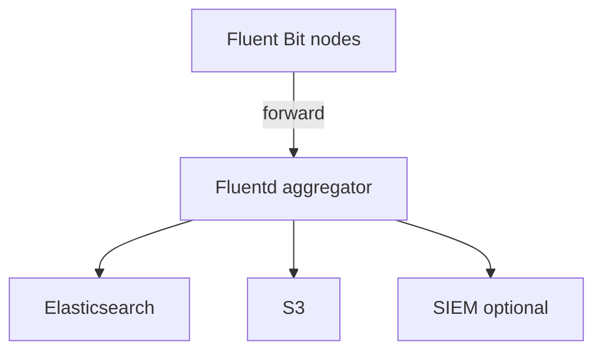

import { ConceptTemplate } from '@/features/kb/components/templates/ConceptTemplate'
import { Callout } from '@/features/kb/components/mdx/Callout'
import { ComparisonTable } from '@/features/kb/components/mdx/ComparisonTable'

export default function Layout({ children }) {
  return (
    <ConceptTemplate title="Fluentd">
      {children}
    </ConceptTemplate>
  )
}

**Fluentd** is a CNCF graduated collector whose rule is **everything becomes a JSON record with a tag**. Inputs, filters, and outputs are plugins. It is the **aggregator** you run as a StatefulSet or VM service when Fluent Bit on the node is too thin and you need a weird sink, a heavy transform, or a fan-out that is easier in Ruby.

## 1. Deep Dive and Mechanics

**Event.** Each event is `time`, `tag`, `record`. The tag (`app.nginx`, `kube.shop`) drives `match` directives. Think of tags as a routing key, not as Elasticsearch fields.

**Plugins.** `in_tail`, `in_forward`, `in_http`, `filter_parser`, `filter_record_transformer`, `out_elasticsearch`, `out_s3`, `out_kafka`, plus a long tail from the community. The core is C; plugins are often Ruby. That is why RSS is tens to hundreds of MB, not 3.

**Buffer.** Fluentd’s reliability story is the **buffer chunk** (memory or file). A chunk flushes to an output with retries and exponential backoff. File buffers survive process crash; you must provision disk and inode count.

**Forward protocol.** Fluent Bit and other Fluentd instances speak `forward` (TCP, optional TLS and shared key). Node Bit → central Fluentd is a standard two-tier design.

<Callout icon="warning" title="Ruby plugins are a supply-chain and GC surface">
A random `fluent-plugin-*` gem can stall the event loop or leak. Pin versions, run Fluentd under a memory limit, and prefer C/Go outputs for the hottest path.
</Callout>

## 2. Mathematical / Theoretical Foundation

The buffer is a **queue**. If flush latency rises, chunk count rises. File buffer capacity is `chunk_limit × queue_limit`. Beyond that, Fluentd applies backpressure or drops — configuration chooses which. At-least-once is the default; duplicates appear after a crash between send and dequeue.

Parse cost: a naïve regex on every Nginx line at 200k lines/s will dominate a vCPU. Move parse to the app (JSON) or to a compiled parser; keep Fluentd for route and enrich.

<ComparisonTable
  headers={['Tier', 'Process', 'Job']}
  rows={[
    ['Node', 'Fluent Bit', 'Tail, metadata, ship'],
    ['Aggregator', 'Fluentd', 'Parse, fan-out, odd plugins'],
    ['Store', 'ES / Loki / S3', 'Query or archive'],
    ['All-in-one', 'Fluentd DaemonSet', 'Small clusters only'],
  ]}
/>

## 3. Real-World Implementation

```text
<source>
  @type forward
  port 24224
  bind 0.0.0.0
</source>

<filter app.**>
  @type parser
  key_name message
  reserve_data true
  <parse>
    @type json
  </parse>
</filter>

<match app.**>
  @type copy
  <store>
    @type elasticsearch
    host es.internal
    port 9200
    index_name app-logs
    <buffer>
      @type file
      path /var/log/fluentd-buffers/es
      flush_interval 10s
    </buffer>
  </store>
  <store>
    @type s3
    s3_bucket logs-archive
    path app/%Y/%m/%d
  </store>
</match>
```

The `copy` output writes search and archive in one match. Buffer paths must be on persistent disks.

## 4. Visualizations



## 5. Interview Prep

**Q: Fluentd versus Logstash?**
**A:** Same niche (heavy transform hub). Fluentd is CNCF, tag-routed, and common in Kubernetes history (the old default DaemonSet). Logstash is Elastic-native Grok and JVM. Pick the ecosystem you already run.

**Q: Why not Fluentd on every node anymore?**
**A:** Memory × nodes. Fluent Bit or Vector took the edge. Fluentd remains a great concentrator.

**Q: How do you avoid losing logs on a rolling restart?**
**A:** File buffers on a PVC, a long `terminationGracePeriodSeconds`, and `flush_at_shutdown`. Kill the pod too fast and the last chunks die.

## 6. Production Use Cases

- **Central log router** that must feed Elastic, S3, and a SIEM at once.
- **Legacy syslog / multiline** estates that already have Fluentd configs.
- **Multi-tenant** platforms that tag by team and match into isolated indexes.

<Callout icon="tip" title="Treat tags as a contract">
If node agents emit random tags, aggregator `match` rules rot. Publish a tag scheme (app.NAME, sys.NAME) and reject the rest.
</Callout>
