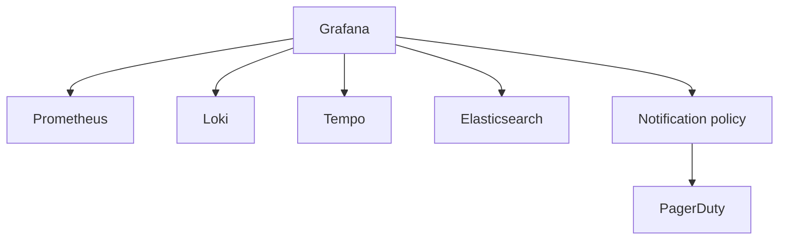

import { ConceptTemplate } from '@/features/kb/components/templates/ConceptTemplate'
import { Callout } from '@/features/kb/components/mdx/Callout'
import { ComparisonTable } from '@/features/kb/components/mdx/ComparisonTable'

export default function Layout({ children }) {
  return (
    <ConceptTemplate title="Grafana">
      {children}
    </ConceptTemplate>
  )
}

**Grafana** is the dashboard. Prometheus stores samples; Loki stores logs; Tempo stores traces; Grafana **queries** them with a common time picker and a shared variable. Grafana Labs also sells Cloud and the LGTM stack (Loki, Grafana, Tempo, Mimir), but the open-source server is still “talk to other databases.”

## 1. Deep Dive and Mechanics

**Data sources.** Each source is a plugin with a query editor: PromQL, LogQL, TraceQL, SQL, Elasticsearch DSL. A dashboard panel is “this source + this query + this viz.” Mixed datasources on one row are the whole point.

**Dashboards as code.** JSON or the newer schema, provisioned from a config map or Terraform. Click-ops dashboards drift. Library panels and repeating rows keep 50 services from becoming 50 hand copies.

**Alerting.** Unified alerting evaluates rules in Grafana (or reads Prometheus rules) and routes through notification policies (Slack, PagerDuty, email). Keep SLO burn alerts in Prometheus if that is your source of truth; use Grafana alerting for multi-source rules (Prom + Loki).

**Explore.** Ad-hoc query UI with split panes: jump from a red CPU panel to the Loki stream for that pod, then to a Tempo trace id. That jump only works if you copied labels across signals.

<Callout icon="warning" title="Grafana is not a metrics database">
If Prometheus dies, Grafana shows empty graphs, not cached history (unless you put Mimir/Thanos in front). Dashboard HA is not data HA.
</Callout>

## 2. Mathematical / Theoretical Foundation

A graph is a **sampled** view. The panel step size is `range / pixels` (roughly). Asking for 1-second resolution over 30 days will either downsample or melt the source. PromQL `rate` over a window W needs at least 2 scrape intervals inside W.

Variables explode cardinality in the browser: a template variable of every pod name in a 5,000-pod cluster will hang the JSON. Scope variables to namespace or use `label_values` with a matcher.

<ComparisonTable
  headers={['Need', 'Grafana role', 'Actual store']}
  rows={[
    ['Golden signals', 'Time series panels', 'Prometheus / Mimir'],
    ['Log lines', 'Logs panel / Explore', 'Loki / ES'],
    ['Request tree', 'Trace view', 'Tempo / Jaeger'],
    ['Business SQL', 'Table / bar', 'Postgres'],
  ]}
/>

## 3. Real-World Implementation

```json
{
  "title": "API golden signals",
  "panels": [
    {
      "type": "timeseries",
      "title": "Request rate",
      "datasource": { "type": "prometheus", "uid": "prom" },
      "targets": [
        {
          "expr": "sum(rate(http_requests_total{job=\"api\"}[5m]))"
        }
      ]
    }
  ]
}
```

Provision this JSON via `dashboards.yaml` pointing at a folder. The PromQL lives in the panel; Grafana will not invent the metric.

## 4. Visualizations



## 5. Interview Prep

**Q: Grafana versus Kibana?**
**A:** Kibana is native to Elasticsearch. Grafana is source-agnostic and the default for Prometheus. If your world is only ELK, Kibana is fine. If you have Prom + Loki, Grafana is the UI.

**Q: Where should alerts live?**
**A:** Recording and alerting rules next to the metrics (Prometheus) survive a Grafana outage. Grafana-managed alerts shine when the condition spans two stores.

**Q: What is the LGTM stack?**
**A:** Loki (logs), Grafana (UI), Tempo (traces), Mimir (metrics). One vendor’s OSS suite meant to compete with Datadog on price.

## 6. Production Use Cases

- **SRE golden-signal** walls in the operations room.
- **Per-service** dashboards generated from a mixin or Jsonnet.
- **Executive** uptime panels that hide PromQL behind a friendly chart.

<Callout icon="tip" title="Link traces with a derived field">
If logs contain a trace id, configure a derived field that opens Tempo. That single click is worth more than another gauge.
</Callout>
