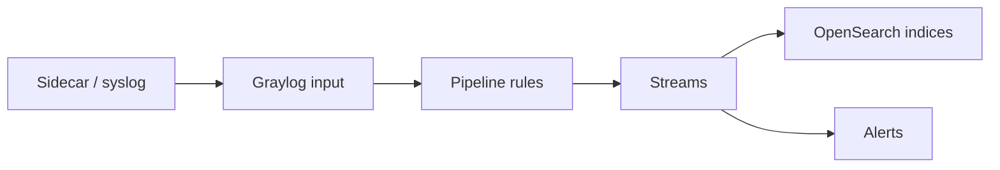

import { ConceptTemplate } from '@/features/kb/components/templates/ConceptTemplate'
import { Callout } from '@/features/kb/components/mdx/Callout'
import { ComparisonTable } from '@/features/kb/components/mdx/ComparisonTable'

export default function Layout({ children }) {
  return (
    <ConceptTemplate title="Graylog">
      {children}
    </ConceptTemplate>
  )
}

**Graylog** is a Java log management app. Storage is **OpenSearch or Elasticsearch**; Graylog owns ingest, **pipelines**, **streams**, role-based search, and alerts. Teams pick it when they want a SIEM-ish log product without assembling ELK from parts — or when they already standardized on Graylog in the SOC.

## 1. Deep Dive and Mechanics

**Inputs.** Syslog, GELF, Beats, HTTP, raw TCP/UDP. Collectors (sidecar) run on endpoints and ship to those inputs. GELF is Graylog’s structured datagram format (compressed JSON over UDP or TCP).

**Pipelines.** Rule language: match a message, grok a field, look up threat intel, set a field, drop. Pipelines attach to streams. This is Logstash-filter territory with a UI and versioned rules.

**Streams.** Live subsets (“ssh failures”, “payment errors”). Alerts and retention can differ per stream. A message can land in more than one stream.

**Index sets.** How Graylog maps streams onto Elasticsearch indices (rotation, retention, shards). You still operate a search cluster; Graylog does not abolish heap math.

**Auth.** LDAP/AD and granular search restrictions matter in multi-team SOC deployments. Kibana space isolation is the comparable idea.

<Callout icon="warning" title="UDP GELF can vanish">
UDP has no backpressure. Under burst, the kernel drops datagrams and Graylog never knew. Use TCP GELF or Beats when the log is an audit record.
</Callout>

## 2. Mathematical / Theoretical Foundation

Stream alerts are **count or condition over a sliding window**. “More than 50 failed logins from one IP in 60 seconds” is a threshold on a grouped aggregate. You need enough indexing delay budget; alerting on a 5-second window while ingest lag is 30 seconds is fiction.

Storage is still inverted-index economics. Graylog’s value is **workflow**, not a cheaper Lucene.

<ComparisonTable
  headers={['Product', 'You operate', 'Strength']}
  rows={[
    ['Graylog', 'Graylog + OS/ES', 'Pipelines, streams, RBAC'],
    ['ELK DIY', 'Beats + LS + ES + Kibana', 'Flexible, more glue'],
    ['Loki + Grafana', 'Loki + agents', 'Cheap, label search'],
    ['Datadog Logs', 'Nothing on-prem', 'Correlation, invoice'],
  ]}
/>

## 3. Real-World Implementation

```text
rule "flag brute force ssh"
when
  has_field("application") AND
  to_string($message.application) == "sshd" AND
  contains(to_string($message.message), "Failed password")
then
  set_field("event_type", "ssh_fail");
end
```

Attach the rule to a pipeline on the syslog stream. A separate event-definition alert groups by `source_ip` and pages when the count crosses a threshold.

## 4. Visualizations



## 5. Interview Prep

**Q: Why Graylog instead of Kibana?**
**A:** Opinionated pipelines, streams, and alerting as one app. Kibana plus Watcher/Logstash can match it, with more moving pieces. Graylog still needs you to be good at search-cluster ops.

**Q: GELF versus syslog?**
**A:** GELF is structured and can carry a full JSON payload. Syslog is universal and messy. Prefer GELF or Beats from apps you own; accept syslog from network gear.

**Q: What happens if OpenSearch is down?**
**A:** Journal or disk journal on the Graylog node buffers some ingest, then you drop or block. Size the journal and page on it.

## 6. Production Use Cases

- **SOC** log correlation for firewalls, VPN, and Windows event forwards.
- **App logging** in shops that standardized on Graylog before Loki existed.
- **MSSP** multi-tenant streams with strict search partitions.

<Callout icon="tip" title="Index sets per retention class">
Do not put 3-day debug logs and 1-year audit logs in one index set. Split streams so ILM (or Graylog rotation) can be honest.
</Callout>
