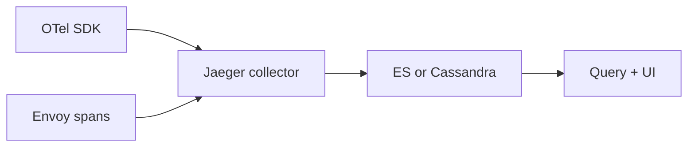

import { ConceptTemplate } from '@/features/kb/components/templates/ConceptTemplate'
import { Callout } from '@/features/kb/components/mdx/Callout'
import { ComparisonTable } from '@/features/kb/components/mdx/ComparisonTable'

export default function Layout({ children }) {
  return (
    <ConceptTemplate title="Jaeger">
      {children}
    </ConceptTemplate>
  )
}

**Jaeger** is the tracing platform Uber open-sourced. Applications (or Envoy) emit spans; Jaeger **collects**, **stores**, and **draws** the tree. It spoke OpenTracing first, then OpenTelemetry. You still see Jaeger as a backend even when the SDK is OTel — Tempo is the newer Grafana-shaped alternative.

## 1. Deep Dive and Mechanics

**Pipeline.** Client or sidecar → **Agent** (optional, local UDP/HTTP) or straight **OTLP** → **Collector** (validate, batch, sample) → **Storage** (Elasticsearch, Cassandra, Badger, memory, Kafka as a buffer) → **Query** + UI.

**Sampling.** Remote sampling: the Agent asks the Collector for per-service strategies (probabilistic, rate-limiting). Adaptive sampling exists so a quiet service is not invisible and a hot gateway does not melt storage.

**Span model.** Follows OTel/OpenTracing: trace id, span id, parent, timestamps, tags/attributes, logs/events. The UI shows a timeline, a service graph, and compare traces.

**Deployment.** All-in-one for demos. Production splits collector, query, and store. The v2 collector is OTel-collector-shaped. Do not run memory storage outside a laptop.

<Callout icon="warning" title="UDP agents drop spans on purpose">
The classic Agent ingest used compact thrift over UDP. Bursts disappear without an error in the app. If the trace is how you debug payments, use OTLP HTTP/gRPC with backpressure.
</Callout>

## 2. Mathematical / Theoretical Foundation

Storage cost is `traces × avg_spans × bytes_per_span × retention / sample_rate`. A 1 percent probabilistic sample of a 10k QPS edge with 20 spans is still 2k spans/s. Elasticsearch mapping for tags can explode if you index arbitrary HTTP URLs.

Service graphs are **adjacency counts** over a time window: edge A→B increments when a span in A has a child in B. Sampling biases the graph toward services that keep more traces (errors, adaptive).

<ComparisonTable
  headers={['Backend', 'Store model', 'Fits']}
  rows={[
    ['Jaeger', 'ES / Cassandra / others', 'Self-hosted tracing veterans'],
    ['Tempo', 'Object storage blocks', 'Grafana LGTM, cheap retention'],
    ['Zipkin', 'ES / MySQL / …', 'Older B3 ecosystems'],
    ['Honeycomb / Datadog', 'Vendor', 'High-cardinality event search'],
  ]}
/>

## 3. Real-World Implementation

```yaml
apiVersion: apps/v1
kind: Deployment
metadata:
  name: jaeger-collector
spec:
  replicas: 3
  template:
    spec:
      containers:
        - name: collector
          image: jaegertracing/jaeger-collector:1.62.0
          args:
            - --es.server-urls=http://es:9200
            - --collector.otlp.enabled=true
          ports:
            - containerPort: 4317
            - containerPort: 4318
```

Apps export OTLP to the collector. Sampling strategy is a separate endpoint the SDK polls; start with `probabilistic` 0.01 in prod and 1.0 in staging.

## 4. Visualizations



## 5. Interview Prep

**Q: Jaeger versus Tempo?**
**A:** Tempo stores traces as cheap blocks in S3 and leans on Grafana. Jaeger is a complete query UI plus a choice of databases you already know. Tempo wins on retention cost; Jaeger wins if you already run it well.

**Q: Why is the service graph missing a hop?**
**A:** No child span, broken context, or that hop was sampled out. Fix propagation before you tune the UI.

**Q: Can Jaeger do metrics?**
**A:** It can emit span metrics (RED from traces). That is a sampled view of traffic, not a replacement for Prometheus request counters on the hot path.

## 6. Production Use Cases

- **Mesh tracing** default when Istio or a platform already points at Jaeger.
- **Polyglot microservices** that standardized on OTLP with a self-hosted backend.
- **Migration** off Zipkin: same idea, newer UI, OTLP ingest.

<Callout icon="tip" title="Index trace id on logs from day one">
The Jaeger UI “find a trace” box is useless if the user only has a request id from a screenshot. Log the hex trace id on every error line.
</Callout>
