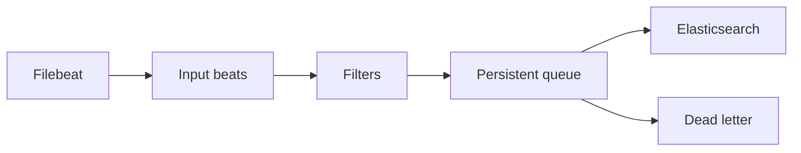

import { ConceptTemplate } from '@/features/kb/components/templates/ConceptTemplate'
import { Callout } from '@/features/kb/components/mdx/Callout'
import { ComparisonTable } from '@/features/kb/components/mdx/ComparisonTable'

export default function Layout({ children }) {
  return (
    <ConceptTemplate title="Logstash">
      {children}
    </ConceptTemplate>
  )
}

**Logstash** is the “L” in ELK: a **server-side pipeline**. It pulls from Beats, Kafka, S3, or a beat listener, **filters** (grok, mutate, geoip, date), and **outputs** to Elasticsearch or elsewhere. It is powerful and JVM-hungry. Most new designs push parse into ingest pipelines or into the app and keep Logstash only when the transform is truly central.

## 1. Deep Dive and Mechanics

**Three stages.**

1. **Input** — `beats`, `kafka`, `s3`, `http`, `tcp`.
2. **Filter** — grok, dissect, mutate, ruby (escape hatch), fingerprint, drop.
3. **Output** — `elasticsearch`, `s3`, `stdout`, secondary fans.

**Persistent queues.** Disk-backed PQ absorbs a downstream outage so Filebeat does not stall forever. Size PQ disk; it is your ingest SLA.

**Grok versus dissect.** Grok is named regex (`COMBINEDAPACHELOG`). Dissect is delimiter-based and cheaper. If the format is fixed columns, dissect. If it is a zoo of vendor lines, grok — and cache, because grok is CPU.

**Multiple pipelines.** `pipelines.yml` isolates a noisy input so a bad grok on firewalls does not stall app logs. Each pipeline has its own workers and batch size.

<Callout icon="warning" title="Do not install Logstash on every app node">
That pattern is how JVM heaps eat the workload. Filebeat or Elastic Agent on the node; Logstash (or none) in the middle.
</Callout>

## 2. Mathematical / Theoretical Foundation

Throughput ≈ `workers × batch_size / mean_filter_ms`. Grok backtracking can make mean_filter_ms explode on a non-matching line — a **ReDoS-shaped** operational bug. Always have a tag-and-pass fallback for grok failures so one malformed line does not stall the pipeline.

PQ capacity is disk, not magic. If ES is down longer than `PQ_size / ingest_rate`, you drop or block. Page on PQ depth.

<ComparisonTable
  headers={['Ingest path', 'CPU home', 'When to use']}
  rows={[
    ['App JSON + Filebeat', 'Almost none', 'Default'],
    ['ES ingest pipeline', 'ES nodes', 'Light grok, Elastic-only'],
    ['Logstash', 'Logstash JVM', 'Multi-sink, heavy mutate'],
    ['Fluentd', 'Aggregator', 'Non-Elastic sinks'],
  ]}
/>

## 3. Real-World Implementation

```text
input {
  beats {
    port => 5044
  }
}

filter {
  if [fileset][name] == "access" {
    grok {
      match => { "message" => "%{COMBINEDAPACHELOG}" }
      tag_on_failure => ["_grokparsefailure"]
    }
    geoip { source => "clientip" }
    date {
      match => ["timestamp", "dd/MMM/yyyy:HH:mm:ss Z"]
    }
  }
}

output {
  if "_grokparsefailure" not in [tags] {
    elasticsearch {
      hosts => ["https://es:9200"]
      index => "nginx-access-%{+YYYY.MM.dd}"
    }
  }
}
```

Failed grok should go to a dead-letter index, not vanish, so you can fix the pattern.

## 4. Visualizations



## 5. Interview Prep

**Q: Logstash versus ingest pipelines?**
**A:** Ingest pipelines run inside Elasticsearch and are enough for simple grok. Logstash wins for Kafka fan-in, multiple outputs, and heavy Ruby/mutate that you do not want on ES heap.

**Q: Why is grok at 100 percent CPU?**
**A:** A line that almost matches a greedy pattern. Add an `if` guard, use dissect, or drop the line. Measure `filter` duration in monitoring APIs.

**Q: How do you upgrade without losing events?**
**A:** Persistent queue on a durable disk, drain, then bounce. Stateless Logstash plus a down ES means Filebeat’s registry stops — also safe, but you concentrate risk on the edge disks.

## 6. Production Use Cases

- **Kafka → Elasticsearch** bridge with enrichment (GeoIP, user-agent).
- **Syslog from network** gear that will never emit JSON.
- **Migration** pipelines that dual-write to old and new clusters.

<Callout icon="tip" title="Tag failures, do not block forever">
A `_grokparsefailure` tag plus a small overflow index is cheaper than a stalled PQ and a page that “logs stopped.”
</Callout>
