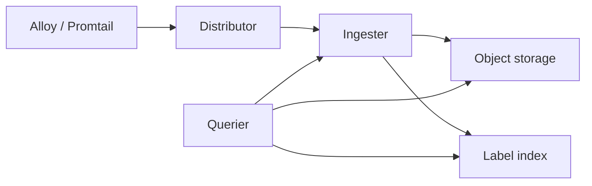

import { ConceptTemplate } from '@/features/kb/components/templates/ConceptTemplate'
import { Callout } from '@/features/kb/components/mdx/Callout'
import { ComparisonTable } from '@/features/kb/components/mdx/ComparisonTable'

export default function Layout({ children }) {
  return (
    <ConceptTemplate title="Loki">
      {children}
    </ConceptTemplate>
  )
}

**Loki** is log aggregation designed like Prometheus. You do **not** index the message body. You index **labels** (app, namespace, level), write compressed chunks to S3 or disk, and at query time **filter streams then grep**. That is why Loki is cheap at petabyte-ish retention and why “search this UUID across everything” is the wrong workload.

## 1. Deep Dive and Mechanics

**Streams.** A stream is a unique label set. All lines with the same labels append to the same chunk. High-cardinality labels (pod id, user id, request id) create millions of tiny streams and melt the index — the classic Loki outage.

**Write path.** Promtail, Grafana Alloy, Fluent Bit, or OTel Collector push via HTTP. Distributors hash streams to ingesters. Ingesters flush chunks to the store. The **index** (BoltDB-shipper or TSDB) records which chunks belong to which labels.

**Read path.** LogQL: select streams with a label matcher, then line filter (`|= "error"`) or regexp, then maybe `rate` / `count_over_time` to turn logs into metrics.

**Queriers** fan out to ingesters (recent) and to object storage (history). Wide queries without a tight label selector become a cluster-wide grep. That is a social problem as much as a technical one.

<Callout icon="error" title="Pod name as a label will page you at 3 a.m.">
Every restart creates a new stream. Use app, namespace, and maybe a stable `container`. Keep pod name as metadata in the line, not as an indexed label.
</Callout>

## 2. Mathematical / Theoretical Foundation

Index size grows with **distinct label combinations**, not with bytes of log text. Text lives in compressed chunks (often 5–10× smaller than raw). Query cost for a line filter is roughly “bytes of selected chunks scanned.” A selector that matches 1 percent of volume is 100× cheaper than a namespace-only matcher over a week.

Cardinality budget: if each of N pods has a unique label, streams ≈ N × other_label_product. Bound N.

<ComparisonTable
  headers={['Store', 'What is indexed', 'Ad-hoc search', 'Cost']}
  rows={[
    ['Loki', 'Labels only', 'After stream select', 'Low'],
    ['Elasticsearch', 'Terms in body', 'Arbitrary full-text', 'High'],
    ['ClickHouse logs', 'Chosen columns', 'SQL analytics', 'Medium'],
    ['S3 + Athena', 'Partitions', 'Slow SQL', 'Very low store'],
  ]}
/>

## 3. Real-World Implementation

```logql
sum(rate({app="checkout", namespace="prod"} |= "ERROR" [5m]))
```

Agent side (Promtail snippet):

```yaml
scrape_configs:
  - job_name: kubernetes-pods
    kubernetes_sd_configs:
      - role: pod
    relabel_configs:
      - source_labels: [__meta_kubernetes_namespace]
        target_label: namespace
      - source_labels: [__meta_kubernetes_pod_label_app]
        target_label: app
      - action: labeldrop
        regex: pod
```

Drop anything that looks like an instance id. Metric-style labels only.

## 4. Visualizations



## 5. Interview Prep

**Q: Why is Loki cheaper than ELK?**
**A:** No inverted index of every token. You pay object storage for compressed bytes and a small index of streams. You give up “search this string in all logs for 90 days” as a casual habit.

**Q: LogQL versus Kibana KQL?**
**A:** LogQL always starts with a stream selector, then filters lines. KQL can term-search the whole index. Different contract.

**Q: How do you alert on logs?**
**A:** LogQL metric queries (`count_over_time`, `rate`) evaluated in Loki ruler or Grafana. Still keep a Prometheus counter for the same error if it is an SLO — logs can lag.

## 6. Production Use Cases

- **Kubernetes** cluster logs next to Prometheus, same label names.
- **Long retention** of INFO logs that you rarely full-text search.
- **Cost-down** migrations off an Elasticsearch cluster that only served `app=` filters anyway.

<Callout icon="tip" title="Mirror Prometheus labels">
If a Prom metric uses `app` and `namespace`, Loki should too. Explore’s “split and jump” depends on those strings matching, not on hope.
</Callout>
