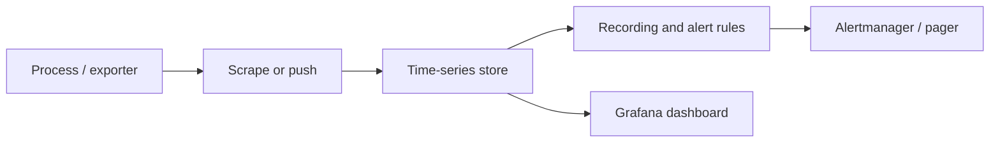

import { ConceptTemplate } from '@/features/kb/components/templates/ConceptTemplate'
import { Callout } from '@/features/kb/components/mdx/Callout'
import { ComparisonTable } from '@/features/kb/components/mdx/ComparisonTable'

export default function Layout({ children }) {
  return (
    <ConceptTemplate title="Metrics">
      {children}
    </ConceptTemplate>
  )
}

**Metrics** are numbers over time. A series is a name plus a label set plus samples. You cannot reconstruct a single request from a metric, but you can tell in seconds whether error rate, latency, or saturation moved. That is why metrics page people and logs explain the page.

## 1. Deep Dive and Mechanics

**Types.** A **counter** only goes up (requests, bytes, errors) — you take `rate` or `increase` to get a useful number. A **gauge** is a point-in-time level (queue depth, heap, in-flight). A **histogram** records observations into buckets so you can estimate percentiles later. A **summary** computes quantiles on the client; you cannot average those quantiles across instances.

**Scrape or push.** Prometheus pulls `/metrics`. StatsD, Datadog, and many cloud agents push. Either way the store is a time-series database that compresses deltas, not a log index.

**Cardinality.** Each unique label combination is a new series. `status` and `method` are fine. `user_id` or `request_id` as labels will OOM the TSDB. Bound the product of label values before you ship.

**Aggregation.** You almost never alert on a raw counter. You alert on a rate, a ratio (errors over requests), or a histogram quantile over a window. Recording rules pre-aggregate expensive queries so dashboards stay cheap.

<Callout icon="error" title="Percentiles are not averages">
P99 of a fleet is not the average of each instance's P99. Histograms merge; summaries do not. If you need a global quantile, use buckets and `histogram_quantile`, not a client-side summary.
</Callout>

## 2. Mathematical / Theoretical Foundation

A sample is the pair (timestamp, value). Storage cost is O(series × samples), not O(events). One counter for a million requests is still one series. Compression (XOR / Gorilla-style) makes dense numeric series tiny compared with log lines.

The four golden signals — **latency, traffic, errors, saturation** — are enough to know a user-facing system is sick. Availability over a window is successful events divided by valid events. Error budget is 1 minus the SLO.

<ComparisonTable
  headers={['Signal', 'What it answers', 'Cost at scale', 'Good for paging']}
  rows={[
    ['Metrics', 'Is it broken now?', 'Low', 'Yes'],
    ['Logs', 'What exactly happened?', 'High', 'Rarely'],
    ['Traces', 'Where did the request go?', 'Medium', 'No — too sparse'],
    ['Profiles', 'Which code is hot?', 'Medium', 'No'],
  ]}
/>

## 3. Real-World Implementation

```text
# HELP http_requests_total Total HTTP requests
# TYPE http_requests_total counter
http_requests_total{method="GET", status="200", app="checkout"} 18420
http_requests_total{method="GET", status="500", app="checkout"} 37
```

PromQL for a pageable error ratio (avoid curly-brace prose; this lives in a query box):

```promql
sum(rate(http_requests_total{status=~"5..", app="checkout"}[5m]))
/
sum(rate(http_requests_total{app="checkout"}[5m]))
```

Alert when that ratio stays above the SLO burn you chose, not on a single 500.

## 4. Visualizations



## 5. Interview Prep

**Q: Counter versus gauge?**
**A:** Counters are cumulative; you must rate them and they reset on restart. Gauges are the current value. Mixing them up makes every chart a lie.

**Q: Why not put user id on a metric?**
**A:** Cardinality. One series per user is a denial-of-service against your own TSDB. Put identifiers in logs or traces.

**Q: How do you get P99 without storing every latency?**
**A:** Histogram buckets. You trade a small amount of quantile error for mergeable, cheap storage.

## 6. Production Use Cases

- **SLO burn alerts** on availability and latency, not on CPU graphs.
- **Capacity** — traffic and saturation trends to buy machines before a sale.
- **Canaries** — compare error ratio of version A versus version B on the same metric names.

<Callout icon="tip" title="Name the unit in the metric">
`_total` for counters, `_seconds` or `_bytes` for units, `_bucket` for histograms. Future you will not remember what a bare `latency` means at 3 a.m.
</Callout>
