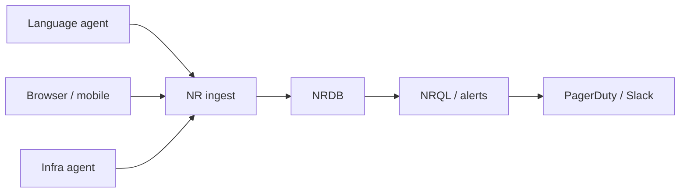

import { ConceptTemplate } from '@/features/kb/components/templates/ConceptTemplate'
import { Callout } from '@/features/kb/components/mdx/Callout'
import { ComparisonTable } from '@/features/kb/components/mdx/ComparisonTable'

export default function Layout({ children }) {
  return (
    <ConceptTemplate title="New Relic">
      {children}
    </ConceptTemplate>
  )
}

**New Relic** is an application performance monitoring platform. You attach a language agent (Java, .NET, Node, Python, Ruby, Go, PHP) and it times transactions, SQL, external calls, and errors without you drawing every span by hand. The product grew from “slow page, which query?” into a full telemetry cloud: APM, infra, browser, mobile, logs, and synthetics on one account.

## 1. Deep Dive and Mechanics

**Language agent.** The agent wraps the HTTP stack and common libraries. Each inbound request becomes a **transaction**. Slow or erroring transactions keep a **trace** — a waterfall of segments (controller, ORM, Redis, HTTP client). That is the classic New Relic screenshot: 50 ms of app, 7.9 s of `SELECT`.

**Telemetry Data Platform.** Metrics, events, logs, and traces land in NRDB. You query with **NRQL**. Dashboards and alert conditions are NRQL under the hood. Sampling and harvest cycles (typical 60 s) mean you see near-real-time, not tick-by-tick kernel traces.

**Infinite Tracing / OTel.** Newer stacks send OpenTelemetry to New Relic instead of (or as well as) the proprietary agent. Tail-based sampling can keep the interesting 1 percent of traces after they finish, which head-based 10 percent sampling cannot.

**Browser and synthetics.** Real User Monitoring injects a snippet and measures front-end paint and Ajax. Synthetics hit URLs from the outside so you notice a CDN or DNS failure before APM does.

<Callout icon="warning" title="The agent is in-process">
A bad agent version, a huge custom attribute, or `recordCustomEvent` in a hot loop will steal latency from the app you are watching. Treat agent upgrades like runtime upgrades.
</Callout>

## 2. Mathematical / Theoretical Foundation

APM latency is a distribution. New Relic historically emphasized **average** plus a slow-trace sample. Averages hide multimodality — a 50 ms mode and a 2 s mode look “fine” as 80 ms. Prefer Apdex, histogram percentiles, or an SLI ratio (good events over valid events) for paging.

Apdex score: satisfied count plus half the tolerating count, divided by total samples, for a chosen T threshold.

<ComparisonTable
  headers={['Product', 'How it sees code', 'Query language', 'Lock-in risk']}
  rows={[
    ['New Relic', 'Language agent + NRQL', 'NRQL', 'High if only NRQL'],
    ['Datadog', 'Agent + APM libraries', 'PromQL-ish + logs', 'High'],
    ['Prometheus + Grafana', 'Exporters you own', 'PromQL', 'Low'],
    ['OpenTelemetry + vendor', 'OTLP, swap exporter', 'Vendor-specific', 'Medium'],
  ]}
/>

## 3. Real-World Implementation

```sql
SELECT percentile(duration, 95), count(*)
FROM Transaction
WHERE appName = 'checkout'
AND httpResponseCode >= 500
SINCE 30 minutes ago
FACET name
```

Agent config sketch (do not paste secrets into repos):

```yaml
common: &default
  license_key: USE_A_SECRET_STORE
  app_name: checkout
  distributed_tracing:
    enabled: true
  application_logging:
    enabled: true
```

Map `app_name` to the same string you use in Prometheus and Loki so humans can jump signals.

## 4. Visualizations



## 5. Interview Prep

**Q: APM versus infra monitoring?**
**A:** Infra tells you the box is hot. APM tells you which transaction and which datastore made the user wait. You need both; paging on CPU alone is a junior habit.

**Q: Why does New Relic miss a spike that Prometheus saw?**
**A:** Harvest interval, sampling, and different aggregations. A 15 s Prom scrape of a counter can catch a 20 s burst that a 60 s APM rollup smoothed away.

**Q: How do you avoid vendor lock-in?**
**A:** Emit OpenTelemetry from the app. Use New Relic as a backend. Keep SLIs in PromQL as well if the contract matters more than the UI.

## 6. Production Use Cases

- **Monoliths** where one transaction name maps to a controller action and a slow SQL list is the daily bread.
- **Retail peak** — watch checkout transaction error rate and datastore time, not just host count.
- **Frontend SLAs** — combine browser page-load percentiles with synthetics so marketing and eng share one number.

<Callout icon="tip" title="Name transactions on purpose">
Default names explode (`GET /user/12345`). Use a framework plugin or `setTransactionName` so cardinality stays at “route,” not “row id.”
</Callout>
