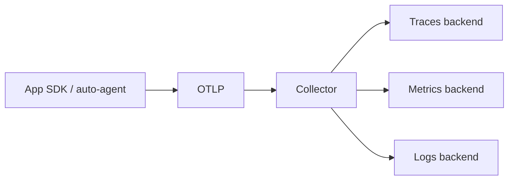

import { ConceptTemplate } from '@/features/kb/components/templates/ConceptTemplate'
import { Callout } from '@/features/kb/components/mdx/Callout'
import { ComparisonTable } from '@/features/kb/components/mdx/ComparisonTable'

export default function Layout({ children }) {
  return (
    <ConceptTemplate title="OpenTelemetry">
      {children}
    </ConceptTemplate>
  )
}

**OpenTelemetry (OTel)** is the vendor-neutral way to produce telemetry. The app speaks the API. The SDK records. The **Collector** receives OTLP, processes, and exports to Jaeger, Tempo, Prometheus, Loki, Datadog, or three of those at once. Switching vendors becomes a Collector config change, not a rewrite of every service.

## 1. Deep Dive and Mechanics

**Signals.** Traces (spans), metrics, and logs share **context**: a trace id and span id travel on the wire (W3C `traceparent` today, B3 still common). Logs that include those fields can jump to a trace.

**API versus SDK versus Collector.** Application code depends on the API. The SDK implements batching, sampling, and exporters. The Collector is a standalone binary: receivers, processors (batch, tail_sampling, redaction), exporters. Sidecar or DaemonSet in Kubernetes is the usual shape.

**Auto-instrumentation.** Java agents and some Python / Node loaders hook HTTP and DB libraries with zero or little code. You still add custom spans around the business operation that libraries cannot see.

**Semantic conventions.** Standard attribute names (`http.route`, `db.system`, `service.name`) make backends comparable. Inventing `svc` in one team and `service` in another breaks every join.

<Callout icon="warning" title="The Collector is in the trust boundary">
It sees tokens, payloads, and customer ids. Redact in a processor before the exporter. Do not run an unauthenticated OTLP receiver on a public IP.
</Callout>

## 2. Mathematical / Theoretical Foundation

Context propagation is a distributed **causal chain**. Each span has a parent id; the graph is a DAG of work for one trace id. Head sampling decides at the root (cheap, biased toward whatever the first service sees). Tail sampling decides after the trace completes (keeps errors and slow traces; needs a collector that buffers).

Metric temporality: **delta** versus **cumulative** must match what the backend expects or rates double-count.

<ComparisonTable
  headers={['Approach', 'App change to switch vendor', 'Processing', 'Typical use']}
  rows={[
    ['Vendor SDK only', 'Rewrite', 'In vendor SaaS', 'Fast start, lock-in'],
    ['OTel SDK + vendor exporter', 'Swap exporter', 'In process', 'Small fleets'],
    ['OTel + Collector', 'Edit Collector YAML', 'Central', 'The default now'],
    ['Dual-write Collector', 'None', 'Fan-out', 'Migration windows'],
  ]}
/>

## 3. Real-World Implementation

```yaml
receivers:
  otlp:
    protocols:
      grpc:
        endpoint: 0.0.0.0:4317
processors:
  batch: {}
  attributes:
    actions:
      - key: user.email
        action: delete
exporters:
  otlp/tempo:
    endpoint: tempo:4317
    tls:
      insecure: true
  prometheusremotewrite:
    endpoint: http://mimir:9009/api/v1/push
service:
  pipelines:
    traces:
      receivers: [otlp]
      processors: [batch, attributes]
      exporters: [otlp/tempo]
    metrics:
      receivers: [otlp]
      processors: [batch]
      exporters: [prometheusremotewrite]
```

Keep `service.name` stable. Everything else is decoration.

## 4. Visualizations



## 5. Interview Prep

**Q: Why not export straight from each pod to Datadog?**
**A:** You will recode to leave. The Collector is where you tail-sample, strip PII, and dual-write during a migration.

**Q: OTLP versus Prometheus scrape?**
**A:** OTLP push is natural for traces and for apps that already have the SDK. Prometheus scrape still wins for infra exporters and simple Go binaries. Many stacks do both.

**Q: What breaks context?**
**A:** A hop that does not forward `traceparent` — an old load balancer, a message bus without headers, a cron that starts work with no parent. The graph splits into orphans.

## 6. Production Use Cases

- **Vendor escape** — keep instrumentation, change exporters over a quarter.
- **Multi-sink** — traces to Tempo, metrics to Mimir, logs to Loki, a copy to a SIEM.
- **Platform teams** — one Collector helm chart, many language SDKs, one semantic convention doc.

<Callout icon="tip" title="Start with auto-instrumentation, then add one custom span">
The custom span should be the business verb: `ReserveInventory`, not `handler`. That is the name humans search when checkout is on fire.
</Callout>
