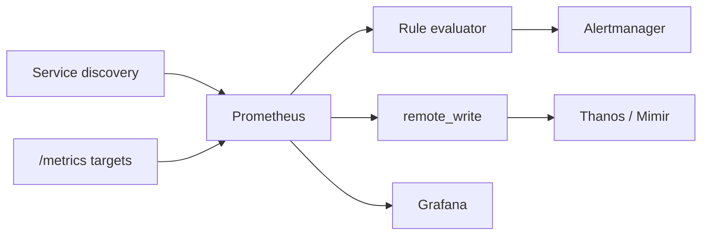

import { ConceptTemplate } from '@/features/kb/components/templates/ConceptTemplate'
import { Callout } from '@/features/kb/components/mdx/Callout'
import { ComparisonTable } from '@/features/kb/components/mdx/ComparisonTable'

export default function Layout({ children }) {
  return (
    <ConceptTemplate title="Prometheus">
      {children}
    </ConceptTemplate>
  )
}

**Prometheus** is the default metrics system for Kubernetes. It **pulls** text expositions, stores samples in a local TSDB, and evaluates **PromQL**. It does not page you by itself — **Alertmanager** groups, inhibits, and routes. Long-term storage is someone else's problem (Thanos, Mimir, Cortex, or a vendor remote_write).

## 1. Deep Dive and Mechanics

**Discovery and scrape.** `kubernetes_sd` asks the API for pods, endpoints, or ingresses. Relabeling keeps or drops targets and maps metadata onto labels. A scrape is an HTTP GET; timeouts and overlapping scrapes are how you melt a slow `/metrics`.

**TSDB.** Head block in memory, compacted blocks on disk, WAL for crash safety. Queries that touch high-cardinality series or huge ranges blow memory in the querier, not in the app.

**PromQL.** Instant vectors versus range vectors. `rate` on counters, `histogram_quantile` on buckets, `increase` for integer-ish events. Recording rules write new series so Grafana does not recompute the same join every 10 s.

**HA pair.** Two Prometheuses scrape the same targets. Alertmanager dedups. They are not a clustered DB — they are two copies. Remote_write ships a third copy to long-term storage.

<Callout icon="error" title="Cardinality is the outage">
A label that includes pod uid, user id, or a raw path with ids creates millions of series. The process OOMs. Drop or hash at the source; do not “just give it more RAM.”
</Callout>

## 2. Mathematical / Theoretical Foundation

`rate(x[5m])` is the per-second average slope of a counter over the range, accounting for resets. It is not instant QPS. Short spikes shorter than the range are smoothed. For paging, pick a range several times the scrape interval (often 4× to 5×) so one missed scrape does not NaN the alert.

Availability SLI: sum of successful rates over sum of valid rates. Burn-rate alerts compare that ratio to the SLO over short and long windows.

<ComparisonTable
  headers={['System', 'Collection', 'Query', 'Long-term story']}
  rows={[
    ['Prometheus', 'Pull scrape', 'PromQL', 'Local days + remote_write'],
    ['InfluxDB', 'Push', 'Flux / InfluxQL', 'Built-in retention'],
    ['Datadog', 'Agent push', 'Datadog query', 'SaaS'],
    ['Graphite', 'Push carbon', 'Functions', 'Whisper / Victoria'],
  ]}
/>

## 3. Real-World Implementation

```yaml
scrape_configs:
  - job_name: kubernetes-pods
    kubernetes_sd_configs:
      - role: pod
    relabel_configs:
      - source_labels: [__meta_kubernetes_pod_annotation_prometheus_io_scrape]
        action: keep
        regex: "true"
      - source_labels: [__meta_kubernetes_pod_annotation_prometheus_io_path]
        action: replace
        target_label: __metrics_path__
        regex: (.+)
```

Alert rule:

```yaml
- alert: CheckoutErrorBudgetBurn
  expr: |
    (
      sum(rate(http_requests_total{app="checkout", status=~"5.."}[5m]))
      /
      sum(rate(http_requests_total{app="checkout"}[5m]))
    ) > 0.01
  for: 10m
  labels:
    severity: page
```

## 4. Visualizations



## 5. Interview Prep

**Q: Why pull instead of push?**
**A:** Failed scrapes are a signal. Discovery is central. Targets do not need the Prom VIP. Push still exists (`pushgateway`) for batch jobs that die before a scrape — use it sparingly.

**Q: Prometheus versus Grafana?**
**A:** Prom stores and alerts. Grafana draws and fans out to Loki and Tempo. Mixing them up in an interview is a tell.

**Q: How do you keep 13 months of metrics?**
**A:** Do not scale a single Prometheus disk forever. remote_write to an object-storage-backed system and query that for history.

## 6. Production Use Cases

- **Kubernetes** — kube-state-metrics, node-exporter, cAdvisor, and app scrapes on one label scheme.
- **SLO pages** — multi-window multi-burn alerts into Alertmanager then PagerDuty.
- **Federation** — edge Proms scrape local jobs; a global Prom or Thanos Query unions them.

<Callout icon="tip" title="Match Loki and Tempo labels">
`app` and `namespace` should be the same strings everywhere. Explore’s jump-to-logs button is a string compare, not magic.
</Callout>
