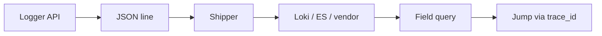

import { ConceptTemplate } from '@/features/kb/components/templates/ConceptTemplate'
import { Callout } from '@/features/kb/components/mdx/Callout'
import { ComparisonTable } from '@/features/kb/components/mdx/ComparisonTable'

export default function Layout({ children }) {
  return (
    <ConceptTemplate title="Structured logging">
      {children}
    </ConceptTemplate>
  )
}

**Structured logging** means the program writes a record with named fields, not a sentence that happens to contain numbers. Humans still read a `msg`. Machines filter on `user_id`, `error_code`, and `trace_id`. When someone rewords the sentence, the query does not die.

## 1. Deep Dive and Mechanics

**One object per line.** JSON Lines (NDJSON) is the interop default. A shipper (Fluent Bit, Alloy, Filebeat) parses the object and forwards. Multiline Java stack traces need an explicit merge rule or they become orphan lines.

**Schema discipline.** Agree field names: `service`, `env`, `trace_id`, `span_id`, `level`. Elastic Common Schema and OTel log conventions exist so you do not invent `traceId` versus `trace_id` twice. Low-cardinality fields can become Loki labels; high-cardinality fields stay in the line.

**Correlation.** Put the current trace id on every log in the request. That is how you walk Metrics → Logs → Traces in Grafana. Without it, structured logs are just prettier grep.

**Levels and sampling.** DEBUG in production is a denial-of-wallet. Sample debug, always keep warn/error, and never log secrets (tokens, PAN, session cookies).

<Callout icon="error" title="Do not stringify the object into a message">
`msg: "user 456 failed"` plus no fields is unstructured logging with extra braces in the file. Emit `event=login_failed` and `user_id=456` as fields.
</Callout>

## 2. Mathematical / Theoretical Foundation

A structured event is a typed tuple. Index cost in Elasticsearch is O(distinct terms × fields). In Loki, index cost is O(streams); the JSON is scanned after stream select. Either way, wide, unique fields (UUIDs as labels) explode cost.

Query time: equality on an indexed field is roughly O(posting list). Regex on a free-text `msg` is O(bytes scanned). Structure moves work from query time to emit time.

<ComparisonTable
  headers={['Style', 'Example shape', 'Query fragility', 'Machine use']}
  rows={[
    ['Printf text', 'User 456 failed from 10.0.0.1', 'High — regex', 'Poor'],
    ['Structured JSON', 'event plus typed fields', 'Low', 'Filters and metrics'],
    ['Wide events', 'One fat record per request', 'Low', 'Analytics'],
    ['Binary / protobuf logs', 'Schema-first', 'Low', 'High volume internals'],
  ]}
/>

## 3. Real-World Implementation

```javascript
logger.info({
  event: 'login_failed',
  user_id: 456,
  ip: '10.0.0.1',
  reason: 'invalid_password',
  trace_id: ctx.traceId,
  service: 'auth',
  env: 'prod'
}, 'login failed')
```

Loki-style metric from structured lines (after the stream select):

```logql
sum by (reason) (
  count_over_time({app="auth"} | json | event="login_failed" [5m])
)
```

Prefer an application counter for the same event if the page is an SLO. Logs can lag or drop.

## 4. Visualizations



## 5. Interview Prep

**Q: Why JSON and not logfmt?**
**A:** Both are structured. JSON wins on nested objects and ecosystem parsers. Logfmt is nicer for humans in a terminal. Pick one per pipeline and do not mix in the same stream.

**Q: Should request id be a Loki label?**
**A:** No. It is unique per request. Keep it in the JSON. Label `app` and `namespace` only.

**Q: How do you test logs?**
**A:** Assert on fields in unit tests. Snapshot the event name and required keys. Do not assert on full English sentences.

## 6. Production Use Cases

- **Audit** — `event`, actor, target, outcome as queryable columns.
- **Checkout errors** — count `reason` without parsing English.
- **Security** — ship the same structured stream to the SIEM with PII stripped.

<Callout icon="tip" title="Stable event names are APIs">
`login_failed` is a contract. Renaming it breaks dashboards the same way renaming a metric does. Version or add, do not silently rename.
</Callout>
