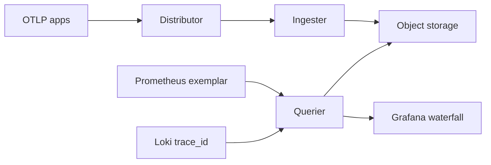

import { ConceptTemplate } from '@/features/kb/components/templates/ConceptTemplate'
import { Callout } from '@/features/kb/components/mdx/Callout'
import { ComparisonTable } from '@/features/kb/components/mdx/ComparisonTable'

export default function Layout({ children }) {
  return (
    <ConceptTemplate title="Tempo">
      {children}
    </ConceptTemplate>
  )
}

**Grafana Tempo** stores traces the way Loki stores logs: **object storage first**, small index, huge volume. The original contract was “give me a trace id.” You found that id in a Loki line or a Prometheus exemplar. Later **TraceQL** added search, but the cheap path is still id lookup, not “all traces where user equals …”.

## 1. Deep Dive and Mechanics

**Write path.** OTLP, Jaeger, or Zipkin receivers on the distributor. Ingesters batch spans into blocks. Compactors rewrite blocks in S3/GCS/Azure Blob. No Cassandra cluster required.

**Read path.** Querier fetches a block by trace id. That is a key-value get, not a fan-out search. TraceQL search walks a search index or scans — use tight time ranges and service names or you will pay for a cluster-wide read.

**Grafana join.** Exemplars on Prometheus histograms carry a trace id. Loki lines carry `trace_id`. Explore stitches the three. If the strings do not match, the button does nothing.

**Sampling.** Tempo will happily store 100 percent of traces until the bill arrives. Head or tail sample in the OTel Collector. Keep errors and slow traces; drop the 20 ms health checks.

<Callout icon="warning" title="Search is not Elasticsearch">
Tempo is the wrong backend if the product requirement is “find this customer id in any span tag for 30 days.” That is a different cost model. Use metrics and logs to find the id, then Tempo to render the waterfall.
</Callout>

## 2. Mathematical / Theoretical Foundation

Id lookup is O(1) against an index of block metadata plus an object get. Full tag search is O(spans scanned in range) unless you pay for a search index. Retention cost is roughly compressed bytes in the bucket plus a little request tax. Indexing every span attribute would return you to Jaeger-on-ES prices.

<ComparisonTable
  headers={['Backend', 'Primary lookup', 'Storage', 'Ops weight']}
  rows={[
    ['Tempo', 'Trace id + TraceQL', 'Object store', 'Low'],
    ['Jaeger + ES/Cassandra', 'Tag search', 'Clustered DB', 'High'],
    ['Zipkin', 'Id + limited search', 'You choose', 'Medium'],
    ['Vendor APM', 'UI search', 'SaaS', 'Low ops, high $'],
  ]}
/>

## 3. Real-World Implementation

Grafana datasource: point Tempo at the query frontend. In the app, always log the trace id:

```javascript
log.info({ trace_id: span.spanContext().traceId, event: 'checkout_failed' }, 'checkout failed')
```

Collector tail sample (keep failures):

```yaml
processors:
  tail_sampling:
    decision_wait: 10s
    policies:
      - name: errors-keep
        type: status_code
        status_code:
          status_codes: [ERROR]
      - name: percent-ok
        type: probabilistic
        probabilistic:
          sampling_percentage: 5
```

## 4. Visualizations



## 5. Interview Prep

**Q: Why is Tempo cheaper than Jaeger plus Elasticsearch?**
**A:** It does not build a full inverted index of every tag. You buy object storage and accept a discovery workflow through metrics and logs.

**Q: What is an exemplar?**
**A:** A trace id attached to a metric sample (often a histogram observation). Click the spike, open the trace. Requires Prometheus and a client that emits exemplars.

**Q: Can Tempo replace APM?**
**A:** For server-side distributed traces, yes if you invest in instrumentation. You lose polished vendor features (session replay, CI deploy markers) unless you add them elsewhere.

## 6. Production Use Cases

- **Grafana stack** — Mimir + Loki + Tempo with one label vocabulary.
- **Cost-down** from a Jaeger/ES cluster that only ever opened traces from error logs.
- **High-cardinality services** where you cannot index every user id but still need waterfalls for the traces you kept.

<Callout icon="tip" title="Put the trace id in the error metric path">
If the page is a Prom alert, the runbook should say: open the graph, pick an exemplar, open Tempo. If there is no exemplar, the instrumentation is unfinished.
</Callout>
