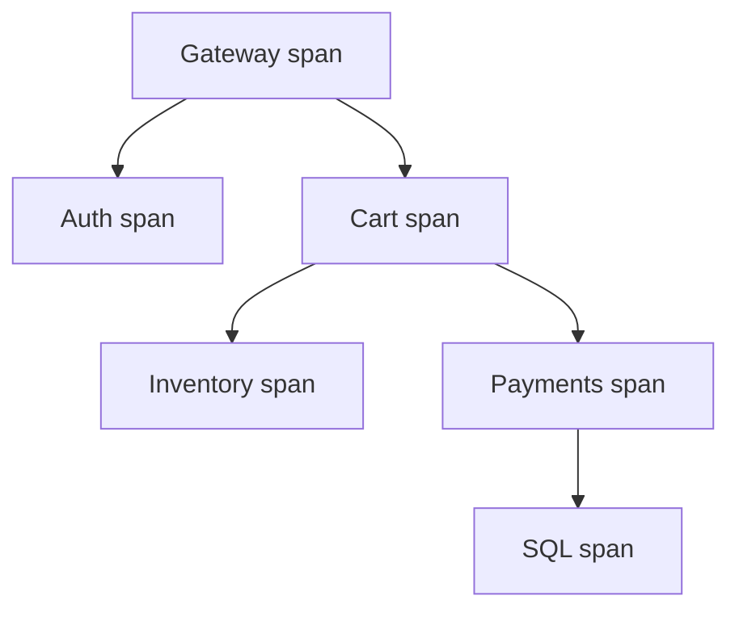

import { ConceptTemplate } from '@/features/kb/components/templates/ConceptTemplate'
import { Callout } from '@/features/kb/components/mdx/Callout'
import { ComparisonTable } from '@/features/kb/components/mdx/ComparisonTable'

export default function Layout({ children }) {
  return (
    <ConceptTemplate title="Traces">
      {children}
    </ConceptTemplate>
  )
}

**Traces** record one request’s life across process boundaries. A **trace** is the whole graph. A **span** is one unit of work (inbound HTTP, a SQL round trip, a queue publish). Metrics tell you the fleet is slow. A trace tells you the 4.9 s is inside `users` waiting on Postgres, not inside the gateway.

## 1. Deep Dive and Mechanics

**Identifiers.** Trace id (128-bit) is global for the request. Span id is local. Parent span id builds the tree. W3C `traceparent` carries version, trace id, span id, and flags on HTTP. Messaging and async jobs must copy the same fields or the graph breaks.

**Waterfall.** Duration is end minus start. A parent that is long while children are short has local work or a missing child (uninstrumented hop). A child that is long is the bottleneck. Exclusive time is parent duration minus children — that is “our code.”

**Sampling.** 100 percent at retail scale is usually unaffordable. Head sampling at the edge is simple and biased. Tail sampling keeps errors and outliers after the fact. Consistent sampling (same decision for a trace id) is required or you store half-trees.

**Baggage.** Optional key-values that propagate (tenant, experiment). Keep it tiny. Baggage is not a database.

<Callout icon="warning" title="A missing hop looks like a fast service">
If the gateway does not propagate context, you get many root spans and no edges. The waterfall lies. Fix the headers before you buy a bigger tracing backend.
</Callout>

## 2. Mathematical / Theoretical Foundation

A trace is a **DAG**. Cycles mean clock or instrumentation bugs. Critical path is the longest root-to-leaf duration chain — that is the lower bound on request latency even if you parallelize the rest.

Sampling estimator: if you keep probability p of traces, a rare 0.01 percent error class may never appear. Condition on errors (always keep) or you will “prove” the system is healthy.

<ComparisonTable
  headers={['Pillar', 'Grain', 'Question', 'Typical sample rate']}
  rows={[
    ['Metrics', 'Aggregates', 'Is the SLO burning?', '100 percent of events, aggregated'],
    ['Logs', 'Per event line', 'What did this instance say?', 'All errors, sampled info'],
    ['Traces', 'Per request graph', 'Where did time go?', '1 to 10 percent plus all errors'],
    ['Profiles', 'Stacks over time', 'Which function is hot?', 'Continuous, cheap'],
  ]}
/>

## 3. Real-World Implementation

```javascript
import { trace, SpanStatusCode } from '@opentelemetry/api'

const tracer = trace.getTracer('checkout')

export async function checkout(ctx, cart) {
  return tracer.startActiveSpan('ReserveInventory', async (span) => {
    span.setAttribute('cart.items', cart.items.length)
    try {
      await reserve(cart)
      span.setStatus({ code: SpanStatusCode.OK })
    } catch (err) {
      span.recordException(err)
      span.setStatus({ code: SpanStatusCode.ERROR })
      throw err
    } finally {
      span.end()
    }
  })
}
```

Always end the span. Leaked spans become eternal in-memory work or missing tails.

## 4. Visualizations



## 5. Interview Prep

**Q: Span versus transaction?**
**A:** APM “transaction” is often the root inbound request. A span is any timed piece, including the transaction. OTel only has spans.

**Q: Why is my P99 high when every span looks fine?**
**A:** Clock skew, missing spans, queueing before the first span, or a slow client. Also: you are looking at a sampled happy trace, not the slow one. Filter by duration.

**Q: Trace id versus request id?**
**A:** Use one 128-bit W3C trace id everywhere. A second house `X-Request-Id` is fine for access logs if you also store the trace id. Two uncorrelated ids is how joins fail.

## 6. Production Use Cases

- **Microservice latency wars** — show the waterfall in the incident channel instead of opinions.
- **Dependency maps** — service graph from span edges, with the caveat that sampling hides rare edges.
- **SLO forensics** — from a burn alert to an exemplar trace to the bad deploy.

<Callout icon="tip" title="Name spans like product verbs">
`POST /v2/cart/items` is a route. `AddToCart` is what on-call searches. Semantic conventions cover the HTTP shape; you still own the business name.
</Callout>
