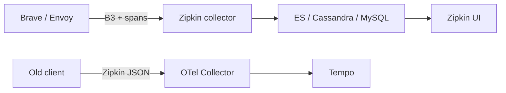

import { ConceptTemplate } from '@/features/kb/components/templates/ConceptTemplate'
import { Callout } from '@/features/kb/components/mdx/Callout'
import { ComparisonTable } from '@/features/kb/components/mdx/ComparisonTable'

export default function Layout({ children }) {
  return (
    <ConceptTemplate title="Zipkin">
      {children}
    </ConceptTemplate>
  )
}

**Zipkin** is the tracing system Twitter open-sourced in 2012 after Google’s Dapper paper. The UI and server are no longer the default greenfield choice (Jaeger and Tempo ate that), but **B3 propagation** — `X-B3-TraceId`, `X-B3-SpanId`, `X-B3-Sampled` — is still on the wire in Envoy, Spring, and older meshes. Knowing Zipkin is knowing why those headers exist.

## 1. Deep Dive and Mechanics

**Components.** Instrumented apps emit spans (HTTP, Kafka, or Scribe in the old days). A **collector** receives them. **Storage** is pluggable (Cassandra, Elasticsearch, MySQL for demos). The **query** service and UI look up by trace id and offer limited tag search.

**B3.** Single-header B3 (`b3: traceid-spanid-sampled`) and the multi-header form both exist. `X-B3-Sampled` is 0 or 1 (sometimes `true`). Downstream must honor the sampled flag or you get inconsistent trees.

**Brave / Spring Sleuth / Micrometer.** The Java ecosystem spoke Zipkin for years. Many apps still export Zipkin JSON even when the backend is Tempo or a vendor (they ingest the format).

**Sampling.** The first service flips a coin. If sampled, every child sets the flag. That is head-based sampling. Cheap and biased toward whatever hit the edge.

<Callout icon="info" title="Zipkin is a format as much as a product">
OTel Collectors have a Zipkin receiver. You can retire the Zipkin server and keep the old clients until you finish the SDK migration.
</Callout>

## 2. Mathematical / Theoretical Foundation

Dapper’s insight: traces are samples from a latency distribution. A 1 percent sample of a high-QPS service still yields thousands of traces per minute — enough to estimate the shape, not enough to debug one user’s 10-minute-ago request unless you also log the id or raise the sample rate for errors.

Header overhead is constant per hop. The cost that matters is span export volume: O(sampled requests × spans per request).

<ComparisonTable
  headers={['System', 'Propagation', 'Search model', 'Where you see it']}
  rows={[
    ['Zipkin', 'B3', 'Id + light tags', 'Legacy Java / Envoy'],
    ['Jaeger', 'Jaeger + B3 + W3C', 'Tag search on ES', 'Older K8s installs'],
    ['OTel + Tempo', 'W3C traceparent', 'Id + TraceQL', 'Grafana stacks'],
    ['Vendor APM', 'Vendor + W3C', 'UI', 'Enterprises'],
  ]}
/>

## 3. Real-World Implementation

Envoy-style B3 (config conceptually):

```yaml
tracing:
  provider:
    name: envoy.tracers.zipkin
    typed_config:
      '@type': type.googleapis.com/envoy.config.trace.v3.ZipkinConfig
      collector_cluster: zipkin
      collector_endpoint: /api/v2/spans
      collector_endpoint_version: HTTP_JSON
```

Migrate by accepting Zipkin on the Collector and exporting OTLP to Tempo. Do not dual-run two sampling dice.

## 4. Visualizations



## 5. Interview Prep

**Q: B3 versus W3C `traceparent`?**
**A:** Same job, different bytes. W3C is the present standard. B3 is the installed base. Gateways must translate or you split traces at the edge.

**Q: Why did Tempo win over Zipkin server for new stacks?**
**A:** Object storage economics and Grafana integration. Zipkin’s storage options were “run a cluster.” The Zipkin data model still maps cleanly.

**Q: What does `X-B3-Flags` do?**
**A:** Debug / forced sampling. One client sending debug=1 on every request will drown the backend. Treat it like a dump permission.

## 6. Production Use Cases

- **Brownfield Java** — Sleuth/Brave still emitting Zipkin while the platform team stands up OTel.
- **Service mesh** — Envoy Zipkin tracer pointed at a Collector, not at a laptop demo MySQL.
- **Header translation** — edge proxy converts B3 to W3C so new services only speak `traceparent`.

<Callout icon="tip" title="One sampler to rule them all">
If Envoy samples at 1 percent and the app samples at 10 percent independently, trees are shredded. Decide sampling once, usually at the mesh or Collector.
</Callout>
