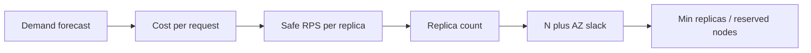

import { ConceptTemplate } from '@/features/kb/components/templates/ConceptTemplate'
import { Callout } from '@/features/kb/components/mdx/Callout'
import { ComparisonTable } from '@/features/kb/components/mdx/ComparisonTable'

export default function Layout({ children }) {
  return (
    <ConceptTemplate title="Capacity planning">
      {children}
    </ConceptTemplate>
  )
}

**Capacity planning** turns a demand forecast into a resource plan with a safety margin. Autoscaling reacts after load arrives. Planning answers “will we survive Black Friday if a zone dies at peak?” You measure how much of a machine one request costs, multiply by the peak you believe, then add redundancy and queueing slack.

## 1. Deep Dive and Mechanics

**Baseline.** Load-test until the SLO breaks, not until the box falls over. Record RPS (or concurrent sessions) at the latency and error limits you actually page on. That number is the **safe capacity** of one replica, not the lab max.

**Demand.** Marketing’s “10× traffic” is a story. Convert it to arrival rate, payload size, cache hit ratio, and write amplification. A 10× hit rate on a 90 percent cache is a 10× origin storm if the cache is cold.

**Headroom and N+1.** Provision so that after one AZ or one node pool disappears, remaining capacity still holds peak. Horizontal: extra replicas. Vertical: leave CPU below the knee (often 60–70 percent) because tail latency explodes before average CPU looks “full.”

**Bottleneck tour.** The web tier is rarely the limit. Connection pools, disk IOPS, NAT ports, certificate QPS, and downstream quotas fail first. Plan the constraint, not the pretty dashboard.

<Callout icon="warning" title="Autoscaling is not a plan">
HPA needs spare node-pool capacity, image pull time, and warm JVM/JIT. A 15-minute scale-up against a 2-minute flash sale is a documented outage. Keep a floor of warm replicas for known peaks.
</Callout>

## 2. Mathematical / Theoretical Foundation

Little’s law: L = λW. Concurrent in-flight work equals arrival rate times residence time. If latency doubles at the same RPS, you need twice the concurrency (threads, connections, pods) or you queue.

Utilization ρ = λ / μ for a single server. M/M/1 queue delay blows up as ρ → 1. That is why “run at 95 percent CPU to save money” is a latency tax.

Forecast: required replicas ≈ ceil(peak_λ / safe_λ_per_replica) × redundancy_factor × (1 + buffer).

<ComparisonTable
  headers={['Method', 'When it works', 'Failure mode', 'Cost']}
  rows={[
    ['Load test + Little’s law', 'Known peak shape', 'Lab is not prod mix', 'Eng time'],
    ['Trend the golden signals', 'Organic growth', 'Misses a launch cliff', 'Low'],
    ['HPA only', 'Diurnal wobble', 'Cold start at the sale', 'Looks cheap'],
    ['Overprovision 3× forever', 'Always', 'Finance revolt', 'High'],
  ]}
/>

## 3. Real-World Implementation

```text
safe_rps_per_pod   = 500     # at p99 < 200 ms, error ratio < 0.1%
forecast_peak_rps  = 10000
az_loss_factor     = 1 / 0.66   # survive losing one of three AZs
buffer             = 1.2        # forecast error and cold cache
pods = ceil(10000 / 500 * az_loss_factor * buffer)  # 37
```

k6 sketch to find `safe_rps_per_pod`:

```javascript
import http from 'k6/http'
import { check } from 'k6'

export const options = {
  stages: [
    { duration: '5m', target: 200 },
    { duration: '10m', target: 500 },
    { duration: '5m', target: 0 }
  ],
  thresholds: {
    http_req_failed: ['rate<0.001'],
    http_req_duration: ['p(99)<200']
  }
}
```

Stop raising target when a threshold fails. That RPS is the ceiling, not a stretch goal.

## 4. Visualizations



## 5. Interview Prep

**Q: Capacity versus scalability?**
**A:** Capacity is how much you can take today. Scalability is how cost and latency grow when you add more. A system can have spare capacity and still be unscalable (a single primary database).

**Q: Why not size from average CPU?**
**A:** Averages hide the saturated core, the stop-the-world GC, and the lock. Size from SLO-breaking load and from pool exhaustion.

**Q: How do you plan for a dependency you do not own?**
**A:** Ask for their published QPS quota, cache aggressively, shed load, and put their limit in the same spreadsheet as your pods. Your 40 pods mean nothing if the payments API caps you at 200 RPS.

## 6. Production Use Cases

- **Peak events** — reserved capacity and pre-warmed pools a week out, not the morning of.
- **Migrations** — dual-running old and new stacks needs ~2× for a while; plan the bill.
- **Cost reviews** — show unused headroom versus the AZ-loss scenario so finance does not harvest the slack that is the DR plan.

<Callout icon="tip" title="Revisit after every architecture change">
A new fan-out to three backends triples downstream capacity need. The spreadsheet from last November is now fiction.
</Callout>
