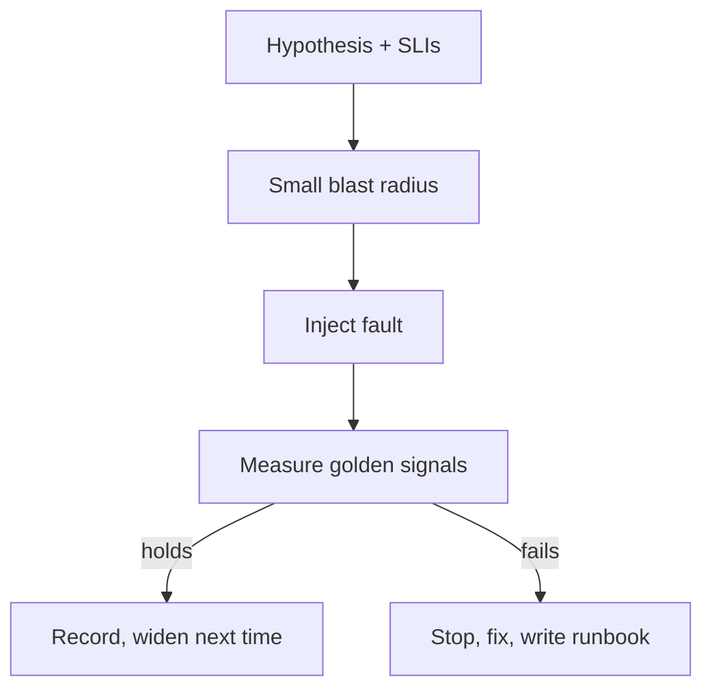

import { ConceptTemplate } from '@/features/kb/components/templates/ConceptTemplate'
import { Callout } from '@/features/kb/components/mdx/Callout'
import { ComparisonTable } from '@/features/kb/components/mdx/ComparisonTable'

export default function Layout({ children }) {
  return (
    <ConceptTemplate title="Chaos engineering">
      {children}
    </ConceptTemplate>
  )
}

**Chaos engineering** is the scientific method applied to production failure. You state a hypothesis (“if Redis dies, checkout falls back to Postgres within 2 s and the error ratio stays under 1 percent”), inject a fault with a **bounded blast radius**, measure the golden signals, and stop if the hypothesis fails. Netflix’s Chaos Monkey made the idea famous. The discipline is the experiment design, not the kill script.

## 1. Deep Dive and Mechanics

**Steady state.** Define it in SLI language before you touch anything: error ratio, p99, in-flight checkouts. If you cannot graph success, you cannot tell chaos from an organic incident.

**Faults.** Kill a pod or node, partition a network, add latency, expire certificates, fill a disk, throttle a dependency, flip a feature flag. Start with staging, then a canary slice of prod, then a region. Never the first experiment on the write path of payments at 100 percent.

**Blast radius.** One shard, one percent of traffic, one AZ, abort criteria wired to the same SLIs. Game days put humans in the loop. Automated chaos (Gremlin, Chaos Mesh, Litmus, fishtank scripts) still needs a kill switch.

**Game days.** Scheduled, with an incident commander, a communications lead, and a written stop condition. The point is to find the missing runbook, not to surprise on-call on a Friday.

<Callout icon="error" title="No hypothesis, no experiment">
“Let’s see what happens if we kill the primary” is an incident you scheduled. Write the expected user-visible outcome and the abort metric first.
</Callout>

## 2. Mathematical / Theoretical Foundation

You are sampling the system’s response surface. A single kill proves little; a series of faults with measured recovery time estimates MTTR under that class. Confidence grows with coverage of failure modes, not with drama.

Blast radius as expected user harm: fraction_of_traffic × duration × severity. Design so that product and legal already accepted that product. Error-budget spend should be explicit — chaos that burns the monthly budget is a failed process, not a badge.

<ComparisonTable
  headers={['Practice', 'Environment', 'Goal', 'Risk']}
  rows={[
    ['Unit / integration tests', 'CI', 'Known cases', 'False green'],
    ['Load test', 'Lab', 'Capacity knee', 'Wrong mix'],
    ['Chaos experiment', 'Prod-like / prod slice', 'Unknown unknowns', 'Real users if unbounded'],
    ['Game day', 'Prod with staff', 'People + process', 'Calendar cost'],
  ]}
/>

## 3. Real-World Implementation

Chaos Mesh style pod kill (concept):

```yaml
apiVersion: chaos-mesh.org/v1alpha1
kind: PodChaos
metadata:
  name: checkout-redis-kill
  namespace: chaos
spec:
  action: pod-kill
  mode: one
  duration: '30s'
  selector:
    namespaces: ['prod']
    labelSelectors:
      app: redis
      pool: checkout-canary
```

Hypothesis card the team signs:

```text
Steady state: checkout error ratio < 0.5% and p99 < 300 ms
Fault: kill one canary Redis replica for 30s
Expect: failover < 5s, no SLO burn on the canary slice
Abort: error ratio > 2% for 1 minute — halt and revert
```

## 4. Visualizations



## 5. Interview Prep

**Q: How is this different from testing HA?**
**A:** HA tests the failover you designed. Chaos finds the hidden coupling — the one DNS cache, the one stateful singleton, the client that does not retry.

**Q: Is production required?**
**A:** Production-like traffic and data shape are required. Many faults are safe on a canary. Some (IAM, global control planes) only exist in prod. Start wherever the hypothesis can be falsified safely.

**Q: Who approves?**
**A:** Service owners plus whoever owns the error budget. Chaos is a planned budget spend, like a deploy.

## 6. Production Use Cases

- **After a postmortem** — replay the failure class on a schedule so the fix stays fixed.
- **Kubernetes platforms** — regular node drains and zone loss on non-critical namespaces.
- **Dependency contracts** — inject 500s from a stub payments API and prove the circuit breaker opens.

<Callout icon="tip" title="Instrument the experiment itself">
A `chaos.experiment` metric with name and result makes the game day visible next to the SLO. If nobody can see it, it did not happen.
</Callout>
