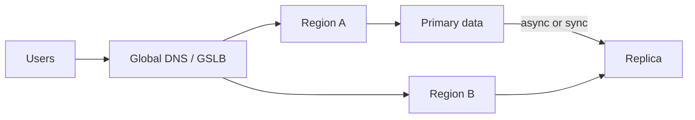

import { ConceptTemplate } from '@/features/kb/components/templates/ConceptTemplate'
import { Callout } from '@/features/kb/components/mdx/Callout'
import { ComparisonTable } from '@/features/kb/components/mdx/ComparisonTable'

export default function Layout({ children }) {
  return (
    <ConceptTemplate title="Disaster recovery">
      {children}
    </ConceptTemplate>
  )
}

**Disaster recovery (DR)** is what you do when high availability is not enough: a whole region, a ransomware event, or a bad global config. HA keeps a node from ruining lunch. DR assumes the building — or the AWS region — is gone. The business picks **RPO** (how much data you may lose) and **RTO** (how long you may be down). Engineering picks the topology that can meet both, then **rehearses**.

## 1. Deep Dive and Mechanics

**Tiers.** Backup-and-restore (cold): cheap, slow RTO. Pilot light: core data replicated, compute off. Warm standby: scaled-down stack running. Hot / active-active: both sites serve traffic. Cost and complexity rise in that order.

**Data first.** Stateless pods are easy. Databases, object stores, Kafka offsets, and secrets are the DR. Async replica implies non-zero RPO. Sync cross-region implies latency and a new failure mode (the replica stalls writes).

**Control plane.** Terraform state, DNS, IdP, artifact registries, and CI must exist outside the burning region or you cannot fail over. “We have replicas” is incomplete if `terraform apply` needs a state bucket that lived in us-east-1.

**Drills.** A plan never restored is a wish. Fail over a non-critical service on a cadence. Measure actual RTO. The number in the slide deck is always optimistic.

<Callout icon="error" title="Backups are not DR until a restore works">
Untested snapshots fail on encryption keys, IAM, and “we never backed up the schema registry.” Restore into an empty account at least once a quarter.
</Callout>

## 2. Mathematical / Theoretical Foundation

RPO is the maximum acceptable time between the last durable copy and the disaster. If backups are daily, RPO cannot be 5 minutes. RTO is the maximum acceptable time from disaster to service restored (including detection, decision, DNS, data replay).

Availability of a dual-site design is not 1 minus (p1 × p2) if the sites share fate (same IaC bug, same identity provider, same container registry). Independence is an assumption you must design for.

<ComparisonTable
  headers={['Pattern', 'Typical RPO', 'Typical RTO', 'Bill']}
  rows={[
    ['Daily backup', 'Hours', 'Hours to days', 'Low'],
    ['Pilot light', 'Minutes (replica)', 'Tens of minutes', 'Medium'],
    ['Warm standby', 'Seconds to minutes', 'Minutes', 'High'],
    ['Active-active', 'Near zero', 'Seconds', '≈ 2×'],
  ]}
/>

## 3. Real-World Implementation

```text
# DR runbook excerpt — fail DNS only after data is writable
1. Declare SEV-1 DR, IC owns the call
2. Promote Postgres replica in eu-west-1 (ensure lag < RPO)
3. Point internal config to the new primary
4. Scale warm ASG to peak min
5. Flip weighted DNS 0/100
6. Freeze deploys; open comms to status page
```

Terraform reminder: state and modules in a third region or another cloud. Document the break-glass user that does not depend on the down IdP.

## 4. Visualizations



## 5. Interview Prep

**Q: DR versus HA?**
**A:** HA is redundant components in one failure domain (or a few). DR is a second failure domain with a tested promotion story. Multi-AZ is often HA, not DR.

**Q: Why not always active-active?**
**A:** Conflict resolution, 2× cost, and double the ways to ship a bad config globally. Many businesses are fine with a 30-minute RTO.

**Q: What is a DR paradox?**
**A:** The more automation you use to fail over, the more a bug in that automation is itself a disaster. Guard with human approval for the last DNS flip when you can afford the minutes.

## 6. Production Use Cases

- **Regulated finance** — documented RPO/RTO, evidence of restores, separate legal entity accounts.
- **SaaS regional outages** — warm standby and status-page comms, not heroics in a single region.
- **Ransomware** — immutable, offline backups with a restore path that does not trust the infected control plane.

<Callout icon="tip" title="Write RPO and RTO on the service charter">
If product never signed the numbers, you will invent a hot standby for a blog and daily dumps for payments. Make them pick.
</Callout>
