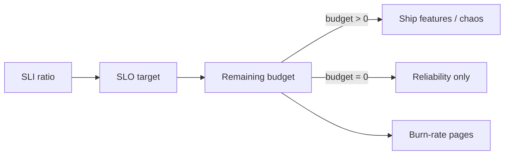

import { ConceptTemplate } from '@/features/kb/components/templates/ConceptTemplate'
import { Callout } from '@/features/kb/components/mdx/Callout'
import { ComparisonTable } from '@/features/kb/components/mdx/ComparisonTable'

export default function Layout({ children }) {
  return (
    <ConceptTemplate title="Error budgets">
      {children}
    </ConceptTemplate>
  )
}

An **error budget** is 1 minus the SLO, measured over the same window as the SLO. A 99.9 percent availability objective over 30 days allows 0.1 percent failed valid requests — about 43 minutes if you think in time, or a count of bad events if you think in requests. The budget is **currency**. Deploys, chaos, and sharp edges spend it. When it hits zero, feature launches stop and reliability work wins. That is the truce between product velocity and operations fear.

## 1. Deep Dive and Mechanics

**Count events, not wall time, when you can.** A 10-minute outage at noon is not equal to 10 minutes at 4 a.m. Request-based SLIs make the budget match user pain. Time-based SLIs are a fallback for batch or always-on streams.

**Burn rate.** Fast burn (14× the allowed rate for one hour) pages immediately. Slow burn (2× over three days) pages the team before the month is quietly dead. Google’s multi-window multi-burn alerts are the standard recipe.

**Policy.** Write it down: who can spend budget (chaos, flags), what “freeze” means (no features, yes hotfixes), how you handle a single huge incident that eats the month, and whether you use a sliding window or calendar month.

**Gaming.** Excluding “bad” traffic after the fact, shrinking the window, or setting the SLO to 99 percent so the budget never dies — that is how the mechanism rots. Review exclusions in the same meeting as the postmortem.

<Callout icon="warning" title="A budget without a freeze is a dashboard">
If product can override every freeze, you do not have SRE. You have a reliability newsletter. The policy has to hurt sometimes or it is decoration.
</Callout>

## 2. Mathematical / Theoretical Foundation

Let s be the SLO (0.999). Budget B = 1 − s. Over N valid events, allowed bad events = B × N. Burn rate r = (observed bad ratio) / B. r = 1 means you will exactly exhaust the budget if this continues for the whole window. r = 14 means you will exhaust it in 1/14 of the window.

Time translation (only if events are uniform): minutes_down_allowed = (1 − s) × window_minutes. For 99.9 percent and 30 days: 0.001 × 43 200 ≈ 43.2 minutes.

<ComparisonTable
  headers={['Signal', 'Role', 'Owner', 'Legal?']}
  rows={[
    ['SLI', 'The measurement', 'Eng', 'No'],
    ['SLO', 'The target', 'Eng + product', 'No'],
    ['Error budget', 'Allowed miss + policy', 'Eng + product', 'No'],
    ['SLA', 'Credits if missed', 'Legal + sales', 'Yes'],
  ]}
/>

## 3. Real-World Implementation

```promql
# 1-hour burn at 14x for a 30-day 99.9% SLO
(
  sum(rate(http_requests_total{app="checkout", status=~"5.."}[1h]))
  /
  sum(rate(http_requests_total{app="checkout"}[1h]))
) > (14 * (1 - 0.999))
```

Pair with a 6-hour / 2× or 3-day / 1× rule so a slow leak pages too. `for` must be long enough to survive scrape gaps.

## 4. Visualizations



## 5. Interview Prep

**Q: Why not target 100 percent?**
**A:** You would spend infinity for a difference users on mobile networks cannot see, and you could never deploy. The budget is the deliberate sliver of unreliability you spend on change.

**Q: Time-based versus event-based budget?**
**A:** Event-based tracks users. Time-based is simpler and over-weights quiet hours. Prefer events for request/response services.

**Q: The budget died on day two after a vendor outage. Now what?**
**A:** The policy should say. Typical: freeze features, work on mitigations (timeouts, multi-vendor), and do not silently reset the SLO. A reset is a product decision, not an on-call one.

## 6. Production Use Cases

- **Release trains** — ship when budget is healthy; hold the marketing launch if burn is high.
- **Chaos calendar** — experiments only while budget remains above a floor.
- **Exec reporting** — “we spent 60 percent of the budget on the payments incident” beats “we felt unstable.”

<Callout icon="tip" title="Put budget remaining on the deploy page">
A big number next to the release button changes behavior more than a wiki policy. Make the currency visible at the moment of spend.
</Callout>
