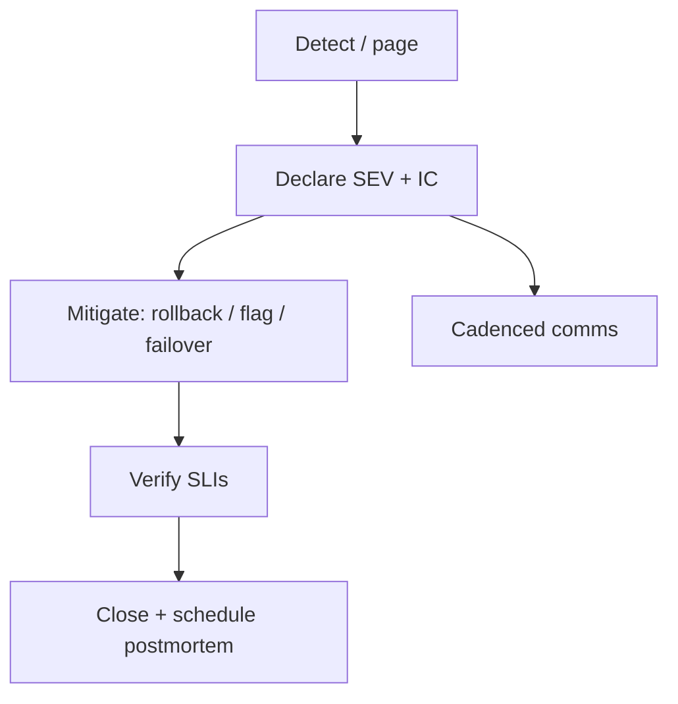

import { ConceptTemplate } from '@/features/kb/components/templates/ConceptTemplate'
import { Callout } from '@/features/kb/components/mdx/Callout'
import { ComparisonTable } from '@/features/kb/components/mdx/ComparisonTable'

export default function Layout({ children }) {
  return (
    <ConceptTemplate title="Incident management">
      {children}
    </ConceptTemplate>
  )
}

**Incident management** is the operating system for bad days. When checkout is down and the company is bleeding money, you do not “hop in Slack.” You declare a severity, appoint an **incident commander (IC)**, split investigate versus communicate, mitigate first, and write it down. The goal is to restore service, then to learn. Debugging without a process is how MTTR grows with headcount.

## 1. Deep Dive and Mechanics

**Declare.** Anyone can raise. The IC confirms severity (SEV-1 user-facing vs SEV-3 limited). Open a dedicated channel. State the working theory every 10–15 minutes even if it is “we do not know.” Silence is how shadow bridges form.

**Roles.** IC: decide and delegate, do not tail logs. **Tech lead / investigator:** form hypotheses and change the system. **Comms:** status page, support, execs. **Scribe:** timeline. On a small team one person wears two hats; on a large SEV-1 they must not wear all four.

**Mitigate versus fix.** Rollback, feature-flag off, fail over, shed load. A clean root-cause patch during the fire is optional. A revert that restores the SLO is the win.

**Handoff and close.** Follow-the-sun ICs. Close only when user-visible impact is gone and a watch is in place. Schedule the postmortem before people scatter.

<Callout icon="warning" title="The IC does not deploy">
If the commander is also the person with the only mental model of the database, there is no commander. Hand the keyboard over. Cognitive overload is how you drop tables “to help.”
</Callout>

## 2. Mathematical / Theoretical Foundation

MTTR = detect + assemble + diagnose + mitigate + verify. Process attacks assemble and mitigate (roles, runbooks, rollback). Observability attacks detect and diagnose. You cannot math your way out of a missing IC.

Severity should map to user impact × scope, not to how embarrassed eng is. Mis-severing either pages the company for a hiccup or leaves customers in the dark.

<ComparisonTable
  headers={['Mode', 'Who decides', 'Comms', 'Typical MTTR']}
  rows={[
    ['Hero in Slack', 'Whoever shouts', 'None / late', 'Long and random'],
    ['IC + roles', 'Named IC', 'Cadenced updates', 'Shorter, repeatable'],
    ['Follow-the-sun IC', 'On-shift IC', '24 h coverage', 'No 3 a.m. heroes'],
    ['Vendor bridge only', 'Vendor', 'Filtered', 'You wait'],
  ]}
/>

## 3. Real-World Implementation

```text
SEV-1 template
- Impact: checkout 5xx ~ 12%, started 14:03 UTC
- IC: Alex  Comms: Sam  Tech: Riley
- Next update: 14:20 UTC
- Actions: rollback deploy abc123 (Riley); status page (Sam)
- Working theory: bad canary on payments
```

PagerDuty / Opsgenie: severity → escalate policy. The first ack becomes IC unless they immediately reassign. Do not leave “everyone is paged, nobody owns.”

## 4. Visualizations



## 5. Interview Prep

**Q: What does the IC say in the first two minutes?**
**A:** Severity, impact in user terms, who holds which role, where the channel is, and when the next update is. Then they ask for a mitigation option, not a novel.

**Q: When do you involve legal or execs?**
**A:** Data exposure, safety, or a public SEV-1 that will hit the press. Comms owns that path. Engineers stay on mitigation.

**Q: Incident versus problem?**
**A:** ITIL split: incident is the pain now; problem is the underlying cause. You can close the incident when service is back and still have an open problem ticket for the fragile fail over.

## 6. Production Use Cases

- **Multi-team outages** — one IC above the service ICs so five channels do not diverge.
- **Status pages** — comms posts from the timeline, not from engineering rumor.
- **Regulated comms** — clock-accurate scribe notes become the audit trail.

<Callout icon="tip" title="Practice with game days">
The first time someone is IC should not be a real SEV-1. Rotate the hat on chaos days until the words are muscle memory.
</Callout>
