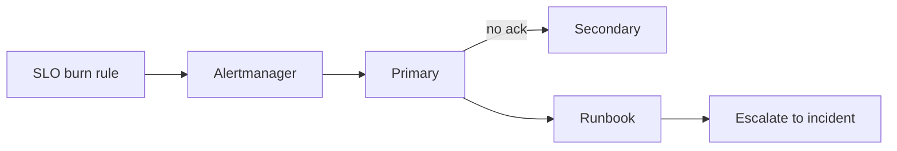

import { ConceptTemplate } from '@/features/kb/components/templates/ConceptTemplate'
import { Callout } from '@/features/kb/components/mdx/Callout'
import { ComparisonTable } from '@/features/kb/components/mdx/ComparisonTable'

export default function Layout({ children }) {
  return (
    <ConceptTemplate title="On-call practices">
      {children}
    </ConceptTemplate>
  )
}

**On-call** is the human SLA in front of the machine SLO. If the pager is a firehose of CPU graphs, people mute it and miss the real burn. Good practice: page only on **user-visible SLO violations** (or imminent ones), rotate fairly, pay for the load, and hand the night to another timezone when you can. Burnout is an availability bug.

## 1. Deep Dive and Mechanics

**Actionable pages.** A page must have a runbook link, a graph, and a verb (rollback, scale, fail over, declare). If the only action is “watch it,” it is a ticket, not a page. Delete or downgrade.

**Rotation design.** Primary and secondary. Handoff notes, not tribal Slack. Limit consecutive nights. A week of nights plus a day job is how you ship the next incident. Measure pages per shift; more than a handful a week is a product defect.

**Follow-the-sun.** When you have two regions of humans, the pager lives in daylight. That is an org design choice, not a PagerDuty checkbox. Without it, compensate and cap frequency.

**Overrides and shadows.** New engineers shadow before they hold the primary. Staff engineers still take shifts or the rotation becomes a junior ghetto and the graphs rot.

<Callout icon="error" title="Never page on symptoms the user cannot feel">
Disk at 70 percent, CPU at 90 percent, one replica restarting — those are tickets or automations. Page when the error budget is burning or a hard dependency is gone.
</Callout>

## 2. Mathematical / Theoretical Foundation

Human response quality drops with sleep debt and with false-positive rate. Signal detection: if 9 of 10 pages are noise, the 10th is treated as noise. Target a high precision pager even if you lose some recall (catch those with tickets and business-hours alerts).

Load: expected pages per week × duration × cognitive severity. That product should fit in a life. If it does not, you need reliability work or more people, not heroism.

<ComparisonTable
  headers={['Paging style', 'Human cost', 'Miss risk', 'Use']}
  rows={[
    ['Every graph threshold', 'Burnout', 'Mute-all', 'Never'],
    ['SLO burn + urgency', 'Sustainable', 'Low if SLIs are right', 'Default'],
    ['Follow-the-sun', 'Lowest night cost', 'Handoff gaps', 'Global teams'],
    ['Follow-the-sun + shadows', 'Training cost', 'Lowest long-term', 'Healthy orgs'],
  ]}
/>

## 3. Real-World Implementation

```yaml
# Alertmanager inhibit: do not also page the cause if the SLO already pages
inhibit_rules:
  - source_matchers: ['alertname=CheckoutErrorBudgetBurn']
    target_matchers: ['team=checkout', 'severity=ticket']
    equal: ['service']
```

Handoff checklist:

```text
- Open incidents and watches
- Deploys in flight / feature flags at risk
- Vendor tickets
- Pages last 24h that were noise (file to delete)
- Who is secondary and how to escalate
```

## 4. Visualizations



## 5. Interview Prep

**Q: How many pages is too many?**
**A:** Google-ish folklore is “a handful a week” and sleep through most nights. If every night pages, the system is not production-ready and the rotation is a stand-in for engineering.

**Q: Should developers be on-call for their services?**
**A:** Yes, or they will not feel the toil they create. Pair with a platform secondary so a 3 a.m. Kubernetes issue is not a frontend engineer’s problem.

**Q: Comp time versus cash?**
**A:** Both are valid. Unpaid on-call is how you lose the people who can actually fix the pager. State the policy.

## 6. Production Use Cases

- **Service ownership** — each product SLI has a named rotation, not “#ops.”
- **Platform layers** — node/disk pages go to the platform rotation; app SLO pages go to the app.
- **Incidents** — the on-call becomes IC or immediately appoints one.

<Callout icon="tip" title="Review every page in the weekly SRE meeting">
Keep, fix, or delete. If you do not close the loop, the same disk alert will wake someone until they quit.
</Callout>
