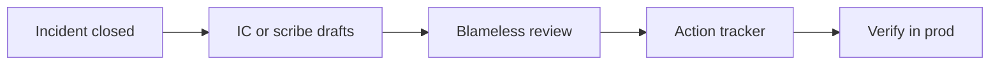

import { ConceptTemplate } from '@/features/kb/components/templates/ConceptTemplate'
import { Callout } from '@/features/kb/components/mdx/Callout'
import { ComparisonTable } from '@/features/kb/components/mdx/ComparisonTable'

export default function Layout({ children }) {
  return (
    <ConceptTemplate title="Postmortems">
      {children}
    </ConceptTemplate>
  )
}

A **postmortem** (post-incident review) is how you convert downtime into a safer system. It is written, time-bounded, and **blameless**: people tell the truth because the document attacks conditions, not character. If the conclusion is “Dave was careless,” you learned nothing and the next Dave will hide the timeline.

## 1. Deep Dive and Mechanics

**When.** SEV-1 always. SEV-2 if it burned serious budget or surprised you. Near misses count; they are cheaper teachers.

**Skeleton.** Summary in user terms, impact (who, how long, SLI numbers), timeline in UTC, detection path (did a human beat the pager?), contributing factors, what went well, **action items** with owners and dates. Graphs beat adjectives.

**Five Whys, used carefully.** Stop at a changeable condition (no canary gate, no backup restore test), not at “humans exist.” Multiple contributing factors beat a single “root cause” myth. The last straw is rarely the only straw.

**Follow-through.** Unowned actions are decoration. Track them like bugs. A postmortem without shipped fixes is a blog post.

<Callout icon="warning" title="Blame hides data">
The moment the room hunts a villain, timelines get cleaner and faker. Ask “what allowed this step to succeed?” about the bad command, not “who typed it.”
</Callout>

## 2. Mathematical / Theoretical Foundation

Incidents are usually **conjunctions** of latent conditions (Reason’s Swiss cheese): a missing inhibit, a stale runbook, a change, a saturated replica. Probability of the joint event is small; after it happens, each hole is still worth closing.

Action items should change the hazard rate, not the folklore. Prefer guards (required review on `DROP`, automatic rollback) over “be more careful,” which has no measured effect.

<ComparisonTable
  headers={['Artifact', 'Tone', 'Output', 'Failure mode']}
  rows={[
    ['Blameless postmortem', 'Systems', 'Owned actions', 'Actions rot'],
    ['Blame report', 'Personal', 'Punishment', 'Silence next time'],
    ['Ticket dump', 'None', 'Noise', 'No narrative'],
    ['Slide-only review', 'Political', 'Feelings', 'No audit trail'],
  ]}
/>

## 3. Real-World Implementation

```markdown
# INC-2147 checkout 5xx — 2026-09-01
## Impact
12% of checkout POSTs failed, 14:03–14:41 UTC. Budget spend: 38% of 30-day SLO.

## Detection
Customer tweet 14:11. Pager 14:14 (burn rule). Gap: synthetics not on POST.

## Contributing factors
- Canary at 100% (Terraform default)
- No rollback button in the deploy UI
- Payments client retries amplified the 500s

## Actions
- [ ] P0 Riley: enforce 10% canary in CI — 2026-09-08
- [ ] P0 Sam: one-click rollback — 2026-09-08
- [ ] P1 Alex: cap retries with jitter — 2026-09-15
```

Review in a 45-minute meeting. Do not relitigate tone; edit the doc live.

## 4. Visualizations



## 5. Interview Prep

**Q: What if a person really was negligent?**
**A:** HR is a different process. The postmortem still asks why the system allowed a single actor to cause that blast radius. Mixing the two poisons both.

**Q: How many actions?**
**A:** A few that change probability. A laundry list is how nothing ships. P0s that land in a week beat twenty P3s.

**Q: Public versus internal?**
**A:** Customer-facing summaries omit internal names and unfixed paths. Internal docs keep the ugly graphs. Do not lie in public; do not dump your internals either.

## 6. Production Use Cases

- **SEV-1 closeout** — the IC stays owner until the doc exists, then transfers actions.
- **Recurring pages** — a mini-mortem on a weekly theme (“disk again”) to force automation.
- **Compliance** — timestamped reviews for auditors who want evidence of learning, not just tickets.

<Callout icon="tip" title="Lead with impact numbers">
“We were down” is not a sentence an exec can prioritize. “38 percent of the monthly budget in 38 minutes” is.
</Callout>
