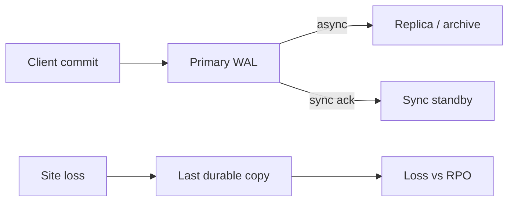

import { ConceptTemplate } from '@/features/kb/components/templates/ConceptTemplate'
import { Callout } from '@/features/kb/components/mdx/Callout'
import { ComparisonTable } from '@/features/kb/components/mdx/ComparisonTable'

export default function Layout({ children }) {
  return (
    <ConceptTemplate title="RPO">
      {children}
    </ConceptTemplate>
  )
}

**RPO (Recovery Point Objective)** is how far back the last acceptable copy of data may be when a disaster hits. An RPO of 24 hours allows a daily dump. An RPO of five minutes forces continuous replication. An RPO of zero forces synchronous commit to a second site — and you will feel that in latency and cost. RPO is a **data-loss** number. It is not downtime (that is RTO).

## 1. Deep Dive and Mechanics

**What is “data.”** Database rows, object-store blobs, queue messages, feature-flag state, secrets, and “we generate it from the WAL.” If it is not in the replica or the backup, it counts as loss when the site dies.

**Mechanisms.** Periodic snapshots: RPO ≈ interval plus snapshot duration. PITR / WAL shipping: RPO ≈ last shipped segment. Async streaming replica: RPO ≈ replication lag (seconds to minutes under load). Sync replica: RPO ≈ 0 for committed transactions, at the price of commit latency and write unavailability if the replica is down.

**Independence.** A replica in the same AZ is not an RPO strategy for a datacenter fire. Cross-region, another cloud, or offline immutable backups — pick the fate you are actually designing against (hardware, region, ransomware, bad `DROP`).

**Application truth.** Dual writes to two stores with different lags mean the **worse** RPO is the real one unless you have a reconcilers. “The DB is at 0 and S3 is at 15 minutes” is a 15-minute RPO for the product feature that needs both.

<Callout icon="error" title="Async replica plus ‘zero data loss’ in the deck is a lie">
If the primary can ack a commit before the replica has it, you chose a non-zero RPO. Say the lag SLO out loud (for example 30 seconds) or pay for sync.
</Callout>

## 2. Mathematical / Theoretical Foundation

Let T_disaster be the failure instant and T_durable the last copy that will survive. Loss window = T_disaster − T_durable. RPO is the maximum allowed loss window. Expected loss under async replication is a function of lag distribution — plan for the tail (p99 lag), not the happy 5 ms.

Synchronous commit: a transaction is durable iff both sites persist. Availability of writes becomes the intersection of site availabilities (and the network). You traded RPO for a harder RTO/availability problem.

<ComparisonTable
  headers={['Technique', 'Achievable RPO', 'Write cost', 'Typical fit']}
  rows={[
    ['Nightly dump to object storage', 'Hours', 'None on path', 'Blogs, analytics'],
    ['PITR every few minutes', 'Minutes', 'Low', 'Most SaaS DBs'],
    ['Async streaming replica', 'Seconds–minutes', 'Low', 'Regional HA / warm DR'],
    ['Sync cross-region', '≈ 0', 'High latency', 'Ledgers, payments'],
  ]}
/>

## 3. Real-World Implementation

```sql
-- Postgres: do not claim a 5-minute RPO without checking lag
SELECT
  client_addr,
  state,
  replay_lag,
  write_lag,
  flush_lag
FROM pg_stat_replication;
```

Alert when `replay_lag` exceeds the RPO (with a small buffer). A replica that is 40 minutes behind is a backup that is failing in slow motion.

```text
Business: RPO 5 minutes for orders
Engine: WAL archive every 60s + async replica, page if lag > 3 minutes
Not in scope: marketing CMS (RPO 24h nightly)
```

## 4. Visualizations



## 5. Interview Prep

**Q: RPO versus RTO?**
**A:** RPO is how much data you may lose. RTO is how long you may be down while you restore or promote. A tape in a vault can have a decent RPO and a terrible RTO.

**Q: Can RPO be zero with a single-region disk snapshot?**
**A:** No. The snapshot shares fate with the region. Zero RPO against region loss needs a second region that already has the bytes.

**Q: What about caches?**
**A:** Treat cache as disposable unless you promised otherwise. Rebuilding a cache affects RTO (cold start), not RPO, if the source of truth survived.

## 6. Production Use Cases

- **Orders and balances** — tight RPO, often sync or very low-lag async plus WAL archive.
- **Clickstream** — hours of loss may be acceptable; do not buy sync replication for vanity events.
- **Ransomware** — immutable, lagged copies so a logical `DROP` or encrypt job does not hit the only replica immediately.

<Callout icon="tip" title="Split RPO by data class">
One number for the whole company produces either ruinous cost or silent negligence. Payments, PII, and logs get different RPOs on the same charter.
</Callout>
