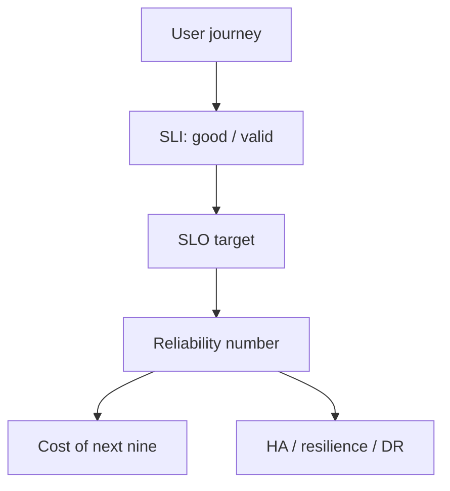

import { ConceptTemplate } from '@/features/kb/components/templates/ConceptTemplate'
import { Callout } from '@/features/kb/components/mdx/Callout'
import { ComparisonTable } from '@/features/kb/components/mdx/ComparisonTable'

export default function Layout({ children }) {
  return (
    <ConceptTemplate title="Reliability">
      {children}
    </ConceptTemplate>
  )
}

**Reliability** is whether the system does what users need, when they need it. Google’s line is that reliability is the most important feature: a perfect UI that returns 500s has value zero. In SRE it is not a vibe. It is SLIs (measurement), SLOs (targets), and the cost of moving one more nine.

## 1. Deep Dive and Mechanics

**Availability.** Successful valid events over valid events, or uptime if you only have a probe. “Valid” excludes 404s on bad client URLs and your own load tests if you agreed to. Include latency: a 30-second “success” is a failure for checkout.

**Correctness.** The 200 that charged twice is unreliability. Fewer teams measure it. Audit metrics and reconciliation jobs belong next to the availability graph.

**MTBF and MTTR.** Classic hardware: stretch time between failures. Cloud: assume failure and crush recovery time (automated failovers, rollbacks). Availability ≈ MTBF / (MTBF + MTTR) for a simple repair model. Halving MTTR often beats chasing infinite MTBF.

**The nines.** 99 percent ≈ 3.65 days down/year. 99.9 percent ≈ 8.8 hours. 99.99 percent ≈ 53 minutes. 99.999 percent ≈ 5 minutes. Each step is a different architecture, not a tighter Nagios threshold.

<Callout icon="info" title="Users already donated unreliability">
Mobile networks, last-mile ISPs, and the customer’s laptop eat more than your last nine. Spending a fortune to go from 99.95 to 99.99 can be invisible. Measure from the user or a true synthetic, not only from the load balancer.
</Callout>

## 2. Mathematical / Theoretical Foundation

Series composition: A_total = Π A_i if the user needs every dependency. Three 99.9 percent services in series are about 99.7 percent if failures are independent. Parallel (redundant) composition: 1 − Π (1 − A_i) if any replica suffices and failovers are instant — they are not, so include switchover as downtime.

Cost is convex in the last nines. The derivative d(cost)/d(availability) explodes near 1. SRE is picking the point on that curve the business will pay for.

<ComparisonTable
  headers={['Idea', 'Question', 'Moves the number by']}
  rows={[
    ['Reliability', 'Does the user succeed?', 'SLI design + architecture'],
    ['Resilience', 'How do we absorb faults?', 'Bulkheads, retries, degradation'],
    ['HA', 'Survive a component death?', 'Redundancy in one domain'],
    ['DR', 'Survive a domain death?', 'Second site + RPO/RTO'],
  ]}
/>

## 3. Real-World Implementation

```promql
# Request success ratio as an availability SLI
sum(rate(http_requests_total{app="checkout", status!~"5.."}[5m]))
/
sum(rate(http_requests_total{app="checkout"}[5m]))
```

Nines cheat sheet you should know cold:

```text
99%     ~ 7.3 h / month
99.9%   ~ 43 min / month
99.95%  ~ 22 min / month
99.99%  ~ 4.3 min / month
```

Do not promise a nine you cannot see in an SLI.

## 4. Visualizations



## 5. Interview Prep

**Q: Reliability versus availability?**
**A:** Availability is a common SLI for reliability. Reliability also includes freshness, correctness, and latency. A store that is “up” but shows yesterday’s prices is available and unreliable.

**Q: How many nines do we need?**
**A:** Enough that the error budget matches how often you want to change the system, and enough that revenue/safety math is happy. Never “as many as Google Search” for an internal tool.

**Q: Why did adding retries lower reliability?**
**A:** Retry storms amplify a dependency outage and turn a 5 percent backend failure into a self-DDoS. Cap, jitter, and shed.

## 6. Production Use Cases

- **Service charters** — publish the nines and the SLI so product cannot demand 100 percent in a hallway.
- **Dependency reviews** — multiply series availabilities before you add a fourth critical SaaS.
- **Exec reports** — budget spend and user-journey success, not CPU heat maps.

<Callout icon="tip" title="Define ‘valid’ in writing">
Bot traffic, health checks, and client 400s will dominate the denominator if you do not exclude them. The reliability number is only as honest as that filter.
</Callout>
