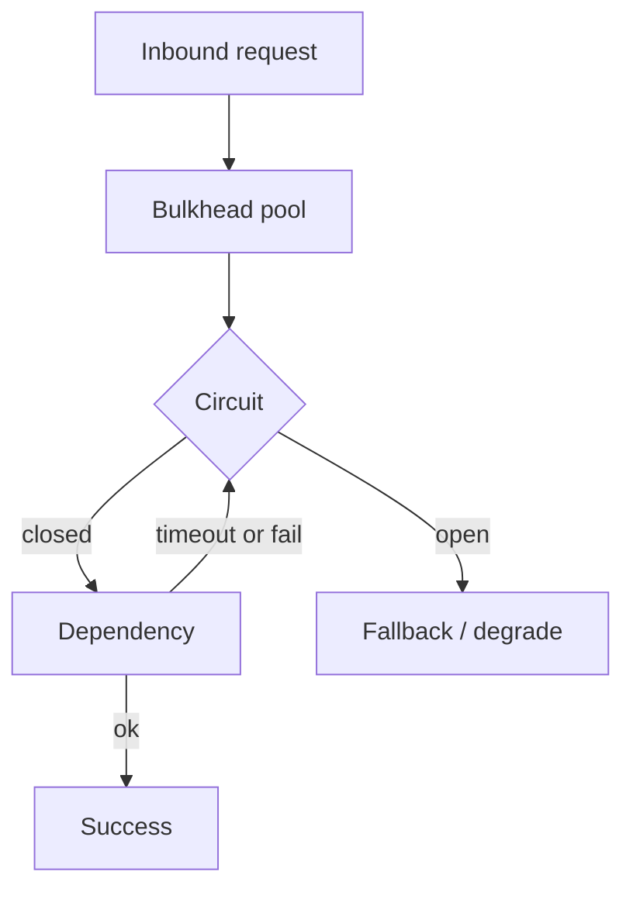

import { ConceptTemplate } from '@/features/kb/components/templates/ConceptTemplate'
import { Callout } from '@/features/kb/components/mdx/Callout'
import { ComparisonTable } from '@/features/kb/components/mdx/ComparisonTable'

export default function Layout({ children }) {
  return (
    <ConceptTemplate title="Resilience engineering">
      {children}
    </ConceptTemplate>
  )
}

**Resilience engineering** assumes components will fail and asks whether the *system* still meets the user need. Reliability is the outcome. Resilience is the set of patterns that keep a dead cache or a slow payment API from taking the site down with them. Ships use bulkheads so one flooded compartment does not sink the hull. Services should too.

## 1. Deep Dive and Mechanics

**Timeouts.** Every remote call needs a deadline. Without one, threads pile up and you fail from exhaustion, not from the original error. Set the timeout from the SLO, not from hope.

**Retries.** Only on idempotent or safely deduped calls. Exponential backoff plus **jitter** so thundering herds do not synchronize. Cap attempts. Retrying a 400 is a bug; retrying a 503 with jitter is a pattern.

**Circuit breakers.** After a threshold of failures, stop calling and fail fast (or serve fallback) for a cool-down, then probe. You are protecting *your* resources from a dead dependency.

**Bulkheads and isolation.** Separate thread pools, queues, and deployments for “login” versus “PDF invoice.” Limit concurrency per dependency (semaphore). One noisy neighbor must not starve the critical path.

**Graceful degradation.** Read-only mode, cached recommendations, hide the personalized rail. A worse page that works beats a perfect JSON 500.

<Callout icon="error" title="Unbounded retries are an attack on yourself">
When the dependency is down, N services × M retries × no jitter is a self-inflicted DDoS. The circuit breaker exists to refuse that math.
</Callout>

## 2. Mathematical / Theoretical Foundation

Queueing: if arrival rate to a pool exceeds service rate, the queue (and latency) grows without bound. Timeouts convert a hung tail into a bounded failure. Circuit breakers drop arrival rate to zero once failure is detected — a control loop, not a guess.

Retry amplification: if each failed call is tried k times, offered load is up to k×. Independence of failures is usually false (shared fate), so retries correlate and make it worse.

<ComparisonTable
  headers={['Pattern', 'Protects', 'Risk if mis-set']}
  rows={[
    ['Timeout', 'Your threads', 'Too short: false errors; too long: pileup'],
    ['Retry + jitter', 'Transient blips', 'Storms, duplicate writes'],
    ['Circuit breaker', 'Your pool vs a dead dep', 'Flapping, hidden outages'],
    ['Bulkhead', 'Critical path vs batch', 'Underused capacity'],
    ['Degradation', 'User journey', 'Silent wrongness if not obvious'],
  ]}
/>

## 3. Real-World Implementation

```javascript
import CircuitBreaker from 'opossum'

const pay = new CircuitBreaker(callPayments, {
  timeout: 800,
  errorThresholdPercentage: 50,
  resetTimeout: 15000
})

pay.fallback(() => ({ ok: false, reason: 'payments_degraded' }))

export async function charge(order) {
  return pay.fire(order)
}
```

Pair with an idempotency key on the charge so a legitimate retry cannot double-bill when the breaker closes.

## 4. Visualizations



## 5. Interview Prep

**Q: Resilience versus HA?**
**A:** HA is extra copies of the same thing. Resilience is what happens when the thing you call is wrong, slow, or gone — including dependencies you cannot replicate.

**Q: Where do you put the breaker — client or mesh?**
**A:** Both can work. Mesh gives consistency; app breakers know idempotency and fallbacks. Do not stack three layers of retries (app, SDK, mesh) without a budget.

**Q: What is backpressure?**
**A:** Refusing or slowing intake when you cannot shed work safely. Load shedding and admission control are resilience for *your* overload, not only for theirs.

## 6. Production Use Cases

- **Checkout** — payments behind a breaker; cart still readable; clear “try again” instead of a blank 500.
- **Multi-tenant platforms** — per-tenant concurrency limits so one customer cannot crowd out others.
- **Batch versus interactive** — separate pools so nightly reports cannot starve interactive queries.

<Callout icon="tip" title="Name the degraded mode in the UI and in metrics">
A `payments_degraded` counter plus a banner is honest. Silent fallback to a stale price is how you create a correctness incident.
</Callout>
