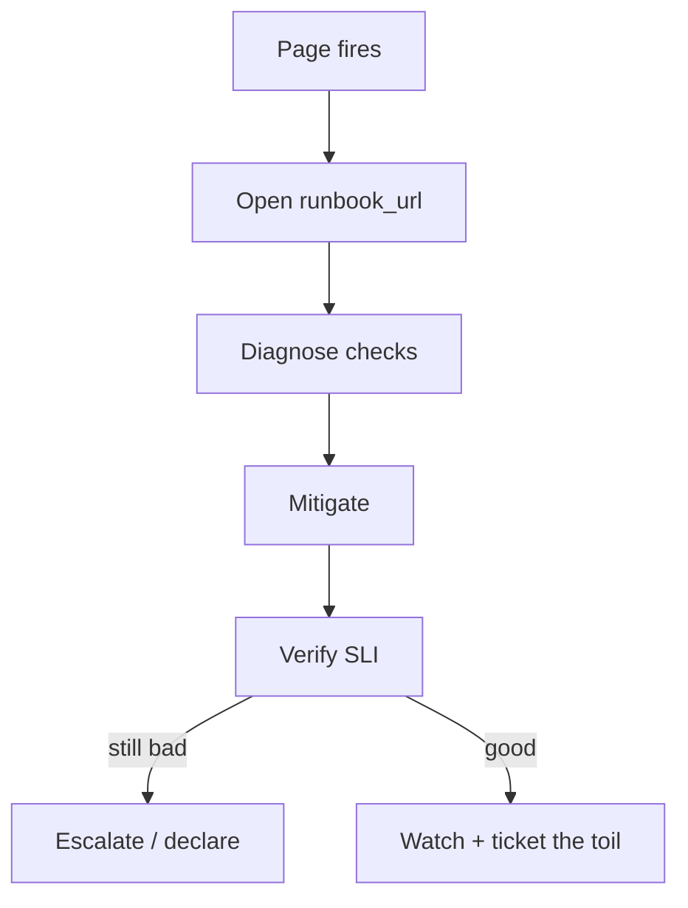

import { ConceptTemplate } from '@/features/kb/components/templates/ConceptTemplate'
import { Callout } from '@/features/kb/components/mdx/Callout'
import { ComparisonTable } from '@/features/kb/components/mdx/ComparisonTable'

export default function Layout({ children }) {
  return (
    <ConceptTemplate title="Runbooks">
      {children}
    </ConceptTemplate>
  )
}

A **runbook** (playbook) is the algorithm for a specific page. It assumes a tired human. It links the alert, the graphs, the safe commands, the rollback, and the escalate path. If the step is “figure out Redis,” it is a wiki essay, not a runbook. If the step is “run this command; if used_memory exceeds this, fail traffic to replica B,” it is a runbook.

## 1. Deep Dive and Mechanics

**One alert, one runbook.** The page’s annotation is a URL. The doc’s title matches the alert name. Drift here is how people open the wrong play.

**Shape.** Symptom (what the user feels), how we know (SLI), immediate safety (page IC? public comms?), diagnose (ordered checks with expected output), mitigate (rollback, scale, shed, fail over), verify (which graph returns to green), escalate (who, when).

**Copy-paste.** Commands with placeholders filled by labels from the alert (`namespace`, `cluster`). No “adjust as needed.” No screenshots of a dashboard that moved last quarter — permalinks.

**Executable runbooks.** Buttons that run the diagnostic (with audit) beat a wall of Markdown. Still keep the text path for when the automation host is the thing that is down.

**Freshness.** A runbook older than the last architecture change is hostile. Review when the alert fires and in the postmortem. Delete runbooks for alerts you deleted.

<Callout icon="warning" title="A runbook that needs prod-admin SSH is unfinished">
Prefer RPCs, runbooks-as-code, and break-glass that is logged. If the only fix is an undocumented one-liner on the primary, you will get a worse incident the night the author is on a plane.
</Callout>

## 2. Mathematical / Theoretical Foundation

MTTR drops when diagnose + mitigate are O(1) lookups instead of search. Each decision point is a branch; keep the tree shallow. Automation moves a step from “human latency ~ minutes” to “script latency ~ seconds,” which is why executable runbooks pay off on frequent pages.

Toil: if the same runbook is executed every week with the same outcome, the action should become a controller, not a better paragraph.

<ComparisonTable
  headers={['Form', 'Speed at 3 a.m.', 'Stale risk', 'Best for']}
  rows={[
    ['Tribal Slack', 'Slow', 'High', 'Never'],
    ['Wiki essay', 'Medium', 'High', 'Background'],
    ['Alert-linked steps', 'Fast', 'Medium', 'Default'],
    ['Executable + audit', 'Fastest', 'Low if tested', 'Frequent pages'],
  ]}
/>

## 3. Real-World Implementation

```markdown
# Alert: CheckoutRedisOOM
## Impact
Checkout latency and 5xx if evictions climb.

## Diagnose
1. Open https://grafana.example/d/redis?var-pool=checkout
2. Confirm evicted_keys rising and mem > 90%
3. Identify writer: top clients on the Redis dashboard

## Mitigate
- If a canary writer: disable flag `checkout-cache-v2`
- Else: fail read traffic to replica (script: scripts/redis_ro.sh checkout)
- Do not restart the primary as a first step (stampede)

## Verify
Error ratio < 0.5% for 10 minutes. Stay on watch.

## Escalate
Platform on-call if failover script errors. IC if user impact > 5 minutes.
```

Alert rule annotation: `runbook_url: https://runbooks/CheckoutRedisOOM`.

## 4. Visualizations



## 5. Interview Prep

**Q: Runbook versus postmortem?**
**A:** The runbook is how you fight this fire next time. The postmortem explains why this fire happened and what you will change so the runbook is needed less.

**Q: How long should it be?**
**A:** Short enough to run half-asleep. Link out for deep internals. If it exceeds a few screens, split by symptom.

**Q: What if the runbook is wrong?**
**A:** Fix it before you close the incident window. A wrong runbook is worse than none because it adds confidence to a bad path.

## 6. Production Use Cases

- **Every paging alert** — no URL, no merge of the alert.
- **Sev playbooks** — “declare SEV-1” is itself a runbook (roles, status page, exec list).
- **Customer comms** — a comms runbook with approved sentences so engineers do not invent legal claims.

<Callout icon="tip" title="Put the rollback at the top if that is usually the answer">
For deploy-caused pages, step 1 is rollback. Diagnosis can happen after users are recovered. Pride is not an SLO.
</Callout>
