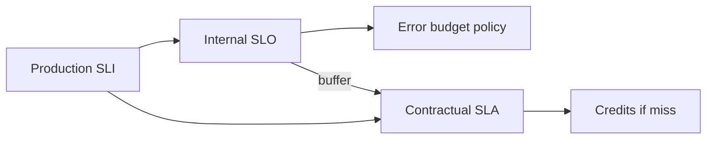

import { ConceptTemplate } from '@/features/kb/components/templates/ConceptTemplate'
import { Callout } from '@/features/kb/components/mdx/Callout'
import { ComparisonTable } from '@/features/kb/components/mdx/ComparisonTable'

export default function Layout({ children }) {
  return (
    <ConceptTemplate title="SLAs">
      {children}
    </ConceptTemplate>
  )
}

An **SLA (Service Level Agreement)** is a contract. It states how the service will behave (often availability or latency), how that will be measured, and what the customer gets if you miss — usually service credits, sometimes termination rights. Lawyers and sales own the signature. Engineering owns whether the **SLO** is strictly better than the SLA so you feel the burn before you write checks.

## 1. Deep Dive and Mechanics

**Measurement clause.** The SLA is only as real as the denominator. Exclude maintenance windows? Whose probes? Which regions? Status-page declared incidents only? Vendors write these clauses to be achievable. Read them when you *buy* as well as when you sell.

**Credits, not damages.** Typical public-cloud SLAs pay a percent of the monthly bill, not your lost revenue. “99.9 percent SLA” is not insurance for your Black Friday. Your own SLO still matters.

**Stacking.** Your SLA to customers cannot honestly exceed the weakest critical dependency unless you have a mitigation (multi-vendor, buffers). Selling 99.99 percent on top of a 99.9 percent object store without design is a legal problem waiting for an outage.

**Internal vs external.** Internal platform “SLAs” are often SLO-shaped unless money changes hands. Do not call it an SLA if there is no remedy.

<Callout icon="warning" title="Never let sales sell a nine you cannot measure">
If you cannot compute the SLA metric from production data with the same filters the contract uses, you will argue invoices instead of systems. Instrument first, sign second.
</Callout>

## 2. Mathematical / Theoretical Foundation

Let SLA target be a (for example 0.999) over a billing month. Credit schedule is a step function of measured availability. Engineering SLO s should satisfy s > a (for example 0.9995) so the error-budget freeze triggers while you are still inside the contract.

Independence: if credits are per-service and a shared control plane fails, you may owe many SLAs from one cause. Model that as correlated risk, not as a product of probabilities.

<ComparisonTable
  headers={['Document', 'Audience', 'Miss means', 'How tight']}
  rows={[
    ['SLI', 'Engineers', 'A number moved', 'N/A — it is the meter'],
    ['SLO', 'Eng + product', 'Budget / freeze', 'Tighter than SLA'],
    ['SLA', 'Customer + legal', 'Credits / clauses', 'Looser, negotiated'],
    ['Status page', 'Public', 'Trust', 'Honest, not legal'],
  ]}
/>

## 3. Real-World Implementation

```text
External SLA (contract)
- Metric: monthly successful HTTP 2xx/3xx/4xx over valid requests
- Target: 99.9%
- Remedy: 10% credit if 99.0–99.9; 25% if below 99.0
- Exclusions: customer-caused 4xx, agreed maintenance

Internal SLO (not in the PDF)
- Same metric, 99.95%, 30-day rolling
- Burn-rate pages and feature freeze at budget 0
```

When implementing credits, compute from the same pipeline as the SLO or you will have two truths.

## 4. Visualizations



## 5. Interview Prep

**Q: Why is the SLA weaker than the SLO?**
**A:** So you can spend engineering pain (freeze, reliability work) before you spend money and reputation. The buffer is the point.

**Q: Does meeting the SLA mean users were happy?**
**A:** No. Credits are coarse and monthly. A two-hour outage on launch day can still “meet” a loose SLA and destroy trust.

**Q: Should every microservice have an SLA?**
**A:** No. SLAs belong at customer-visible boundaries. Internal services get SLOs. A mesh of 200 SLAs is a legal department, not a platform.

## 6. Production Use Cases

- **SaaS contracts** — availability plus support response times as separate clauses.
- **Buying cloud** — read exclusions; design as if the credit will not cover your loss.
- **Enterprise deals** — custom SLAs need custom SLIs or you will invent math at QBR time.

<Callout icon="tip" title="Keep the credit calculator in the same repo as the SLI">
If finance uses a spreadsheet and eng uses PromQL, the first disputed month will be ugly. One query, two thresholds.
</Callout>
