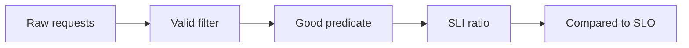

import { ConceptTemplate } from '@/features/kb/components/templates/ConceptTemplate'
import { Callout } from '@/features/kb/components/mdx/Callout'
import { ComparisonTable } from '@/features/kb/components/mdx/ComparisonTable'

export default function Layout({ children }) {
  return (
    <ConceptTemplate title="SLIs">
      {children}
    </ConceptTemplate>
  )
}

An **SLI (Service Level Indicator)** is the meter. Almost always a **ratio**: good events divided by valid events, as a percentage. Availability, latency (fraction under a threshold), freshness, correctness, quality — each is an SLI if you can count numerator and denominator from production. CPU is not an SLI for a user journey. The user cannot feel your cores.

## 1. Deep Dive and Mechanics

**Valid events.** Requests that were the user’s to make. Exclude internal probes if they are not the product (or include them if they *are* the synthetic SLI). Exclude 404s on attacker URL soup if product agrees. Document the filter; it is the soul of the metric.

**Good events.** For availability: non-5xx (and maybe non-timeout). For latency: completed within 200 ms *and* successful, or you will call slow 200s “good” and lie. For freshness: data newer than T.

**Where to measure.** Prefer the edge the user hits (gateway, true synthetic, RUM). Measuring only inside a pod misses DNS, TLS, and the mesh. Measuring only the load balancer misses app-level 200s that are business failures.

**Few SLIs.** Three to five per user journey. A dozen SLIs means none of them page and all of them argue.

<Callout icon="error" title="Do not SLI on saturation">
Saturation (pool full, CPU) is a diagnostic. Page on the user ratio. Use saturation to *explain* the page, not to wake someone when users are fine.
</Callout>

## 2. Mathematical / Theoretical Foundation

SLI(t) = good(t) / valid(t) over a window. Variance is high when valid is small — do not trust a 100 percent SLI on seven requests. Error budget math needs the same good/valid definitions as the SLO.

Time-based SLI (minutes the probe was up / minutes in month) treats a quiet night equal to a peak hour. Event-based SLI weights by traffic. Prefer events for request/response systems.

<ComparisonTable
  headers={['Candidate', 'User-centric?', 'Use as SLI?', 'Use as']}
  rows={[
    ['Success / valid requests', 'Yes', 'Yes', 'Availability'],
    ['Fraction faster than T', 'Yes', 'Yes', 'Latency'],
    ['CPU less than 80 percent', 'No', 'No', 'Capacity debug'],
    ['Replica count', 'No', 'No', 'Platform health'],
    ['Correct charges / orders', 'Yes', 'Yes', 'Correctness'],
  ]}
/>

## 3. Real-World Implementation

```promql
# Latency SLI: good = success AND duration bucket <= 200ms
sum(rate(http_request_duration_seconds_bucket{app="checkout", le="0.2", status!~"5.."}[5m]))
/
sum(rate(http_request_duration_seconds_count{app="checkout"}[5m]))
```

Name the recording rule `sli:checkout_latency_good_ratio` so every dashboard and alert reuses one definition.

## 4. Visualizations



## 5. Interview Prep

**Q: SLI versus SLO versus SLA?**
**A:** SLI is the number. SLO is the target for that number. SLA is the legal target plus remedy, usually looser.

**Q: Why a ratio and not a raw p99?**
**A:** A ratio over a threshold composes cleanly into an error budget (count of bad events). A floating p99 is harder to turn into “how many mistakes do we have left this month.”

**Q: Server-side versus client-side SLI?**
**A:** Client/RUM includes the real network and is honest; it is also noisier and privacy-sensitive. Many teams use server + synthetic as the pager and RUM as the product truth.

## 6. Production Use Cases

- **Checkout, login, search** — one availability and one latency SLI each, not 40 host metrics.
- **Data pipelines** — freshness SLI: fraction of keys updated within T.
- **Platforms** — an SLI on *your* API, plus a separate customer-journey SLI that includes the layers you own together.

<Callout icon="tip" title="Write the SLI as a sentence">
“The proportion of checkout POSTs that finish in under 300 ms with a non-5xx.” If you cannot say it in one sentence, you cannot page on it fairly.
</Callout>
