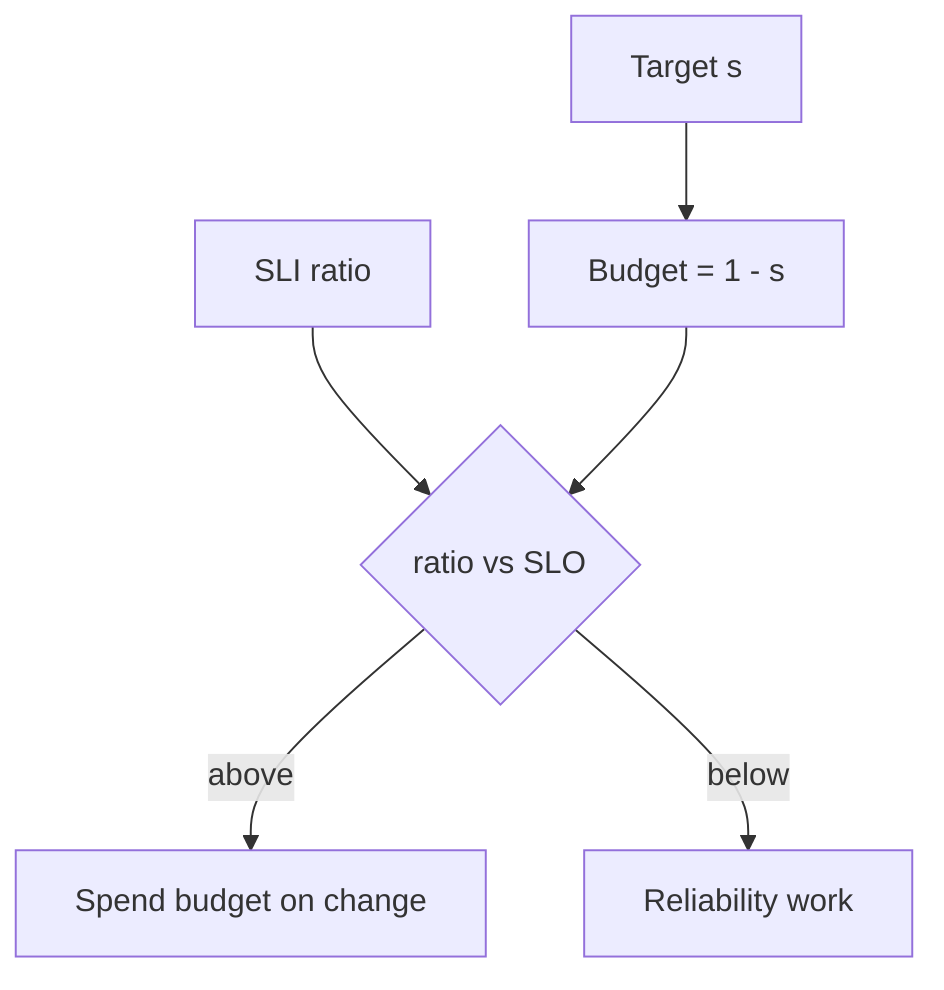

import { ConceptTemplate } from '@/features/kb/components/templates/ConceptTemplate'
import { Callout } from '@/features/kb/components/mdx/Callout'
import { ComparisonTable } from '@/features/kb/components/mdx/ComparisonTable'

export default function Layout({ children }) {
  return (
    <ConceptTemplate title="SLOs">
      {children}
    </ConceptTemplate>
  )
}

An **SLO (Service Level Objective)** is the agreed target for an SLI: “99.9 percent of valid checkout POSTs succeed in under 300 ms over a rolling 30 days.” The SLI is the speedometer. The SLO is the speed limit. Miss it and you spend the **error budget**. Hit 100 percent as a target and you have forbidden change — hardware and networks will still fail, and you will only discover it as shame.

## 1. Deep Dive and Mechanics

**Who sets it.** Product plus engineering, not a lone SRE with a favorite nine. Too tight: you never ship. Too loose: users churn while graphs stay green. Start from current measured SLI, user research, and dependency math — not from “four nines because we are serious.”

**Window.** Rolling 28–30 days is common. Calendar month matches some SLAs. Shorter windows twitch; longer windows hide a bad week. Burn-rate alerts exist so you do not wait 29 days to notice.

**Multiple SLOs.** Availability and latency are different promises. A service can meet one and miss the other. Do not average them into a mushy “health score” that nobody can explain.

**Iterate.** If you never burn budget, the SLO is too weak or you are not shipping. If you always freeze, the SLO is too strong or the system is actually bad. Revisit quarterly.

<Callout icon="warning" title="100 percent is not an SLO">
It is a wish that outlaws deploys and chaos. Pick a number less than one so the leftover is a deliberate budget for change and for reality.
</Callout>

## 2. Mathematical / Theoretical Foundation

SLO: P(good | valid) ≥ s over window W. Error budget B = 1 − s. Allowed bad events = B × (valid count in W).

Choosing s: if users complain at 99.5 percent and are silent at 99.9 percent, the useful SLO is near the second number. The cost of moving s toward 1 is superlinear (extra regions, sync replication, review gates).

<ComparisonTable
  headers={['Target s', 'Budget over 30 days (time heuristic)', 'Typical architecture']}
  rows={[
    ['99%', '~7 hours', 'Single site, modest HA'],
    ['99.9%', '~43 minutes', 'Multi-AZ, fast rollback'],
    ['99.95%', '~22 minutes', 'Mature automation'],
    ['99.99%', '~4 minutes', 'Multi-region, expensive'],
  ]}
/>

## 3. Real-World Implementation

```yaml
# slo.yaml — source of truth consumed by recording rules
service: checkout
sli: success_and_fast
good: 'status!~"5.." AND le="0.3"'
valid: 'all POSTs /checkout'
objective: 0.999
window: 30d
alerts:
  - burn: 14x
    window: 1h
    page: true
  - burn: 2x
    window: 6h
    page: true
```

The same file should generate Grafana and Alertmanager. Hand-copied numbers drift.

## 4. Visualizations



## 5. Interview Prep

**Q: SLO versus SLA?**
**A:** SLO is internal and tighter. SLA is contractual and has credits. You can miss an SLO, freeze deploys, and still meet the SLA — that is the buffer working.

**Q: Why a rolling window?**
**A:** A calendar month lets you behave badly on day 30 after a perfect month. Rolling keeps the recent past in the number. Finance may still want calendar for invoices.

**Q: How many SLOs per service?**
**A:** One or two that match the user journey. A zoo of SLOs is how none of them change behavior.

## 6. Production Use Cases

- **Release policy** — ship when remaining budget is healthy; hold the launch when it is not.
- **Dependency selection** — do not pick a vendor whose published SLA is weaker than your SLO without a mitigation.
- **Quarterly reviews** — tighten or loosen s with evidence, not with fear.

<Callout icon="tip" title="Publish the SLO next to the service catalog">
On-call, product, and new hires should see the same sentence. A hidden SLO is a private opinion.
</Callout>
