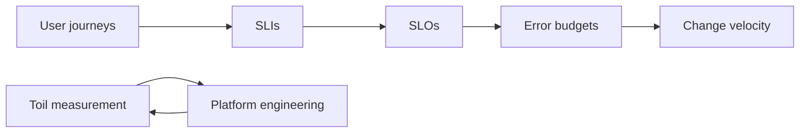

import { ConceptTemplate } from '@/features/kb/components/templates/ConceptTemplate'
import { Callout } from '@/features/kb/components/mdx/Callout'
import { ComparisonTable } from '@/features/kb/components/mdx/ComparisonTable'

export default function Layout({ children }) {
  return (
    <ConceptTemplate title="SRE">
      {children}
    </ConceptTemplate>
  )
}

**SRE (Site Reliability Engineering)** is Google’s answer to “ask a software engineer to design operations.” You run production with code, measurement, and a **toil** budget — not with an endless queue of SSH tickets. The cultural deal: product can ship as long as the **error budget** remains. When it is gone, reliability work wins. That deal is the difference between SRE and “DevOps” as a job title on a pager.

## 1. Deep Dive and Mechanics

**Toil.** Manual, repetitive, automatable, interrupt-driven work that does not add lasting value. Google’s rule of thumb: keep toil under half of an SRE’s time. The rest is engineering (platforms, SLIs, elimination of the toil). If toil is 90 percent, you have sysadmins with a trendy name.

**Error budgets.** SLI versus SLO produces a budget. Policy: deploy and experiment while budget remains; freeze features when it does not. The budget is the peace treaty.

**Software for operations.** Autoscaling, progressive delivery, automated rollback, paved-road telemetry, paved-road on-call. The pager is a product you iterate on, not a personality test.

**Scope.** SRE is not “the people who click Kubernetes.” Application SREs sit with a product. Platform SREs own the shared floor. Both write code. Neither exists to absorb infinite alerts from teams that will not own their SLIs.

<Callout icon="info" title="SRE without SLOs is ops in a hoodie">
If you cannot name the user journey, the SLI, the target, and the freeze policy, you are doing traditional operations. The title will not save the burnout.
</Callout>

## 2. Mathematical / Theoretical Foundation

Reliability targets are economic: cost(nines) versus user value(nines). Error budget B = 1 − SLO converts that into a spendable quantity per window. Toil fraction τ should stay under a cap (often 0.5); if τ rises, you are failing the engineering half of the role.

Series availability of dependencies bounds what an SLO can honestly claim. SRE work is often reducing coupling and MTTR, which appears in availability ≈ MTBF / (MTBF + MTTR).

<ComparisonTable
  headers={['Model', 'How work is done', 'Ship decision', 'Failure mode']}
  rows={[
    ['Sysadmin', 'Tickets, SSH', 'Change board', 'Queue forever'],
    ['DevOps-as-culture', 'Shared ownership', 'Informal', 'Vague, no budget'],
    ['SRE', 'Code + SLOs', 'Error budget', 'Toil takeover'],
    ['No owners', 'Heroes', 'Fear', 'Burnout, outages'],
  ]}
/>

## 3. Real-World Implementation

```text
SRE team charter (excerpt)
- We own checkout SLIs/SLO/budget policy with product
- We cap toil at 50%; excess becomes a ranked engineering backlog
- We do not accept a page without a runbook_url
- We review every page weekly: keep / fix / delete
- We staff follow-the-sun with the Dublin team; no unpaid nights
```

A quarterly toil survey plus ticket tags (`toil`, `eng`) is enough to see if the cap is real.

## 4. Visualizations



## 5. Interview Prep

**Q: SRE versus DevOps?**
**A:** DevOps is a culture (you build it, you run it). SRE is a concrete implementation: SLOs, budgets, toil caps, and a staffing model. You can have DevOps without SRE. “SRE” without budgets is usually ops.

**Q: Should every company copy Google SRE?**
**A:** Copy the measurement and the honesty about toil. Do not copy 50 percent research time and a thousand-person SRE org if you have twelve engineers. Scale the practices to the blast radius.

**Q: What does an SRE interview look for?**
**A:** Debugging with data, designing an SLI, talking through an incident without blame, and knowing when *not* to page. Trivia about a specific tool is secondary.

## 6. Production Use Cases

- **Product SRE** — embedded with checkout or ads, owning the journey SLO.
- **Platform SRE** — Kubernetes, CI, observability floor, paved paths.
- **SRE as a function** — enablement for teams that own their own on-call but need the budget machinery.

<Callout icon="tip" title="Staff SRE like a product, not like a helpdesk">
If the only intake is “please look at my YAML,” you will never get the toil fraction down. A roadmap and a freeze policy are part of the job, not extras.
</Callout>
