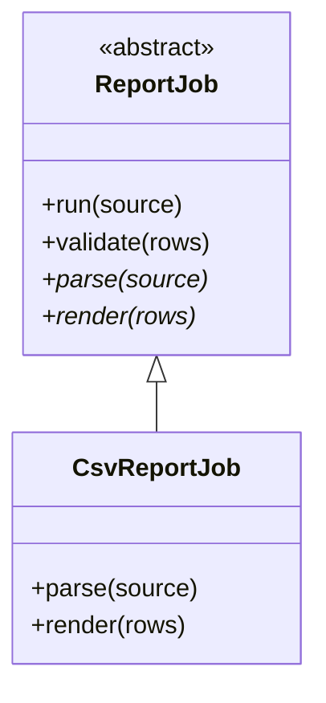

import { ConceptTemplate } from '@/features/kb/components/templates/ConceptTemplate'
import { Callout } from '@/features/kb/components/mdx/Callout'
import { ComparisonTable } from '@/features/kb/components/mdx/ComparisonTable'

export default function Layout({ children }) {
  return (
    <ConceptTemplate title="Abstract Classes">
      {children}
    </ConceptTemplate>
  )
}

An **abstract class** is a type you cannot instantiate. It holds shared fields and concrete methods, plus one or more **abstract** methods that subclasses must implement.

## 1. Deep Dive and Mechanics

Abstract classes sit between interfaces and concrete classes. Use them when subclasses share storage or a template algorithm, but the last step varies.

The **template method** pattern lives here: a concrete `process` method calls abstract `parse`, `validate`, and `persist`. Subclasses supply those steps; the workflow stays in one place.

Languages differ. Java and C-sharp mark the class and methods `abstract`. Python uses `abc.ABC`. C++ uses pure virtual functions (`= 0`). A class with any unimplemented pure virtual is abstract.

<Callout icon="info" title="One abstract method is enough">
A class can be abstract even if most methods are concrete. The abstract methods are the extension points, not a requirement to leave everything blank.
</Callout>

## 2. Mathematical / Theoretical Foundation

An abstract class defines a partial algebra: some operations have equations and implementations, others are holes. Instantiation is forbidden because the type is not a complete record of methods.

Subclassing completes the record. The resulting concrete type must inhabit every abstract slot or remain abstract itself.

<ComparisonTable
  headers={['Construct', 'State allowed', 'Multiple parents', 'Use when']}
  rows={[
    ['Interface / protocol', 'Usually no', 'Yes in most languages', 'Capability only'],
    ['Abstract class', 'Yes', 'Rarely', 'Shared algorithm plus state'],
    ['Concrete class', 'Yes', 'N/A', 'Ready to construct'],
  ]}
/>

## 3. Real-World Implementation

```python
from abc import ABC, abstractmethod

class ReportJob(ABC):
    def run(self, source):
        rows = self.parse(source)
        self.validate(rows)
        return self.render(rows)

    @abstractmethod
    def parse(self, source):
        raise NotImplementedError

    def validate(self, rows):
        if not rows:
            raise ValueError("empty report")

    @abstractmethod
    def render(self, rows):
        raise NotImplementedError

class CsvReportJob(ReportJob):
    def parse(self, source):
        return [line.split(",") for line in source.splitlines()]

    def render(self, rows):
        return "\n".join("|".join(r) for r in rows)
```

`ReportJob()` cannot be constructed. `CsvReportJob` can.

## 4. Visualizations



## 5. Interview Prep

**Q: Abstract class versus interface?**
**A:** Abstract classes can hold fields and implemented methods and (in single-inheritance languages) you get only one parent class. Interfaces are capabilities you can stack. Prefer an interface unless you truly need shared state or a template method.

**Q: Can an abstract class have a constructor?**
**A:** Yes. Subclasses call it. The constructor initializes shared fields; it still cannot be invoked as `new AbstractType` from outside.

**Q: What if a subclass forgets an abstract method?**
**A:** The compiler or ABC machinery keeps that subclass abstract. You find out at compile time or at class-creation time, not at a random call.

## 6. Production Use Cases

- **Ingest pipelines** that share retry and metrics but vary parsers.
- **UI components** with a shared lifecycle and abstract `render`.
- **Test doubles** where an abstract base holds common assertions.

<Callout icon="tip" title="Do not over-abstract">
If only one concrete subclass exists and you cannot name a second, a concrete class plus a function hook is simpler.
</Callout>
