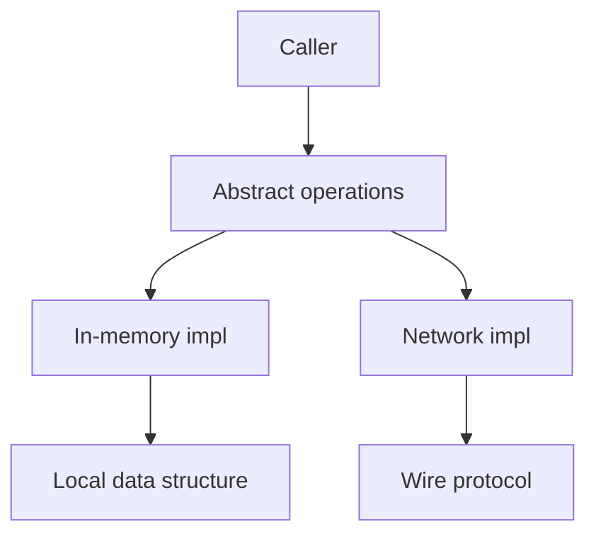

import { ConceptTemplate } from '@/features/kb/components/templates/ConceptTemplate'
import { Callout } from '@/features/kb/components/mdx/Callout'
import { ComparisonTable } from '@/features/kb/components/mdx/ComparisonTable'

export default function Layout({ children }) {
  return (
    <ConceptTemplate title="Abstraction">
      {children}
    </ConceptTemplate>
  )
}

**Abstraction** is the act of naming a useful level of detail and discarding the rest. In OOP that usually means a type whose public methods are the only way callers are allowed to think about the problem.

## 1. Deep Dive and Mechanics

Good abstractions leak as little implementation as possible. A `PaymentGateway` exposes `charge` and `refund`. Callers should not see HTTP clients, retry loops, or card-network error codes unless those details are part of the contract.

**Procedural abstraction** hides a sequence of steps behind a function. **Data abstraction** hides representation behind operations. OOP combines both: the object owns the representation and the operations that preserve its invariants.

**Leaky abstractions.** Timeouts, partial failure, and ordering show through even a clean API. The skill is choosing which leaks are honest (this call may fail) versus accidental (here is our SQL).

<Callout icon="info" title="Abstraction is not vagueness">
A precise contract with few methods is more abstract than a 40-method god interface. Abstraction reduces degrees of freedom, it does not hide the fact that a contract exists.
</Callout>

## 2. Mathematical / Theoretical Foundation

Abstract data types specify a signature and axioms: what operations exist and which equations they obey. Two representations are interchangeable if they satisfy the same axioms. That is why you can swap a tree set for a hash set when the caller only needs "add, contains, remove."

Information hiding (Parnas) is the design rule: module boundaries should match the secrets most likely to change.

<ComparisonTable
  headers={['Kind', 'What is hidden', 'Example']}
  rows={[
    ['Procedural', 'Algorithm steps', 'sort function'],
    ['Data', 'Representation', 'Set type'],
    ['Control', 'Who drives the loop', 'Iterator / callback'],
    ['Hardware', 'Registers and IO', 'Device driver API'],
  ]}
/>

## 3. Real-World Implementation

```python
from abc import ABC, abstractmethod

class Clock(ABC):
    @abstractmethod
    def now_utc(self):
        """Return an aware UTC datetime."""

class SystemClock(Clock):
    def now_utc(self):
        from datetime import datetime, timezone
        return datetime.now(timezone.utc)

class FrozenClock(Clock):
    def __init__(self, fixed):
        self._fixed = fixed

    def now_utc(self):
        return self._fixed
```

Callers depend on `Clock`, not on `datetime.now`. Tests inject `FrozenClock`.

## 4. Visualizations



## 5. Interview Prep

**Q: Abstraction versus encapsulation?**
**A:** Abstraction chooses what to show. Encapsulation is the mechanism that keeps the rest private and consistent. You can encapsulate without a good abstraction (a private mess) and you can sketch an abstraction that leaks because fields are public.

**Q: How do you know an abstraction is wrong?**
**A:** Every new feature requires poking through it, or every caller needs the same three extra methods. That is a sign the secret was drawn in the wrong place.

**Q: Is inheritance the main tool for abstraction?**
**A:** No. Interfaces, functions, and modules abstract just as well. Inheritance is one way to share or vary implementation.

## 6. Production Use Cases

- **Ports and adapters** around payment, email, and identity providers.
- **Storage facades** so domain code never imports a specific database driver.
- **Time, randomness, and clocks** abstracted so tests are deterministic.

<Callout icon="tip" title="Name the secret">
Write down the one thing an abstraction is allowed to change. If you cannot name that secret, you do not have an abstraction yet.
</Callout>
