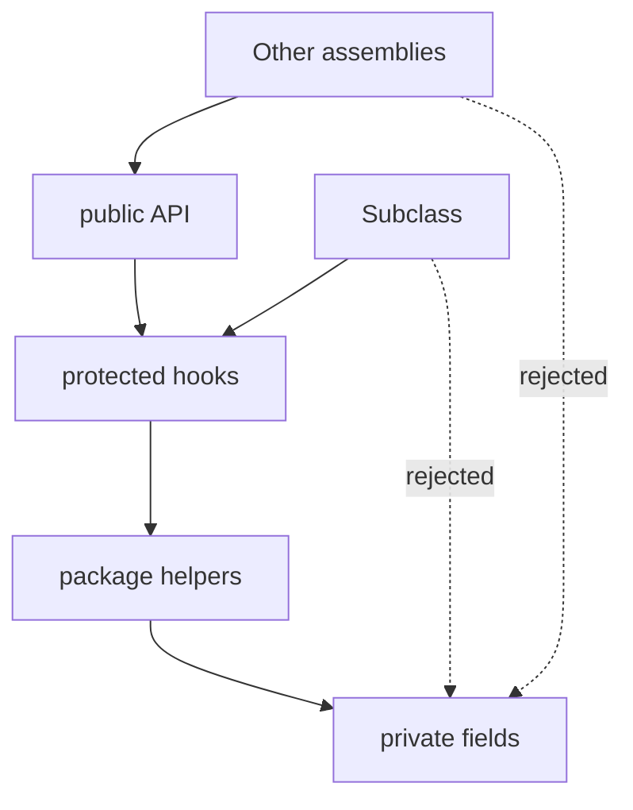

import { ConceptTemplate } from '@/features/kb/components/templates/ConceptTemplate'
import { Callout } from '@/features/kb/components/mdx/Callout'
import { ComparisonTable } from '@/features/kb/components/mdx/ComparisonTable'

export default function Layout({ children }) {
  return (
    <ConceptTemplate title="Access Modifiers">
      {children}
    </ConceptTemplate>
  )
}

**Access modifiers** are compile-time (or module-time) rules about who can name a field, method, or type. They do not encrypt data. They stop ordinary code from depending on internals.

## 1. Deep Dive and Mechanics

Common levels:

- **private**: only the declaring type (and sometimes nested types).
- **protected**: the type plus subclasses. Easy to overuse; subclasses become clients of your layout.
- **package / internal**: same assembly or package. This is the usual "team" boundary.
- **public**: anyone who can import the type.

Java's default is package-private. C-sharp's default for members is private. Python uses a leading underscore as convention and name-mangles `__name` to discourage accidents.

Reflection, `unsafe`, and JNI can bypass modifiers. Treat modifiers as architecture, not a security boundary against a hostile process.

<Callout icon="warning" title="Protected is still an API">
A protected field is a published contract with every future subclass. If you would not document it, do not make it protected.
</Callout>

## 2. Mathematical / Theoretical Foundation

Visibility is a relation between a use-site and a declaration-site. The type checker rejects a use when the pair is not in the allowed relation. This is a static scoping property, independent of the object's runtime type.

Nested classes widen the relation: an inner class may see private members of the outer, which is why they are useful for iterators and builders.

<ComparisonTable
  headers={['Modifier', 'Same class', 'Subclass', 'Same package / assembly', 'World']}
  rows={[
    ['private', 'Yes', 'No', 'No', 'No'],
    ['protected', 'Yes', 'Yes', 'Language-specific', 'No'],
    ['internal / package', 'Yes', 'If same package', 'Yes', 'No'],
    ['public', 'Yes', 'Yes', 'Yes', 'Yes'],
  ]}
/>

## 3. Real-World Implementation

```java
public final class ApiKey {
    private final String secret;

    public ApiKey(String secret) {
        this.secret = secret;
    }

    public boolean matches(String attempt) {
        return secret.equals(attempt);
    }
}
```

Callers can test a guess. They cannot read `secret` without breaking the type's access rules.

## 4. Visualizations



## 5. Interview Prep

**Q: Why prefer private over protected?**
**A:** Protected couples you to unknown subclasses. Prefer private fields and protected or public methods that preserve invariants.

**Q: Are access modifiers a security feature?**
**A:** Not against an attacker who can load code in your process. They are a dependency-management feature. Secrets belong in a vault, not in a private field.

**Q: What does internal buy you in C-sharp?**
**A:** You can share helpers across a library without making them NuGet-public. InternalsVisibleTo is how test assemblies see them.

## 6. Production Use Cases

- **Library surfaces** that must stay stable while internals churn.
- **Hexagonal apps** where only the adapter package talks to the database driver.
- **Value types** that expose operations but hide representation.

<Callout icon="tip" title="Default to the tightest modifier">
Start private. Widen only when a second type has a real reason to name the member.
</Callout>
