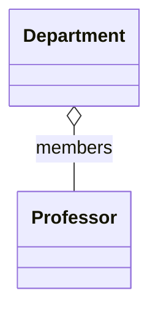

import { ConceptTemplate } from '@/features/kb/components/templates/ConceptTemplate'
import { Callout } from '@/features/kb/components/mdx/Callout'
import { ComparisonTable } from '@/features/kb/components/mdx/ComparisonTable'

export default function Layout({ children }) {
  return (
    <ConceptTemplate title="Aggregation">
      {children}
    </ConceptTemplate>
  )
}

**Aggregation** is a whole-part story with **shared** lifetime. A `Department` has `Professor`s. If the department is dissolved, the professors still exist and may join another department.

## 1. Deep Dive and Mechanics

UML draws aggregation as a hollow diamond on the whole. In code it looks like a collection of references you did not allocate exclusively. Several wholes might even point at the same part (a professor in two departments), which is why aggregation is often called "shared ownership" in modeling, not in the C++ unique-ptr sense.

**Skepticism.** Many modelers treat aggregation as a weak composition and skip the hollow diamond. If the only difference is a sentence about lifetime, a plain association plus a comment may be clearer.

Use aggregation when you want to say: this is a group, not a use-once dependency, and parts are not exclusive.

<Callout icon="info" title="Aggregation is conceptual">
Java has no `aggregate` keyword. The meaning lives in who constructs the part and who is allowed to delete it.
</Callout>

## 2. Mathematical / Theoretical Foundation

Aggregation is an association with a distinguished "whole" role and a constraint that the relation is a grouping, not a transient use. Parts may appear in zero or more wholes depending on the model.

It is not a tree. Composition is closer to a tree (or a forest) because exclusive ownership forbids sharing.

<ComparisonTable
  headers={['Question', 'Aggregation', 'Composition']}
  rows={[
    ['Can the part be shared?', 'Yes', 'No'],
    ['Does deleting the whole delete the part?', 'Not necessarily', 'Yes'],
    ['UML diamond', 'Hollow', 'Filled'],
  ]}
/>

## 3. Real-World Implementation

```python
class Professor:
    def __init__(self, name):
        self.name = name

class Department:
    def __init__(self, name):
        self.name = name
        self.members = []

    def add(self, professor):
        self.members.append(professor)

ada = Professor("Ada")
math = Department("Math")
cs = Department("CS")
math.add(ada)
cs.add(ada)
```

`ada` is aggregated by two departments. Destroying `math` does not delete `ada`.

## 4. Visualizations



## 5. Interview Prep

**Q: How do you show aggregation in an interview?**
**A:** Hollow diamond, whole on the diamond side, parts on the other. Then say: parts can outlive the whole.

**Q: Is a list field always aggregation?**
**A:** No. If the class creates the items and they vanish with it, that is composition. If it holds shared or injected items, that is aggregation or a plain association.

**Q: Why do some books say "skip aggregation"?**
**A:** Because teams argue about hollow versus filled diamonds and never agree. Prefer composition when ownership is exclusive; otherwise draw an association.

## 6. Production Use Cases

- **Teams and employees** in an HR model.
- **Playlists and tracks** where tracks live in a catalog.
- **Classrooms and students** for a single term.

<Callout icon="tip" title="Name the owner of delete">
If nobody can say who is allowed to destroy the part, you do not have a useful whole-part model yet.
</Callout>
