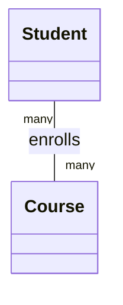

import { ConceptTemplate } from '@/features/kb/components/templates/ConceptTemplate'
import { Callout } from '@/features/kb/components/mdx/Callout'
import { ComparisonTable } from '@/features/kb/components/mdx/ComparisonTable'

export default function Layout({ children }) {
  return (
    <ConceptTemplate title="Association">
      {children}
    </ConceptTemplate>
  )
}

An **association** is a "knows about" link. A `Student` is associated with a `Course`. Neither object's lifetime is defined by the other. UML draws this as a solid line, often with multiplicities.

## 1. Deep Dive and Mechanics

Associations show up in code as fields, collections, or lookup keys (an id stored instead of a pointer). Direction can be one-way or bidirectional. Bidirectional links are easy to get stale: you add a student to a course and forget the reverse list.

**Multiplicity.** One-to-one, one-to-many, many-to-many. Many-to-many almost always needs an association object (`Enrollment`) once you have extra data such as a grade.

**Navigability.** Can you get from A to B in one hop? Persistence models (ORMs) treat this as a mapping. Domain models should navigate only the directions they actually query.

<Callout icon="info" title="Association is the parent idea">
Aggregation and composition are associations plus a lifetime or ownership story. If you cannot name the owner, you have a plain association.
</Callout>

## 2. Mathematical / Theoretical Foundation

An association is a relation R ⊆ A × B, possibly with attributes (a ternary relation via an association class). Multiplicity constraints are cardinalities on the fibers of R.

In memory this is pointers. In a database it is foreign keys. The conceptual relation should stay the same across those representations.

<ComparisonTable
  headers={['Link', 'Lifetime coupled', 'Typical code']}
  rows={[
    ['Association', 'No', 'Field or id reference'],
    ['Aggregation', 'Weakly, parts can outlive', 'Shared list of parts'],
    ['Composition', 'Yes, parts die with whole', 'Owned unique members'],
  ]}
/>

## 3. Real-World Implementation

```python
class Course:
    def __init__(self, code):
        self.code = code
        self.student_ids = []

class Student:
    def __init__(self, student_id):
        self.student_id = student_id
        self.course_codes = []

def enroll(student, course):
    if student.student_id not in course.student_ids:
        course.student_ids.append(student.student_id)
        student.course_codes.append(course.code)
```

Both objects keep ids. Deleting a course does not automatically delete students.

## 4. Visualizations



## 5. Interview Prep

**Q: Association versus dependency?**
**A:** A dependency is "uses in a method" (a parameter or a local). An association is a longer-lived structural link, usually a field. UML uses a dashed arrow for dependency and a solid line for association.

**Q: When do you introduce an association class?**
**A:** When the link itself has data or behavior: seat number, role, effective dates.

**Q: Should associations be bidirectional?**
**A:** Only if both directions are queried. A single owner of the relationship plus a query on the other side is less error-prone.

## 6. Production Use Cases

- **Users and roles** linked by membership, not ownership.
- **Orders and customers** where both persist independently.
- **Graph models** of devices talking to devices.

<Callout icon="tip" title="Store ids at the boundary">
Inside a transaction you may hold objects. Across aggregates, store identifiers. That keeps associations from becoming an accidental object web.
</Callout>
