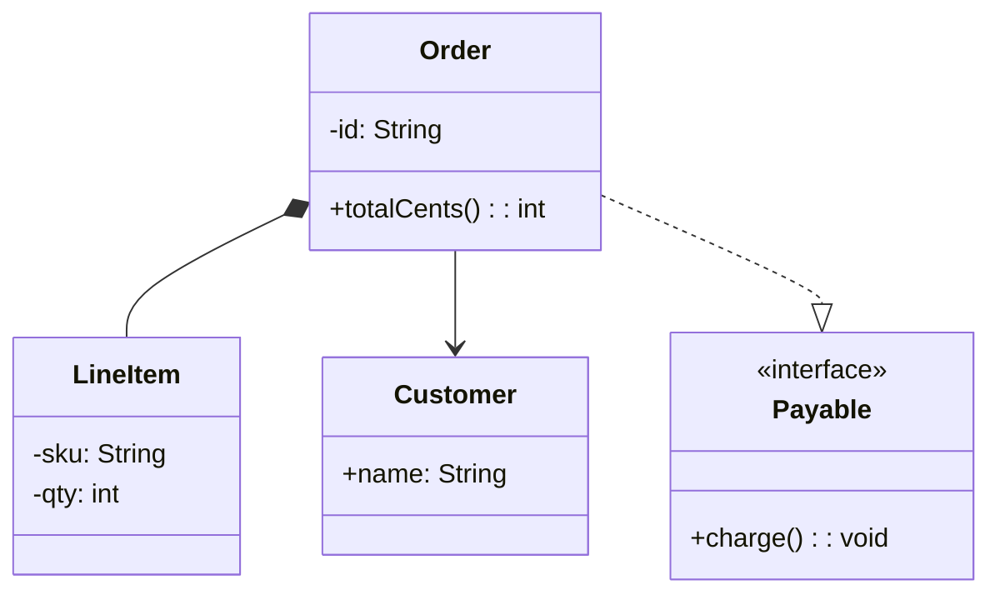
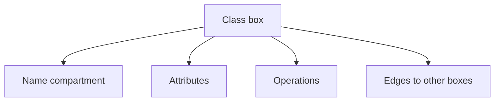

import { ConceptTemplate } from '@/features/kb/components/templates/ConceptTemplate'
import { Callout } from '@/features/kb/components/mdx/Callout'
import { ComparisonTable } from '@/features/kb/components/mdx/ComparisonTable'

export default function Layout({ children }) {
  return (
    <ConceptTemplate title="Class Diagrams (UML)">
      {children}
    </ConceptTemplate>
  )
}

A **UML class diagram** shows types (classes, interfaces), their members, and how they relate. It is a static picture. Sequence and state diagrams cover time.

## 1. Deep Dive and Mechanics

A class box has three compartments: name, attributes, operations. Symbols: `+` public, `-` private, `#` protected, `~` package. Underline static members. Italic names mark abstract types and methods. Stereotypes such as `<<interface>>` sit above the name.

**Relationships.**

- **Association**: solid line, multiplicities like `1` and `0..*`.
- **Aggregation**: hollow diamond on the whole.
- **Composition**: filled diamond on the whole.
- **Generalization** (inheritance): solid line, hollow triangle on the parent.
- **Realization** (implements): dashed line, hollow triangle on the interface.
- **Dependency**: dashed arrow, "uses."

Keep diagrams small. A wall of every DTO is not communication.

<Callout icon="tip" title="Sketch, do not transcribe">
If the diagram has the same information as the source file, generate it or skip it. Draw the relationships that surprise people.
</Callout>

## 2. Mathematical / Theoretical Foundation

A class diagram is a labeled graph. Nodes are classifiers. Edges are relationships with optional multiplicities (cardinalities) and roles. Generalization edges must be acyclic. Composition edges should form a forest if ownership is exclusive.

Multiplicity `a..b` is a constraint on how many instances of the far type may link to one near instance.

<ComparisonTable
  headers={['Edge', 'Line', 'Arrow / diamond']}
  rows={[
    ['Inheritance', 'Solid', 'Hollow triangle on parent'],
    ['Implements', 'Dashed', 'Hollow triangle on interface'],
    ['Association', 'Solid', 'Optional arrows, multiplicities'],
    ['Aggregation', 'Solid', 'Hollow diamond on whole'],
    ['Composition', 'Solid', 'Filled diamond on whole'],
    ['Dependency', 'Dashed', 'Open arrow on the used type'],
  ]}
/>

## 3. Real-World Implementation

That snippet is both documentation and a check that your model has exclusive line items and a non-owning customer link.

## 4. Visualizations

## 5. Interview Prep

**Q: Hollow versus filled diamond?**
**A:** Hollow is aggregation (parts may live on). Filled is composition (parts die with the whole). Triangle is inheritance or realization, never ownership.

**Q: When do you show getters?**
**A:** Almost never. Show fields that matter to the model and operations that are the type's job. Skip ceremony.

**Q: Class diagram versus ER diagram?**
**A:** ER models persisted data and keys. Class diagrams model types and behavior. They often look similar for entities and then diverge around services and interfaces.

## 6. Production Use Cases

- **Design reviews** of a new aggregate and its boundaries.
- **Onboarding maps** of a bounded context (one page, not the whole monolith).
- **Interview whiteboards** where you must show LSP-safe inheritance versus composition.

<Callout icon="info" title="Multiplicity mistakes">
`1` on both ends of composition is rare. A house has `1..*` rooms; a room has `1` house. Write both ends if the room can navigate back.
</Callout>
