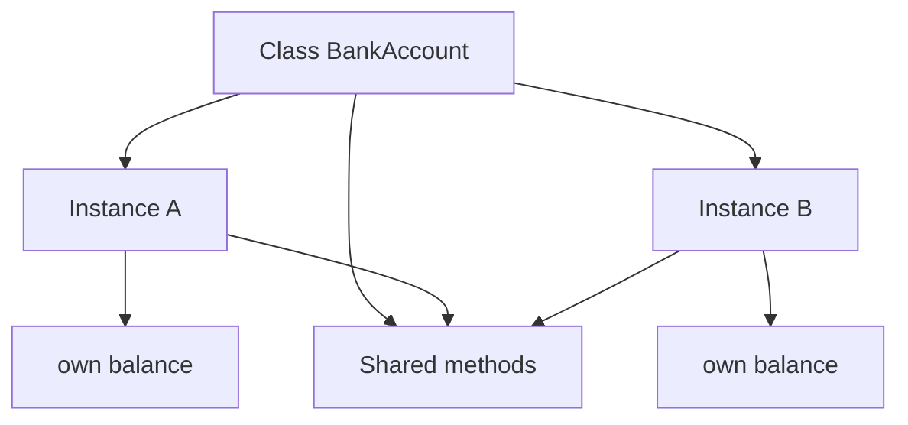

import { ConceptTemplate } from '@/features/kb/components/templates/ConceptTemplate'
import { Callout } from '@/features/kb/components/mdx/Callout'
import { ComparisonTable } from '@/features/kb/components/mdx/ComparisonTable'

export default function Layout({ children }) {
  return (
    <ConceptTemplate title="Classes">
      {children}
    </ConceptTemplate>
  )
}

A **class** is a named type that declares what data an instance holds and what operations it may perform. The class itself is a definition. Runtime cost appears when the language allocates an **instance** of that type.

## 1. Deep Dive and Mechanics

A class typically packages three things: **fields** (state), **methods** (behavior), and **constructors** (initialization). Many languages also attach **static** members to the class object rather than to each instance.

**Instantiation** reads the class layout, reserves heap storage, runs constructors in inheritance order, and returns a reference. Two instances of the same class share method code (or vtable entries) but keep separate field storage.

**Identity vs equality.** Two objects can have identical field values and still be distinct identities. Languages expose this as reference equality versus value equality.

**Nested types.** Inner classes, friend classes, and companion objects are extra names that share privileged access. They do not change the fact that the outer class is still the unit of instantiation.

<Callout icon="info" title="Class vs type">
In Java and C-sharp the class is both a runtime layout and a nominal type. In TypeScript a class also emits a type, but structural typing means extra shapes can satisfy the same surface without sharing that class.
</Callout>

## 2. Mathematical / Theoretical Foundation

A class C can be modeled as a record type of fields plus a set of function types that take an implicit receiver. Inheritance is a subtype relation: if D extends C, values of D may be used where C is expected, provided Liskov constraints hold.

Method dispatch is a function from (receiver-type, method-name, argument-types) to an implementation. Single dispatch looks only at the receiver. The class vtable is an O(1) array of function pointers indexed by method slot.

<ComparisonTable
  headers={['Idea', 'Lives on', 'Shared across instances']}
  rows={[
    ['Field', 'Each instance', 'No'],
    ['Instance method', 'Class / vtable', 'Yes, code is shared'],
    ['Static field', 'Class object', 'Yes'],
    ['Constructor', 'Class', 'Runs per new instance'],
  ]}
/>

## 3. Real-World Implementation

```python
class BankAccount:
    def __init__(self, owner, opening_balance):
        self.owner = owner
        self._balance = opening_balance

    def deposit(self, amount):
        if amount <= 0:
            raise ValueError("amount must be positive")
        self._balance += amount

    def withdraw(self, amount):
        if amount > self._balance:
            raise ValueError("insufficient funds")
        self._balance -= amount

    @property
    def balance(self):
        return self._balance
```

The class is the blueprint. Each `BankAccount(...)` call allocates a distinct object with its own `_balance`.

## 4. Visualizations



## 5. Interview Prep

**Q: Does a class consume heap memory?**
**A:** The metadata and method code live with the type. Per-object cost starts at instantiation. Some runtimes also keep a class object on the heap.

**Q: Class versus struct?**
**A:** In C-sharp and similar languages a class is a reference type with identity and heap allocation. A struct is a value type copied by assignment. The design question is identity and lifetime, not just syntax.

**Q: Why hide fields behind methods?**
**A:** Invariants such as non-negative balance belong in one place. Callers should not be able to write the field directly and skip validation.

## 6. Production Use Cases

- **Domain models** in billing, inventory, and order systems.
- **Framework extension points** where a base class defines a lifecycle and subclasses fill in hooks.
- **ORMs** that map a class to a table and instances to rows.

<Callout icon="tip" title="Keep classes small">
If a class name needs and, plus, or manager to explain itself, it is probably several classes glued together.
</Callout>
