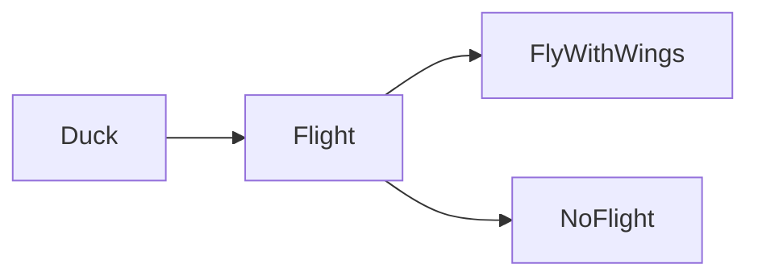

import { ConceptTemplate } from '@/features/kb/components/templates/ConceptTemplate'
import { Callout } from '@/features/kb/components/mdx/Callout'
import { ComparisonTable } from '@/features/kb/components/mdx/ComparisonTable'

export default function Layout({ children }) {
  return (
    <ConceptTemplate title="Composition Over Inheritance">
      {children}
    </ConceptTemplate>
  )
}

**Composition over inheritance** is a design slogan: reuse behavior by holding a collaborator, not by extending a superclass. You can change the collaborator at runtime. You cannot swap a superclass without a new type.

## 1. Deep Dive and Mechanics

The Gang of Four warned that inheritance is the strongest coupling two classes can have. A `Duck` that extends `FlyingBird` cannot become flightless without a lie. A `Duck` that holds a `Flight` strategy can take `FlyWithWings` or `NoFlight`.

**What you still inherit.** Framework types (`TestCase`, `Component`) and true behavioral subtypes. The slogan is against using inheritance as a cheap bag of methods.

**Delegation.** The outer object forwards calls to the inner one. That is composition plus a boring bit of glue. Languages with `delegate` keywords just generate the glue.

<Callout icon="info" title="Both can be true">
A type can extend one small base and compose the rest. The rule is: inherit for subtyping, compose for reuse.
</Callout>

## 2. Mathematical / Theoretical Foundation

Inheritance fixes a linear (or diamond) layout and a static subtype relation. Composition is a product type: the object is a pair of (own state, collaborator). Products are easier to rearrange than subtype chains.

You also gain runtime strategy replacement, which inheritance only fakes with heavy override graphs.

<ComparisonTable
  headers={['Need', 'Prefer', 'Why']}
  rows={[
    ['True is-a + LSP', 'Inheritance', 'Callers need the parent type'],
    ['Reusable algorithm', 'Strategy / function', 'Swap without a new subclass'],
    ['Optional feature', 'Decorator or mixin object', 'Avoids deep trees'],
    ['Framework hook', 'Inheritance', 'The framework constructs the subtype'],
  ]}
/>

## 3. Real-World Implementation

```python
class Flight:
    def move(self):
        raise NotImplementedError

class FlyWithWings(Flight):
    def move(self):
        return "fly"

class NoFlight(Flight):
    def move(self):
        return "walk"

class Duck:
    def __init__(self, flight: Flight):
        self.flight = flight

    def move(self):
        return self.flight.move()

duck = Duck(FlyWithWings())
injured = Duck(NoFlight())
```

No class hierarchy of duck kinds is required to change movement.

## 4. Visualizations



## 5. Interview Prep

**Q: Why is inheritance considered tighter coupling?**
**A:** The child sees protected members and depends on constructor order and override contracts. A composed collaborator is used only through a small public interface.

**Q: Does this kill polymorphism?**
**A:** No. The collaborator is usually an interface. You still get subtype polymorphism, just on the strategy, not on a tall domain tree.

**Q: When would you reject the slogan?**
**A:** When the framework requires a subclass, or when a one-level subtype is the clearest model and LSP holds.

## 6. Production Use Cases

- **Head-first style duck / weapon / payment strategies**.
- **React-style composition** of components instead of deep widget inheritance.
- **Go-like design**: structs plus interfaces, almost no class trees.

<Callout icon="tip" title="Extract the varying verb">
If subclasses only differ in one method, that method wants to be an object or a function you compose.
</Callout>
