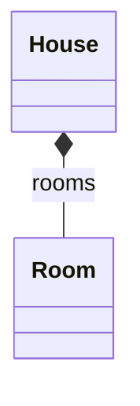

import { ConceptTemplate } from '@/features/kb/components/templates/ConceptTemplate'
import { Callout } from '@/features/kb/components/mdx/Callout'
import { ComparisonTable } from '@/features/kb/components/mdx/ComparisonTable'

export default function Layout({ children }) {
  return (
    <ConceptTemplate title="Composition">
      {children}
    </ConceptTemplate>
  )
}

**Composition** means the whole owns the part. A `House` is composed of `Room`s. Delete the house and the rooms are gone. The part is not shared with another owner.

## 1. Deep Dive and Mechanics

In C++ this is a member value or a `unique_ptr`. In Java and Python it is a field you constructed privately and never publish to another owner. If you return the live part, you have leaked ownership and composition has quietly become aggregation.

**Construction.** The whole typically creates the parts in its constructor, or accepts raw materials and wraps them so no other object keeps a handle.

**Cascading delete** in ORMs (`cascade = ALL`) is the database face of composition.

<Callout icon="warning" title="Do not publish mutable parts">
A getter that returns the internal `Room` list lets callers keep rooms after the house is gone — or mutate the house from the outside. Return copies or an immutable view.
</Callout>

## 2. Mathematical / Theoretical Foundation

Composition is a tree-shaped ownership relation. Each part has at most one owner. Destroying a node destroys the subtree. That matches RAII and unique ownership types.

Memory: the part may be inlined in the whole's layout (value member) or separately allocated but uniquely referenced.

<ComparisonTable
  headers={['Language tool', 'Signals composition']}
  rows={[
    ['C++ unique_ptr / member value', 'Yes, exclusive'],
    ['C++ shared_ptr', 'Usually aggregation'],
    ['Java private final field, never escaped', 'By convention'],
    ['ORM cascade delete', 'Persistence-level composition'],
  ]}
/>

## 3. Real-World Implementation

```python
class Room:
    def __init__(self, name):
        self.name = name

class House:
    def __init__(self, room_names):
        self._rooms = [Room(n) for n in room_names]

    def room_names(self):
        return tuple(r.name for r in self._rooms)
```

Rooms are created by `House`. Callers get names, not room objects they could stash.

## 4. Visualizations



## 5. Interview Prep

**Q: Composition versus aggregation?**
**A:** Composition: exclusive lifetime, filled diamond. Aggregation: shared or independent lifetime, hollow diamond. If you hesitate, draw an association and write "owns."

**Q: Composition versus inheritance?**
**A:** Composition is has-a. Inheritance is is-a. "Composition over inheritance" says prefer has-a for reuse.

**Q: Can a composed part point back to the whole?**
**A:** Yes (a back pointer), but then you must be careful about cycles in destruction and serialization. Prefer passing the whole into a method when needed.

## 6. Production Use Cases

- **Documents and their paragraphs** in an editor model.
- **Orders and line items** in a single aggregate.
- **Widgets and child controls** in a UI tree.

<Callout icon="tip" title="One aggregate root">
In DDD, the composed parts are reached only through the root. That is composition plus a public API boundary.
</Callout>
