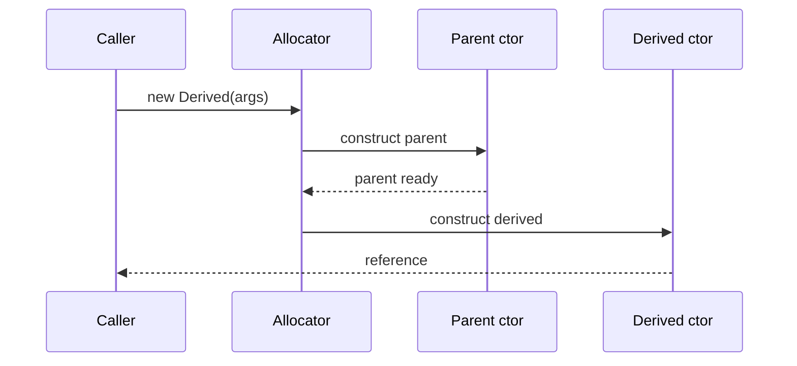

import { ConceptTemplate } from '@/features/kb/components/templates/ConceptTemplate'
import { Callout } from '@/features/kb/components/mdx/Callout'
import { ComparisonTable } from '@/features/kb/components/mdx/ComparisonTable'

export default function Layout({ children }) {
  return (
    <ConceptTemplate title="Constructors">
      {children}
    </ConceptTemplate>
  )
}

A **constructor** is the first user code that runs after allocation. Its job is to leave the object in a state that every later method can trust.

## 1. Deep Dive and Mechanics

Typical order: allocate raw storage, write default field values, run superclass constructors from the top down, then run the most-derived constructor body. Java and C-sharp require `super(...)` or `this(...)` first so the parent is never observed half-built.

**Overloading.** Several constructors can accept different argument lists. They should funnel through one canonical constructor so validation lives once.

**Factories.** `of`, `from`, and `parse` static methods can return subtypes, cache instances, or fail without throwing from `new`. Constructors cannot return a different type.

**Virtual calls.** Calling an overridable method from a constructor is dangerous: the subclass fields are not initialized yet, so the override sees zeros or nulls.

<Callout icon="error" title="Never call overridable methods from a constructor">
The subclass override runs before the subclass constructor body. That is a classic source of nulls and half-built observers.
</Callout>

## 2. Mathematical / Theoretical Foundation

Construction is a function from arguments to a value of the type, or an error. After success, all declared invariants hold. Two-phase init (default construct, then `init`) is a weaker contract: there exists a window where the object is allocated but illegal.

In languages with value types, constructors may run on the stack. Move and copy constructors in C++ are extra operations on lifetime, not just "set the fields."

<ComparisonTable
  headers={['Style', 'Returns other types', 'Can cache', 'Can fail softly']}
  rows={[
    ['Constructor', 'No', 'No', 'Only by throwing'],
    ['Static factory', 'Yes', 'Yes', 'Yes, null or Result'],
    ['Builder', 'Usually the product', 'Optional', 'At build time'],
  ]}
/>

## 3. Real-World Implementation

```python
class Rectangle:
    def __init__(self, width, height):
        if width <= 0 or height <= 0:
            raise ValueError("dimensions must be positive")
        self.width = width
        self.height = height

    @classmethod
    def square(cls, side):
        return cls(side, side)
```

`square` is a named factory that still goes through the same checks.

## 4. Visualizations



## 5. Interview Prep

**Q: Constructor versus factory method?**
**A:** A constructor always allocates this exact type. A factory can reuse instances, pick a subclass, or return a failure object. Prefer factories when those extra powers matter.

**Q: What is a copy constructor?**
**A:** In C++ it builds a new object from an existing one. If you define one, you usually need the rest of the rule-of-five so copies, moves, and destruction stay consistent.

**Q: Why do some guides ban work in constructors?**
**A:** Heavy I/O makes objects hard to test and easy to fail halfway through a graph. Inject already-opened resources, or use an explicit `start` after a cheap constructor.

## 6. Production Use Cases

- **Domain entities** that refuse to exist without an id and a valid status.
- **Builders** for types with many optional fields (HTTP clients, query objects).
- **Dependency graphs** where constructors take interfaces, not concrete services.

<Callout icon="tip" title="One canonical constructor">
Overloads and factories should call one private or primary constructor. Duplicate validation will drift.
</Callout>
