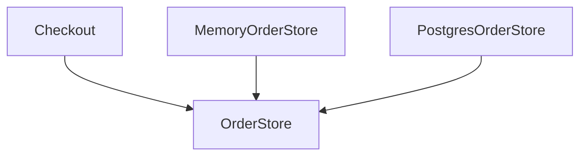

import { ConceptTemplate } from '@/features/kb/components/templates/ConceptTemplate'
import { Callout } from '@/features/kb/components/mdx/Callout'
import { ComparisonTable } from '@/features/kb/components/mdx/ComparisonTable'

export default function Layout({ children }) {
  return (
    <ConceptTemplate title="Dependency Inversion Principle (DIP)">
      {children}
    </ConceptTemplate>
  )
}

The **Dependency Inversion Principle** flips the naive layering arrow. A checkout service must not import a concrete MySQL class. Both checkout and MySQL code depend on an `OrderStore` abstraction that checkout owns.

## 1. Deep Dive and Mechanics

Martin's two rules:

1. High-level modules should not depend on low-level modules. Both should depend on abstractions.
2. Abstractions should not depend on details. Details should depend on abstractions.

**Who owns the interface?** The consumer. The database adapter implements `OrderStore`. The SQL library is a detail behind that adapter.

**DIP is not DI.** Dependency inversion is the rule about arrows. Dependency injection is a technique (constructors, containers) that makes those arrows easy to wire.

<Callout icon="info" title="Invert the source dependency">
Runtime still calls from policy into the adapter. Compile-time imports point inward toward policy. That is the inversion.
</Callout>

## 2. Mathematical / Theoretical Foundation

Draw a DAG of imports. Naive apps point from domain to SQL. DIP wants the domain node to have no edge to SQL. An interface node sits with the domain. SQL has an edge to that interface.

Stability: abstractions that many modules depend on should change rarely. Details may churn.

<ComparisonTable
  headers={['Idea', 'What it governs', 'Typical tool']}
  rows={[
    ['DIP', 'Direction of source dependencies', 'Interfaces owned by policy'],
    ['DI', 'How instances are supplied', 'ctors, containers'],
    ['IoC', 'Who calls whom', 'Frameworks, callbacks'],
  ]}
/>

## 3. Real-World Implementation

```python
class OrderStore:
    def save(self, order_id, payload):
        raise NotImplementedError

class Checkout:
    def __init__(self, store: OrderStore):
        self._store = store

    def complete(self, order_id, payload):
        return self._store.save(order_id, payload)

class MemoryOrderStore(OrderStore):
    def __init__(self):
        self.rows = {}

    def save(self, order_id, payload):
        self.rows[order_id] = payload
        return order_id
```

`Checkout` compiles against `OrderStore`. A Postgres adapter can replace `MemoryOrderStore` at the composition root.

## 4. Visualizations



## 5. Interview Prep

**Q: DIP versus dependency injection?**
**A:** DIP is a dependency rule. Injection is how you pass the implementor in. You can invert dependencies with a simple constructor and no container.

**Q: Where should the interface live?**
**A:** In the high-level package (the policy). Putting it next to the SQL adapter makes policy import infrastructure again.

**Q: Does every class need an interface?**
**A:** No. Invert at architectural boundaries: IO, clocks, vendors. Do not wrap every increment of an integer.

## 6. Production Use Cases

- **Hexagonal / clean architecture** ports and adapters.
- **Replaceable payment and email gateways**.
- **Unit tests** that inject fakes without a network.

<Callout icon="tip" title="Composition root">
Wire concrete types in one place (main, a request factory). The rest of the app should see only abstractions.
</Callout>
