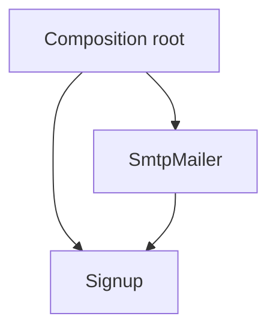

import { ConceptTemplate } from '@/features/kb/components/templates/ConceptTemplate'
import { Callout } from '@/features/kb/components/mdx/Callout'
import { ComparisonTable } from '@/features/kb/components/mdx/ComparisonTable'

export default function Layout({ children }) {
  return (
    <ConceptTemplate title="Dependency Injection (DI)">
      {children}
    </ConceptTemplate>
  )
}

**Dependency injection** means an object does not `new` its collaborators. The caller (or a container) passes them in. That is how you swap a real mailer for a fake without editing the use case.

## 1. Deep Dive and Mechanics

**Constructor injection** is the default: required collaborators appear as constructor parameters. The object is complete after `new`. **Setter injection** allows optional or late collaborators and makes it possible to observe a half-wired object. **Method injection** passes a helper into a single call.

**Containers** (Spring, Dagger, Guice, .NET DI) automate the graph. They are optional. A 20-line `main` that constructs objects in order is still DI.

**Service locator** is the opposite smell: the object asks a global registry for a type. Dependencies become invisible.

<Callout icon="warning" title="A container is not the point">
If you cannot construct the object in a test with three fakes, the design is wrong — no amount of XML or annotations will save it.
</Callout>

## 2. Mathematical / Theoretical Foundation

An object is a function of its dependencies: `UseCase(store, clock)`. Injection is applying that function at the composition root. The object graph should be a DAG. Cycles need lazy holders or a redesign.

Lifetime: singletons, scoped (per request), and transient instances are different ways to instantiate the same type in that DAG.

<ComparisonTable
  headers={['Style', 'Required deps visible', 'Partial construction']}
  rows={[
    ['Constructor injection', 'Yes', 'No'],
    ['Setter injection', 'No', 'Yes'],
    ['Service locator', 'No', 'Yes'],
  ]}
/>

## 3. Real-World Implementation

```python
class Mailer:
    def send(self, to, body):
        raise NotImplementedError

class Signup:
    def __init__(self, mailer: Mailer):
        self._mailer = mailer

    def register(self, email):
        self._mailer.send(email, "welcome")
        return email

class RecordingMailer(Mailer):
    def __init__(self):
        self.sent = []

    def send(self, to, body):
        self.sent.append((to, body))
```

Tests construct `Signup(RecordingMailer())`. Production constructs `Signup(SmtpMailer(...))`.

## 4. Visualizations



## 5. Interview Prep

**Q: DI versus DIP?**
**A:** DIP says depend on abstractions. DI says pass the implementors in. You usually want both. You can inject a concrete class (DI without inversion) and still have painful tests.

**Q: Why prefer constructors over setters?**
**A:** Required dependencies cannot be forgotten. The object never exists in an unusable state. Immutability is easier.

**Q: When is a DI container worth it?**
**A:** When the graph is large, lifetimes differ per request, and many teams would otherwise copy-paste wiring. For a small service, `main` is clearer.

## 6. Production Use Cases

- **Web request scopes**: one Db session per request, injected into handlers.
- **Background jobs** that receive a clock, queue, and metrics client.
- **Mobile / desktop apps** with a composition root at startup.

<Callout icon="tip" title="Inject interfaces at boundaries">
Inject `Clock` and `OrderStore`, not every tiny helper. Over-injection is how constructors grow to fifteen parameters — a sign the class needs a split.
</Callout>
