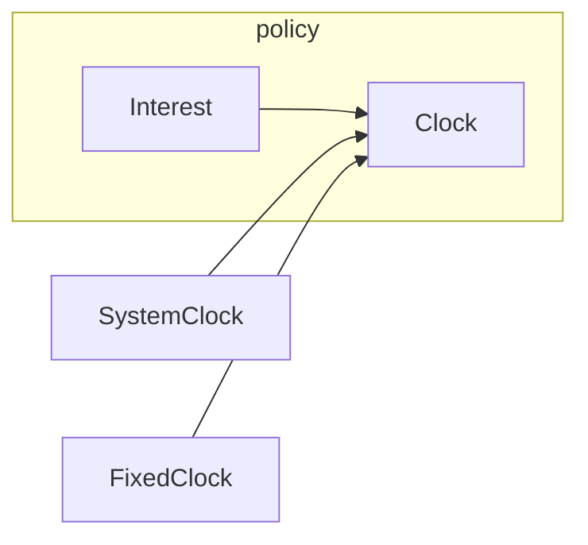

import { ConceptTemplate } from '@/features/kb/components/templates/ConceptTemplate'
import { Callout } from '@/features/kb/components/mdx/Callout'
import { ComparisonTable } from '@/features/kb/components/mdx/ComparisonTable'

export default function Layout({ children }) {
  return (
    <ConceptTemplate title="Dependency Inversion">
      {children}
    </ConceptTemplate>
  )
}

**Dependency inversion** is the design move that makes a core use case compile without knowing Postgres, Stripe, or the system clock. Details plug in from the outside.

## 1. Deep Dive and Mechanics

Without inversion, `PriceOrder` imports `StripeClient`. A Stripe outage, a test, or a second processor all force edits in pricing. With inversion, `PriceOrder` imports `CardCharges`. Stripe code lives in an adapter that implements `CardCharges`.

**Boundaries.** Invert at things that change for external reasons: vendors, protocols, time, randomness, the file system. Do not invert a private helper used by one class.

**Tests.** The first payoff is usually tests. A fake clock and a fake store turn a flaky integration into a deterministic unit test.

<Callout icon="warning" title="Do not invert in both directions">
If the adapter also imports concrete policy types it should not know, you have created a cycle. Share only DTO-like values or types from the policy package.
</Callout>

## 2. Mathematical / Theoretical Foundation

Import graphs should point toward stability. Policy is stable relative to vendors. Therefore vendor packages depend on policy abstractions, not the reverse.

This is the same stability metric Uncle Bob uses: a package that many others depend on must be harder to change. Inversion is how you keep that package free of volatile details.

<ComparisonTable
  headers={['Layering', 'Import arrow', 'Test story']}
  rows={[
    ['Naive', 'Policy to SQL', 'Need a database'],
    ['Inverted', 'SQL adapter to policy port', 'Fake the port'],
    ['Service locator', 'Hidden global lookup', 'Hard to see deps'],
  ]}
/>

## 3. Real-World Implementation

```python
class Clock:
    def today(self):
        raise NotImplementedError

class Interest:
    def __init__(self, clock: Clock):
        self._clock = clock

    def is_late(self, due_day):
        return self._clock.today() > due_day

class FixedClock(Clock):
    def __init__(self, day):
        self._day = day

    def today(self):
        return self._day
```

Production wires a system clock. Tests wire `FixedClock`.

## 4. Visualizations



## 5. Interview Prep

**Q: Is this the same as the SOLID D?**
**A:** Yes. SOLID DIP is this idea stated as two rules about modules and abstractions. This page is the architectural reading of the same move.

**Q: How is this different from inversion of control?**
**A:** IoC is about call direction (the framework calls you). Dependency inversion is about source dependencies. Frameworks often provide both.

**Q: What belongs in the composition root?**
**A:** Concrete constructors, config, and the mapping from interfaces to classes. Not business rules.

## 6. Production Use Cases

- **Clean architecture** use cases that never import a web or SQL package.
- **Feature flags and clocks** injected so behavior is reproducible.
- **Multi-cloud adapters** behind a storage port.

<Callout icon="tip" title="Start with the test you want to write">
If the test needs a network to construct the object, a dependency has not been inverted yet.
</Callout>
