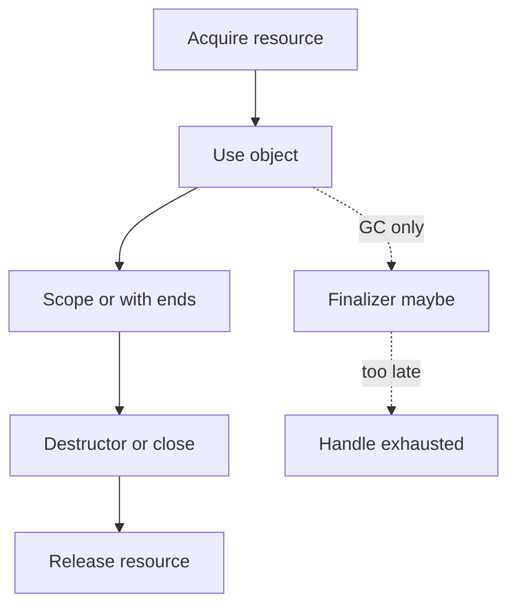

import { ConceptTemplate } from '@/features/kb/components/templates/ConceptTemplate'
import { Callout } from '@/features/kb/components/mdx/Callout'
import { ComparisonTable } from '@/features/kb/components/mdx/ComparisonTable'

export default function Layout({ children }) {
  return (
    <ConceptTemplate title="Destructors / Finalizers">
      {children}
    </ConceptTemplate>
  )
}

A **destructor** runs when an object's lifetime ends in a deterministic language. A **finalizer** is a last-chance hook in a garbage-collected runtime. They look similar and behave very differently.

## 1. Deep Dive and Mechanics

**C++ destructors** run when a stack object leaves scope, when `delete` is called, or when a member is destroyed as part of its owner. This is RAII: the destructor releases the resource the constructor acquired.

**Java and C-sharp finalizers** run if the collector feels like it, on a special thread, with no ordering guarantee among objects. They can resurrect the object by publishing `this`. Modern guidance is: do not write finalizers; implement `Closeable` or `IDisposable` and use try-with-resources.

**Python** `__del__` is closer to a finalizer. Cycles and interpreter shutdown make it unreliable for sockets and files. Prefer context managers.

<Callout icon="error" title="Do not throw from a destructor">
In C++ a throw that escapes a destructor during stack unwinding calls terminate. In GC languages a throw in a finalizer is easy to lose and hard to debug.
</Callout>

## 2. Mathematical / Theoretical Foundation

Deterministic destruction is a stack discipline: last constructed, first destroyed, matching the LIFO of scopes. That gives exception safety: if construction of object n fails, objects 1 through n-1 already have destructors queued.

Finalization is a graph problem. The collector finds unreachable nodes and may enqueue them. There is no bound on time-to-run, so resource limits (file handles, connection caps) cannot depend on it.

<ComparisonTable
  headers={['Hook', 'When it runs', 'Safe for sockets', 'Typical language']}
  rows={[
    ['Destructor', 'Scope end / delete', 'Yes', 'C++, Rust Drop'],
    ['Dispose / close', 'Caller or with-block', 'Yes', 'Java, C-sharp, Python'],
    ['Finalizer / del', 'Sometime after last ref', 'No', 'JVM, CLR, CPython'],
  ]}
/>

## 3. Real-World Implementation

```python
class TempFile:
    def __init__(self, path, handle):
        self.path = path
        self._handle = handle

    def write(self, data):
        self._handle.write(data)

    def close(self):
        if self._handle is not None:
            self._handle.close()
            self._handle = None

    def __enter__(self):
        return self

    def __exit__(self, exc_type, exc, tb):
        self.close()
        return False
```

The context manager is the destructor you can actually test. `__del__` is omitted on purpose.

## 4. Visualizations



## 5. Interview Prep

**Q: Destructor versus finalizer?**
**A:** A destructor is deterministic and is the right place for scarce resources in RAII languages. A finalizer is a safety net for unmanaged memory and should almost never be your primary release path.

**Q: What is the dispose pattern in C-sharp?**
**A:** `IDisposable.Dispose` releases managed and unmanaged resources. A finalizer, if present, only releases unmanaged ones and calls `GC.SuppressFinalize` from Dispose so the object is not queued twice.

**Q: Why is `__del__` disliked in Python?**
**A:** It can prevent cycles from being collected, it may run with globals already torn down, and it is not a substitute for `with`.

## 6. Production Use Cases

- **File, socket, and lock wrappers** in C++ via RAII.
- **Database sessions** closed by try-with-resources or `with`.
- **Native interop** buffers that must be freed even if a finalizer exists as a backstop.

<Callout icon="tip" title="Pair acquire with release in the same type">
The type that opened the handle should be the type that closes it. Do not hand a raw descriptor to callers and hope they remember.
</Callout>
